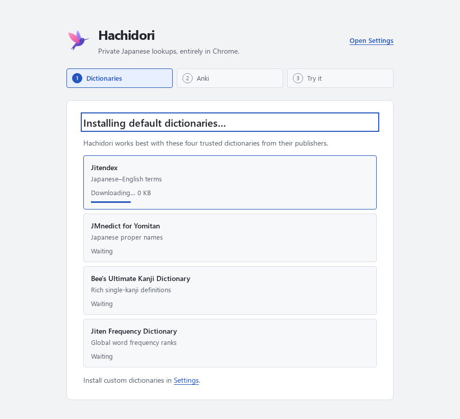
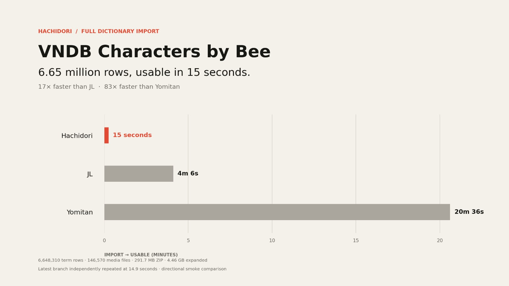
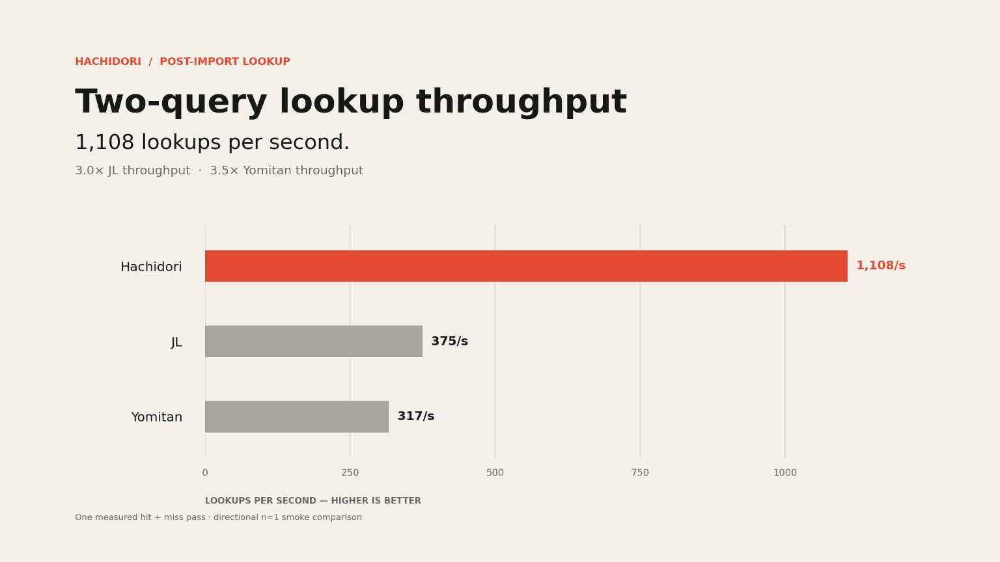

<p align="center">
  
</p>

<h1 align="center">Hachidori</h1>

<p align="center"><strong>The fastest, most feature rich Japanese dictionary app in the world</strong></p>

<p align="center">
  <a href="LICENSE"></a>
  <a href="#install-in-60-seconds"></a>
  <a href="#privacy-by-default"></a>
  <a href="https://sonarcloud.io/summary/new_code?id=bee-san_hachidori"></a>
  <a href="https://github.com/bee-san/hachidori"></a>
</p>

<p align="center">
  <a href="#install-in-60-seconds">Install</a> ·
  <a href="#use-it">Usage</a> ·
  <a href="#benchmarks">Benchmarks</a> ·
  <a href="#hachidori-vs-the-alternatives">Compare</a> ·
  <a href="docs/architecture.md">Architecture</a> ·
  <a href="CONTRIBUTING.md">Contributing</a>
</p>

Hachidori is a blazing fast Japanese Dictionary Chrome Extension that is feature rich and optionated.

## Install in 60 seconds

```sh
git clone https://github.com/bee-san/hachidori.git
```

1. Open `chrome://extensions`.
2. Enable **Developer mode**.
3. Choose **Load unpacked** and select the cloned `hachidori/extension` directory.
4. Hachidori opens a short setup tab on its first install and starts installing the four recommended dictionaries by itself. Open **Settings** from it any time to import your own Yomitan `.zip`, then hover Japanese text on any page.

<p align="center">
  
</p>

The setup tab uses the Settings theme in light and dark mode and walks through **Dictionaries → Anki → Try it**. Dictionaries download and install one after another with real download progress and an installation phase; a source that fails is reported with its reason while the others continue, and **Retry missing dictionaries** fetches only what is still missing. Once every source is installed, the result stays on screen for five seconds and setup moves on. Setup then looks for Anki: if you already mine with a Senren, Lapis or Kiku note type, Hachidori picks the one you use most, the deck you send it to, and fills in the matching field mapping for you — reading your collection only, never changing it. If Anki is not running, or your setup needs a choice only you can make, it says so and points at **Settings**; either way setup moves on by itself and keeps the result on the last screen. The last step is a real lookup: hover the Japanese sentence on the page and the ordinary popup answers from the dictionaries setup just installed — the same behaviour you get on any webpage. Finishing is one click away whether or not you try it. Initial preferences are set once: three-line compact definition summaries, Jitendex as their source and Bee's Ultimate Kanji Dictionary for clicked kanji, each only while you have not chosen otherwise. The tab appears only for a fresh installation: updates and restarts never reopen it or reset your settings, and the installation continues even if you close the tab; Settings shows **Resume setup** until you finish.

**Try it** offers a Japanese street scene with a real lookup from your installed dictionaries. Hover, hold your configured activation key, or use the keyboard-accessible **Look up 辞書** button. **Finish** and **Open Settings** stay available even if you skip the exercise or need to install a dictionary. Beneath it, **Read saved pages too** optionally opens Hachidori’s Chrome extension details: turn on **Allow access to file URLs** yourself, then return to setup for confirmation. If Chrome closes setup during the extension reload, open **Extension options** from the details page and choose **Resume setup**. **Not now** skips this choice; the same shortcut stays in **Settings → Reading**. The bundled exercise works without file access.

# Blazing Fast

Hachidori is 83 times faster than the worlds most popular Japanese dictionary app at importing dictionaries.

<p align="center">
  
</p>

It is even 3.5 times faster at looking up words.

<p align="center">
  
</p>

# Media mining

Hachidori can optionally keep a bounded local history of one shared browser tab,
application window, or monitor, then attach an animated AVIF and captured-source
WAV to a mined Anki note. Source audio availability depends on the browser and
chosen share. Capture is off by default and requires an explicit **Start
capture** click; the controls may then be closed while recording continues.

Timing prefers a matching live texthooker event, then accessible video cues,
then changes in a linked webpage text area. If none is usable, Hachidori uses
the recent history pinned when the root lookup began. Capture stays local until
you explicitly mine a note; raw media and incoming text are not persisted.


See [Media mining setup, limits, and verification](docs/media-capture.md).

# Custom Dictionary

Do you keep on seeing a name pop up over & over again in a book, but it's not in the dictionary? 

With Hachidori, you can highlight the word and add it as a custom definition.

# Lookup blur

Sometimes we fall into a trap of looking up a word over & over again, but never learning it.

Hachidori records how many times you have looked up a word and can blur it for you for a few seconds to force you to remember it.

In **Settings → Design → Definition blur**, you can also enable **Blur definitions for mature Anki words**. It works independently of lookup counts; either enabled rule can blur the definitions. A word qualifies when its first lookup result matches your configured Anki note type and a dedicated plain expression field, in any deck, with at least one review card whose interval is 21 days or more. This follows [Anki's mature-card definition](https://docs.ankiweb.net/getting-started.html#card-states).

Both rules use the same hover or timed reveal and suppress automatic pronunciation for qualifying results. The Anki check is read-only and runs after the dictionary result appears. Closing Anki never prevents lookup; the count rule keeps working offline. See [lookup statistics and definition blur](docs/lookup-statistics.md#definition-blur) for field mapping and behavior details.

# Optionated

Hachidori is an optionated program. If it does not benefit me, the creator, personally than I will not add that feature.

For contributors, please try to imagine yourselves in my shoes as a Japanese learner. I mainly read visual novels and manga. Specifically what about your feature request will benefit me?

I do this because I am a pretty average learner, and if I make this tool great for myself than I am making it great for the average Japanese learner.

I will not mindlessly merge PRs that add nothing for me other than bloat.

# AI Usage

This program was created with the assistance of AI. I used GPT 5.6 Ultra, and then GPT 6.0 Astra Ultra exclusively. 

I have reviewed all plans, I set the direction of how this program works. Most pull requests are reviewed. Large parts of the program such as the actual dictionary core are hand-written. 

On top of this, there are countless tests. At some points I even had Astra Ultra work for 26 hours straight benchmarking & using every part of the program to ensure it was good (it found many bugs).

I also have personally been using this for months, and as I am the main user of this program I find bugs pretty often which I fix.

## Credits

Hachidori is powered by [hoshidicts](https://github.com/Manhhao/hoshidicts) by Manhhao. Its popup renderer, structured-content renderer, furigana segmentation, and CSS are ported from [GameSentenceMiner PR #549](https://github.com/bpwhelan/GameSentenceMiner/pull/549), which adapts [Hoshi Reader](https://github.com/Manhhao/Hoshi-Reader) and [Yomitan](https://github.com/yomidevs/yomitan). See the full [renderer attribution](extension/render/ATTRIBUTION.md).

## License

Hachidori is available under [GPL-3.0-or-later](LICENSE), matching hoshidicts and the ported GameSentenceMiner code.
