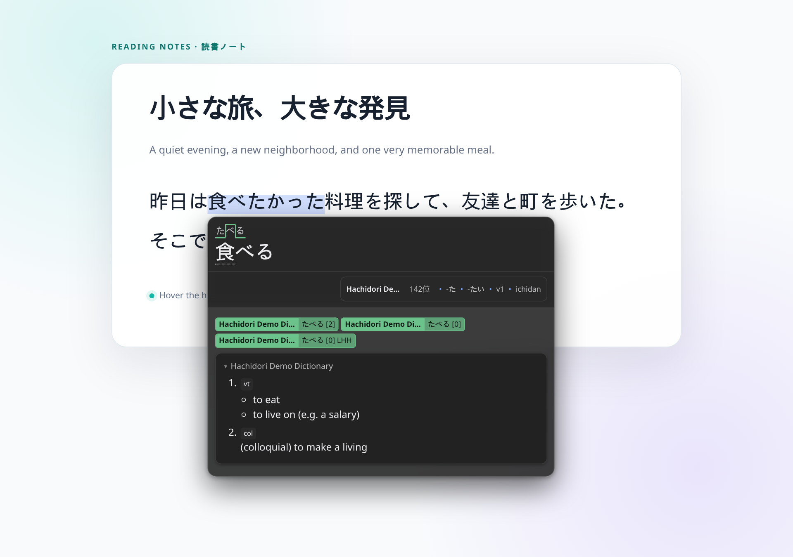
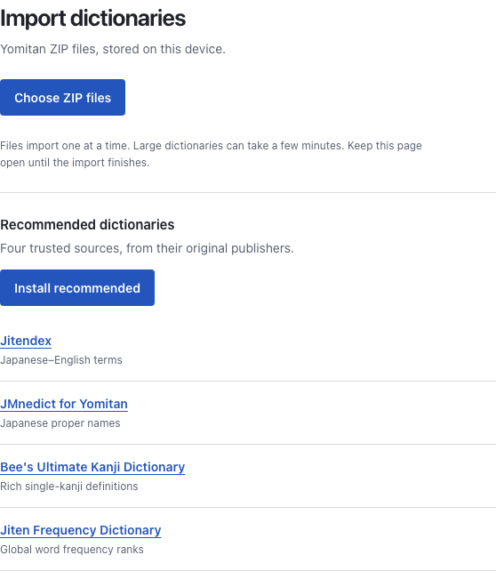
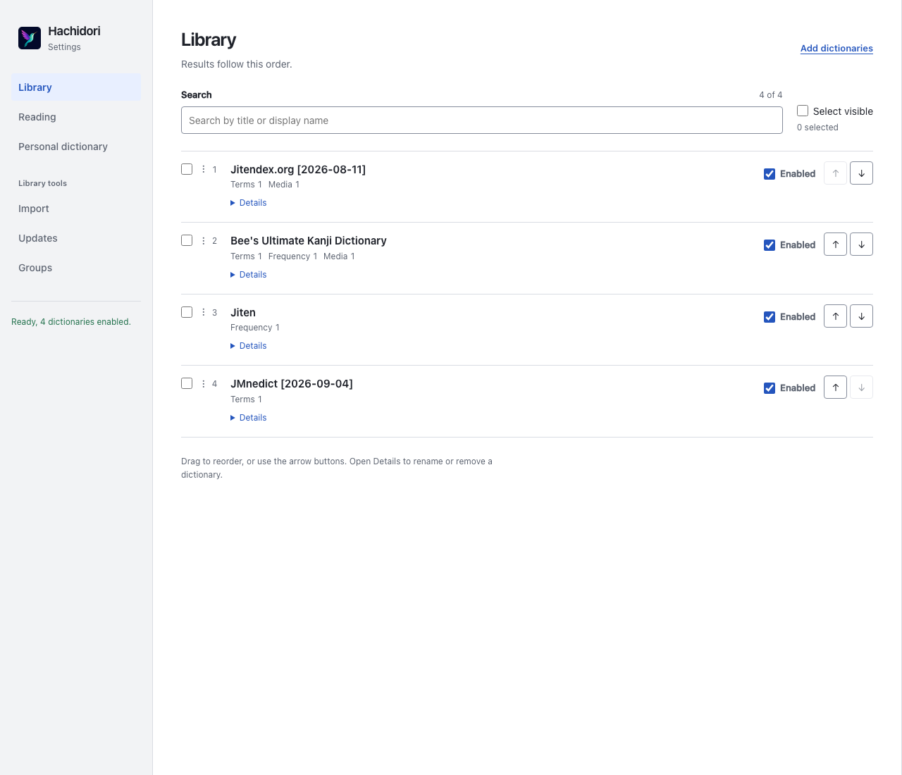
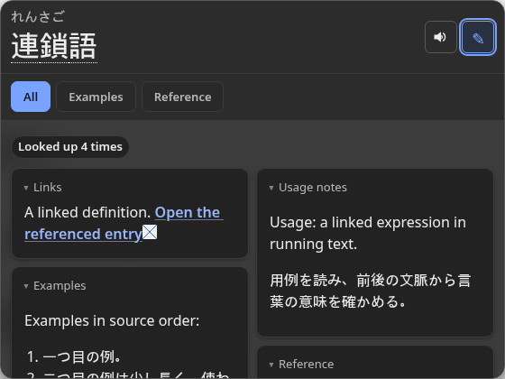
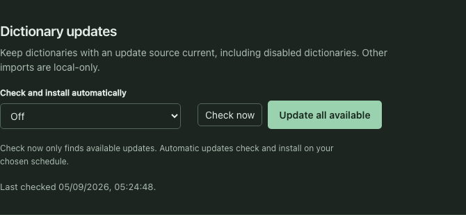
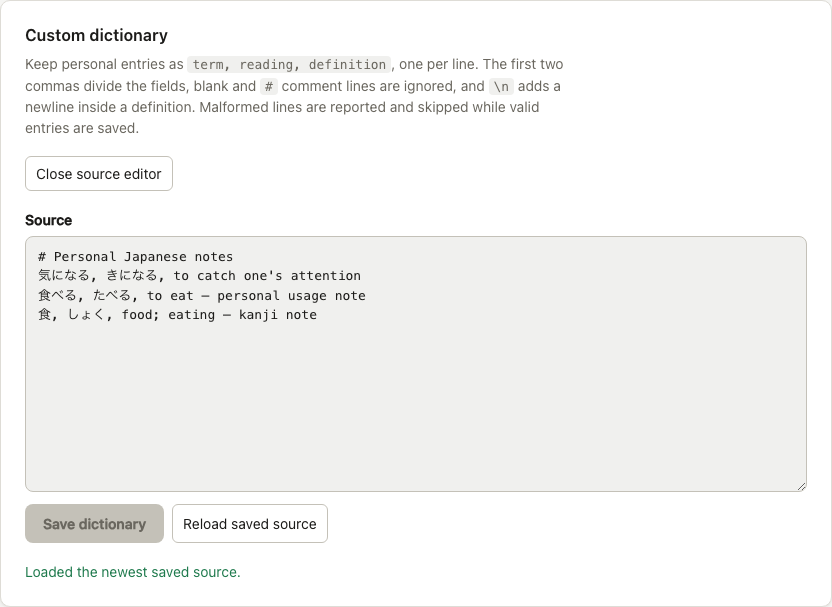
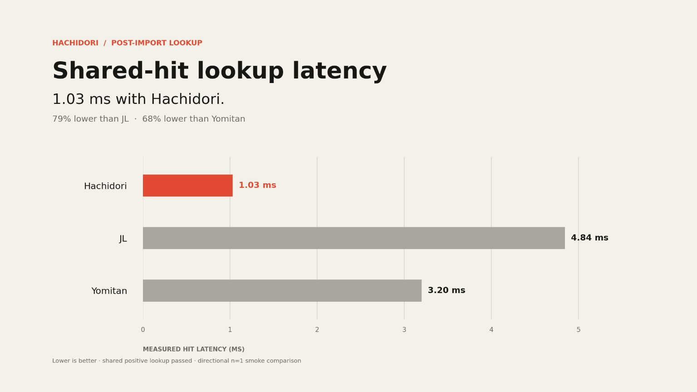

<p align="center">
  
</p>

<h1 align="center">Hachidori</h1>

<p align="center"><strong>Your Japanese dictionaries, on every webpage — fast, private, and entirely in Chrome.</strong></p>

<p align="center">
  <a href="LICENSE"></a>
  <a href="#install-in-60-seconds"></a>
  <a href="#privacy-by-default"></a>
  <a href="https://sonarcloud.io/summary/new_code?id=bee-san_hachidori"></a>
  <a href="https://github.com/bee-san/hachidori"></a>
</p>

<p align="center">
  <a href="#install-in-60-seconds">Install</a> ·
  <a href="#use-it">Usage</a> ·
  <a href="#benchmarks">Benchmarks</a> ·
  <a href="#hachidori-vs-the-alternatives">Compare</a> ·
  <a href="docs/architecture.md">Architecture</a> ·
  <a href="CONTRIBUTING.md">Contributing</a>
</p>

Hachidori turns any Yomitan-compatible `.zip` dictionary into instant Japanese definitions on the page you are reading. Hover a word, see the matching entry, and keep reading. You do not need a native helper, local server, account, or network lookup.

## Install in 60 seconds

```sh
git clone https://github.com/bee-san/hachidori.git
```

1. Open `chrome://extensions`.
2. Enable **Developer mode**.
3. Choose **Load unpacked** and select the cloned `hachidori/extension` directory.
4. Open Hachidori's **Options**, install the four recommended dictionaries or import your own Yomitan `.zip`, then hover Japanese text on any page.

Hachidori requires Chrome 118 or newer. The WebAssembly bundle is committed, so using the extension needs no build step and no submodules.

## See it in action

<p align="center">
  
</p>

Hachidori scans forward from the character under your pointer, deinflects forms such as `食べたかった` to `食べる`, ranks matches using your chosen dictionaries, and renders the result beside the text.

Open the small `食べたかった → 食べる` disclosure below the headword to see
the ordered deinflection steps. It starts closed and supports keyboard
Enter/Space. [Expanded example](docs/assets/deinflection-disclosure.png).

Select text to look up that exact selection instead. Selection lookup works
without holding the hover key and is not restricted to Japanese text. In
Settings, turn off **Japanese text only** to scan other languages automatically
too. Page editors are excluded from text scanning.

## Why Hachidori?

- **Bring your own dictionaries.** Import the same open Yomitan `.zip` ecosystem used by established Japanese-learning tools.
- **Stay on the page.** Definitions appear beside the word under your pointer, including structured content, images, frequencies, pitch accents, and kanji details.
- **Keep lookups private.** The engine, your dictionaries, and every lookup stay inside Chrome.
- **Keep the tool focused.** Hachidori does dictionary import and hover lookup instead of becoming a full study suite.

## Use it

<p align="center">
  
</p>

Open Hachidori's options page to:

- install Jitendex, JMnedict for Yomitan, Bee's Ultimate Kanji Dictionary, and Jiten Frequency Dictionary in one click;
- import one or more Yomitan dictionaries;
- enable or disable dictionaries without losing their place in your library;
- search titles and aliases, select visible matches, and bulk enable, disable, favourite, or unfavourite them;
- reorder dictionaries by dragging, with the arrow buttons, or by entering a position;
- create ordered dictionary groups and arrange each group's dictionaries;
- check managed dictionaries for updates or install them on one global schedule;
- maintain a personal dictionary from editable source, and add entries from term or kanji popups;
- configure the hover key, delay, scan length, result limit, frequency ranking, and the dictionary opened when you click a kanji.

Selecting a frequency dictionary chooses its direction from the dictionary's
metadata: ascending for ranks, descending for occurrence counts (or an
undeclared mode). You can reverse it manually or use **Auto direction** to
restore that choice. **Any** uses automatic ranking across all enabled frequency
dictionaries; **Disabled** turns frequency sorting off.

Settings opens with your library in lookup order. The navigation shows one task
at a time: Library, Reading, Personal dictionary, Import, Updates, or Groups.
Drafts survive switching sections; pending work, errors, and unseen completion
messages remain visible in the navigation. Both light and dark themes follow
your system preference. Open a dictionary's **Details** for its display name,
import metadata, exact position, or removal. Bulk actions appear when you select
dictionaries; disabled dictionaries stay readable and editable.

Lookup preferences save automatically after a short delay. The save status shows
when changes are durable. If another Settings page changes them first, your draft
stays visible: choose **Save my changes** to retry or **Use saved settings** to
discard it. Already-open readers accept only newer committed settings, without
reloading dictionaries. [Lookup settings screenshot](docs/assets/lookup-settings.png).

<p align="center">
  <picture>
    <source media="(prefers-color-scheme: dark)" srcset="docs/assets/settings-dark.png">
    
  </picture>
</p>

Selected dictionaries import one at a time, with an outcome retained for every archive; a failure does not stop the rest. The starter installer behaves the same way and retries only recommendations that are still missing. Large dictionaries can take several minutes, so keep the page open until the batch finishes.

The kanji dictionary chooser accepts both traditional Yomitan kanji dictionaries and term dictionaries with single-kanji entries.

Popup tabs show All, each contributing dictionary, Favourites, and your saved
groups. They filter the returned definitions without another lookup. Renaming or
reordering groups updates open readers; a Note draft or linked child keeps its
current definitions until it is safe to apply changed membership. **Reading →
Definition columns** lays out complete dictionary cards in one to four columns
without replacing an open Note form.

**Reading → Compact summary** adds up to six brief snippets beside each
headword, with a small leading image when available. Choose a preferred
dictionary or let the current tab supply the first available definition.
Summaries are off by default; full definitions and lookup order are unchanged.



[Reading controls, light theme](docs/assets/dictionary-tabs-settings-light.png) ·
[Reading controls, dark theme](docs/assets/dictionary-tabs-settings-dark.png)

Dictionary cross-reference links open beside their parent definition. Follow a
chain without losing earlier entries; **Back** returns from kanji within the
same pane, then closes that child. Each pane keeps its own Note draft. In
**Reading**, **Maximum child popups** defaults to 10; set it to 0 to disable
linked children. Ordinary glossary text is not scanned for nested lookups.


<p align="center">
  
</p>

Recommended dictionaries and imported dictionaries that declare complete HTTPS
update sources are managed. **Check now** queries every managed dictionary,
including disabled ones, and records availability without downloading an
archive. Install one available update, install them all, or choose one global
hourly, daily, weekly, or monthly schedule; scheduled checks install available
updates automatically. Local archives without an update source remain
local-only. Replacements keep the package's identity, position, alias,
enabled/favourite state, and group memberships.

### Custom dictionary and Note

<p align="center">
  
</p>

Open **Custom dictionary** in Options to keep personal entries as readable text.
Each entry is `term, reading, definition`; only the first two commas are
separators, so a definition may contain commas. Blank lines and lines beginning
with `#` are ignored. Use `\n` for a newline in a definition, `\\` for a literal
backslash, and `\\n` for a literal backslash followed by `n`. Saving reports
every malformed line and compiles all valid lines in their original order,
including duplicates. Saving no valid entries removes the compiled custom
dictionary while retaining the source.

The compiled package is always enabled and first, while its alias and favourite
state remain editable. The **Note** action in both term and kanji views prefills
from the result currently shown; saving appends the entry and refreshes that
exact popup view.

## Benchmarks

This directional smoke comparison uses the full **VNDB Characters by Bee** dictionary: 6,648,310 term rows, 146,570 media files, a 291.7 MB archive, and 4.46 GB expanded.

<p align="center">
  
</p>

<p align="center">
  
</p>

<p align="center">
  
</p>

## Hachidori vs the alternatives

| | **Hachidori** | **Yomitan** | **hoshidicts CLI** |
| --- | --- | --- | --- |
| Best for | Focused hover lookups | A complete browser study workflow | Native and command-line integrations |
| Runs in the browser | Yes, including the engine | Yes | No |
| Imports Yomitan dictionaries | Yes | Yes | Yes |
| Hover popup on ordinary pages | Yes | Yes | No built-in browser popup |
| Native helper or local server needed | No | No | The native program itself |
| Audio, Anki, and mining workflows | Deliberately out of scope | Built in or integrated | Build your own integration |

Choose Hachidori when you want the shortest path from a Yomitan dictionary to a private hover definition. Choose Yomitan when you want the broader study ecosystem; choose the hoshidicts CLI when you want the native engine outside a browser.

## Privacy by default

Lookups make no network calls. Your dictionaries and lookup text stay in Chrome, and the bundled WebAssembly engine queries them locally.

Opening an external reference in a definition navigates to that HTTP(S) website
in a new browser tab. This happens only when you activate the link; rendering a
definition does not fetch its external links.

The optional starter action downloads its four named archives directly from the
publishers linked on the Options page. Manual update checks and scheduled update
runs request managed dictionaries' HTTPS indexes; installing an update also
downloads its HTTPS archive. A generic index may select a new HTTPS archive URL,
while recommended sources remain pinned to their built-in catalogue entries.
Importing a local ZIP and every lookup remain local. Imported dictionaries are
persisted in Chrome's extension storage.

Custom-dictionary source and its generated indexes also stay in Chrome. Saving
or appending a Note compiles them locally and makes no network request.

Only import dictionaries you trust. Hachidori validates the archive title before the engine creates its on-disk directory, but dictionary-supplied content and CSS still come from the archive you choose.

## Documentation

- [Architecture and WebAssembly build](docs/architecture.md)
- [Test harness and guarantees](test/README.md)
- [Contributing](CONTRIBUTING.md)
- [Issues and support](https://github.com/bee-san/hachidori/issues)

## Build and test

Building the bundled engine requires [Emscripten](https://emscripten.org/docs/getting_started/downloads.html) and CMake:

```sh
git clone --recurse-submodules https://github.com/bee-san/hachidori.git
cd hachidori
. ./wasm/env.sh && ./wasm/build.sh
```

The fast checks use the committed WebAssembly bundle:

```sh
node test/make-fixture.mjs
node test/node-smoke.mjs
node test/extension-smoke.mjs
```

The [test guide](test/README.md) explains the real-Chrome E2E test, dependencies, fixed assertion counts, and native baseline.

## Contributing

Bug reports, focused pull requests, and documentation improvements are welcome. Start with [CONTRIBUTING.md](CONTRIBUTING.md); if you are unsure where a change belongs, [open an issue](https://github.com/bee-san/hachidori/issues/new).

## Credits

Hachidori is powered by [hoshidicts](https://github.com/Manhhao/hoshidicts) by Manhhao. Its popup renderer, structured-content renderer, furigana segmentation, and CSS are ported from [GameSentenceMiner PR #549](https://github.com/bpwhelan/GameSentenceMiner/pull/549), which adapts [Hoshi Reader](https://github.com/Manhhao/Hoshi-Reader) and [Yomitan](https://github.com/yomidevs/yomitan). See the full [renderer attribution](extension/render/ATTRIBUTION.md).

## License

Hachidori is available under [GPL-3.0-or-later](LICENSE), matching hoshidicts and the ported GameSentenceMiner code.
