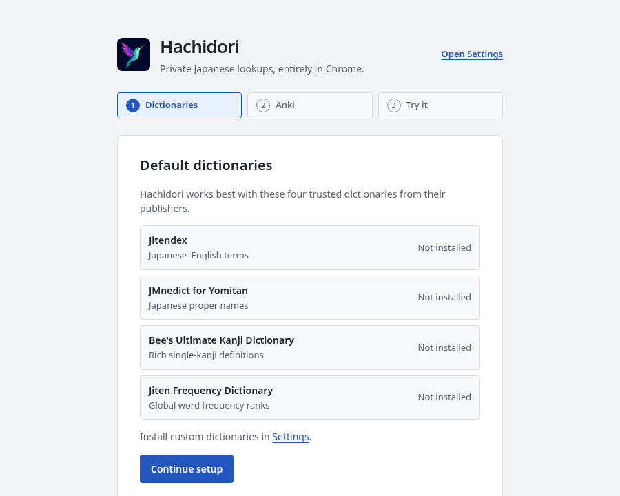

<p align="center">
  
</p>

<h1 align="center">Hachidori</h1>

<p align="center"><strong>Your Japanese dictionaries, on every webpage — fast, private, and entirely in Chrome.</strong></p>

<p align="center">
  <a href="LICENSE"></a>
  <a href="#install-in-60-seconds"></a>
  <a href="#privacy-by-default"></a>
  <a href="https://sonarcloud.io/summary/new_code?id=bee-san_hachidori"></a>
  <a href="https://github.com/bee-san/hachidori"></a>
</p>

<p align="center">
  <a href="#install-in-60-seconds">Install</a> ·
  <a href="#use-it">Usage</a> ·
  <a href="#benchmarks">Benchmarks</a> ·
  <a href="#hachidori-vs-the-alternatives">Compare</a> ·
  <a href="docs/architecture.md">Architecture</a> ·
  <a href="CONTRIBUTING.md">Contributing</a>
</p>

Hachidori is a blazing fast Japanese Dictionary Chrome Extension that is feature rich and optionated.

## Install in 60 seconds

```sh
git clone https://github.com/bee-san/hachidori.git
```

1. Open `chrome://extensions`.
2. Enable **Developer mode**.
3. Choose **Load unpacked** and select the cloned `hachidori/extension` directory.
4. Hachidori opens a short setup tab on its first install. Open **Settings** from it, install the four recommended dictionaries or import your own Yomitan `.zip`, then hover Japanese text on any page.

Hachidori will automatically open a new tab to install the reccomended dictionaries and auto-connect to Anki for you.

<p align="center">
  
</p>

The setup tab uses the Settings theme in light and dark mode, walks through **Dictionaries → Anki → Try it**, and enables three-line compact definition summaries once as an initial preference. It appears only for a fresh installation: updates and restarts never reopen it or reset your settings. Closing it loses nothing; Settings shows **Resume setup** until you finish.

# Blazing Fast

Hachidori is 83 times faster than the worlds most popular Japanese dictionary app at importing dictionaries.

<p align="center">
  
</p>

It is even 3.5 times faster at looking up words.

<p align="center">
  
</p>

# Recording Mode

Hachidori can record your screen and audio, and when you mine it will add the Sentence Audio and an animated gif of your game to your Anki card for you.

# Custom Dictionary

Do you keep on seeing a name pop up over & over again in a book, but it's not in the dictionary? 

With Hachidori, you can highlight the word and add it as a custom definition.

# Optionated

Hachidori is an optionated program. If it does not benefit me, the creator, personally than I will not add that feature.

For contributors, please try to imagine yourselves in my shoes as a Japanese learner. I mainly read visual novels and manga. Specifically what about your feature request will benefit me?

I do this because I am a pretty average learner, and if I make this tool great for myself than I am making it great for the average Japanese learner.

I will not mindlessly merge PRs that add nothing for me other than bloat.

# AI Usage

This program was created with the assistance of AI. I used GPT 5.6 Ultra, and then GPT 6.0 Astra Ultra exclusively. 

I have reviewed all plans, I set the direction of how this program works. Most pull requests are reviewed. Large parts of the program such as the actual dictionary core are hand-written. 

On top of this, there are countless tests. At some points I even had Astra Ultra work for 26 hours straight benchmarking & using every part of the program to ensure it was good (it found many bugs).

I also have personally been using this for months, and as I am the main user of this program I find bugs pretty often which I fix.

## Credits

Hachidori is powered by [hoshidicts](https://github.com/Manhhao/hoshidicts) by Manhhao. Its popup renderer, structured-content renderer, furigana segmentation, and CSS are ported from [GameSentenceMiner PR #549](https://github.com/bpwhelan/GameSentenceMiner/pull/549), which adapts [Hoshi Reader](https://github.com/Manhhao/Hoshi-Reader) and [Yomitan](https://github.com/yomidevs/yomitan). See the full [renderer attribution](extension/render/ATTRIBUTION.md).

## License

Hachidori is available under [GPL-3.0-or-later](LICENSE), matching hoshidicts and the ported GameSentenceMiner code.
