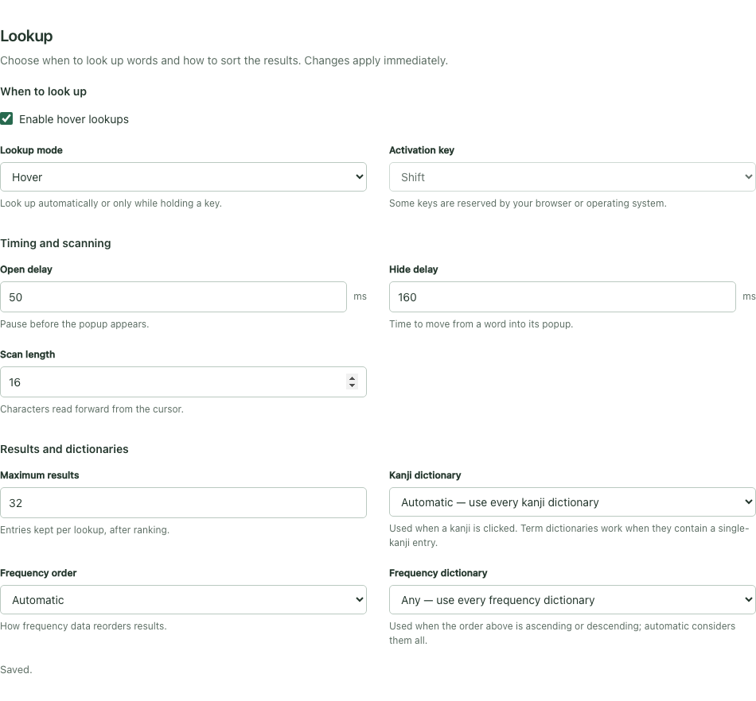
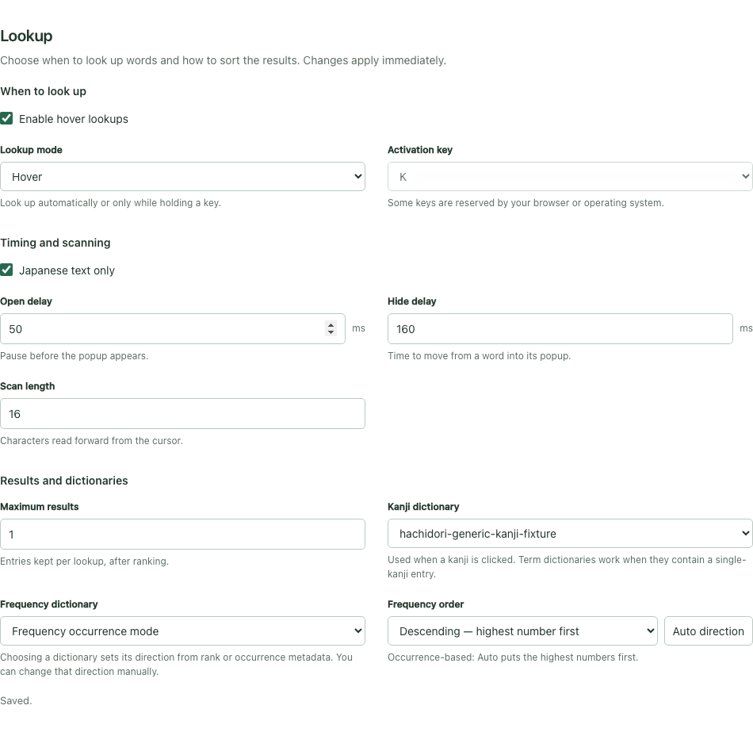
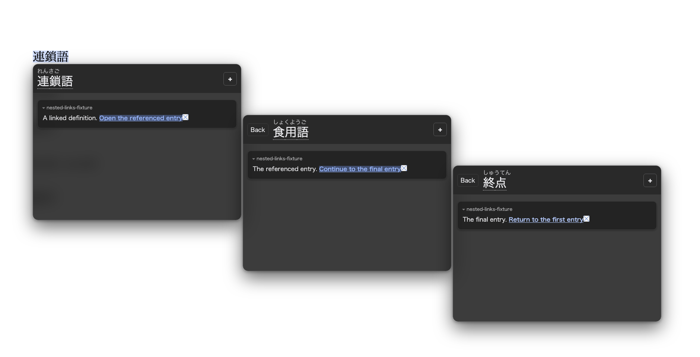
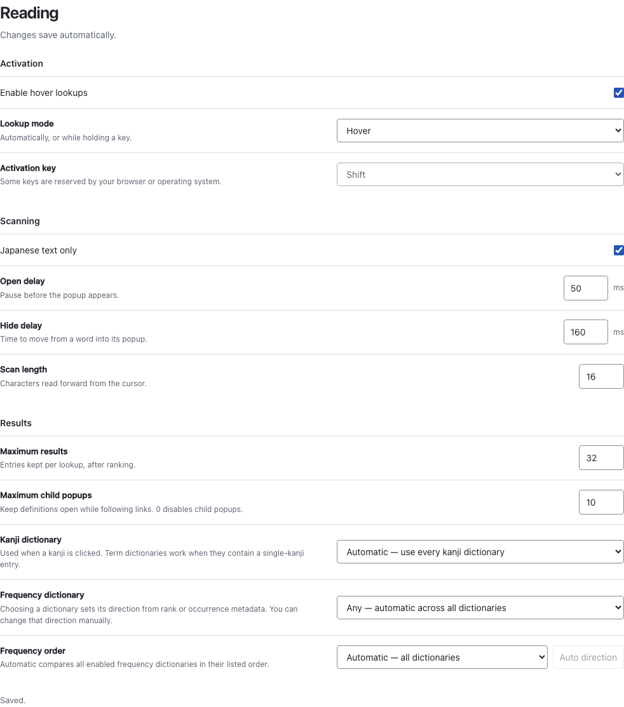
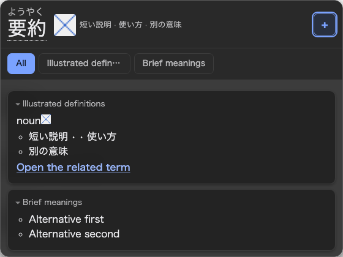
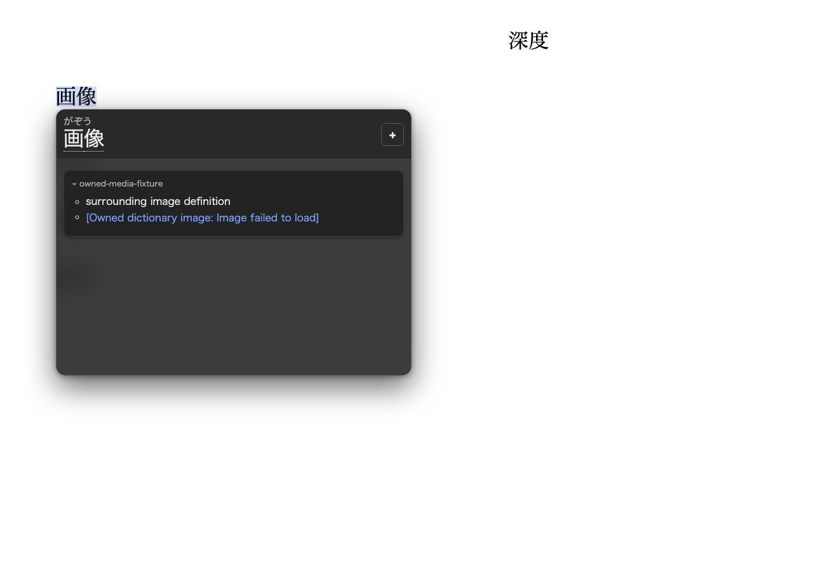
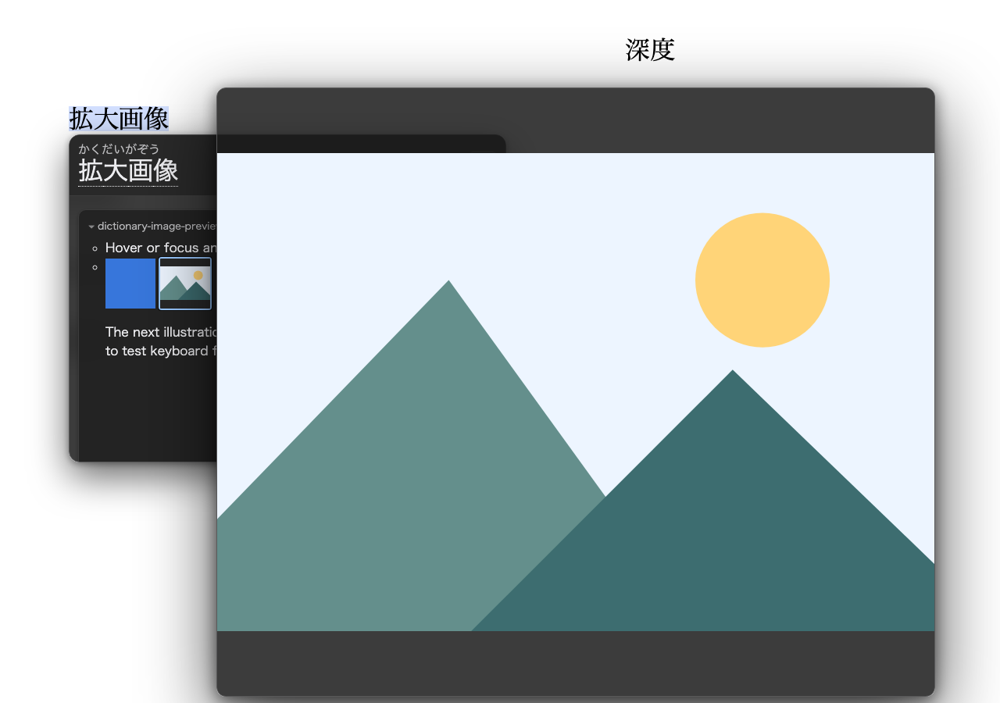
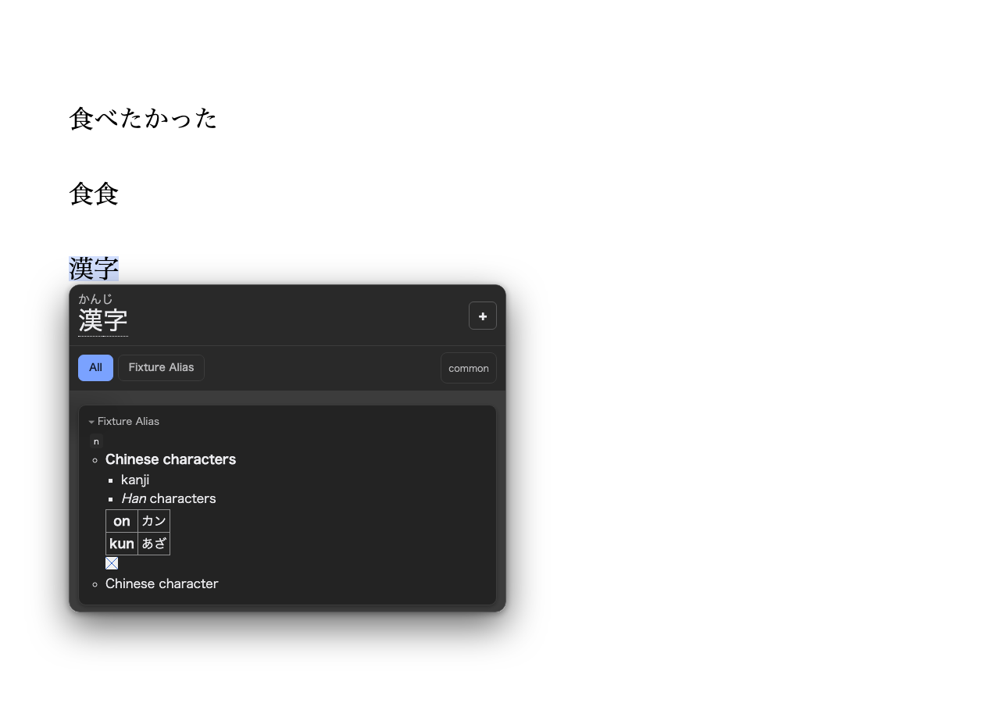

# Architecture

Hachidori is a Manifest V3 Chrome extension with a native C++ dictionary engine compiled to WebAssembly. Extension pages send typed runtime messages; the service worker routes them to an offscreen document whose lifetime is independent of service-worker idling.

## Runtime layout

```text
web page
  └─ content.js
       ├─ scans Japanese text near the pointer
       ├─ renders the popup in a closed shadow root
       └─ appends popup Note entries to the managed custom source

settings.html / content.js
  └─ chrome.runtime.sendMessage
       └─ background.js (MV3 service worker)
            ├─ owns chrome.storage.local dictionary metadata
            ├─ atomically owns the revisioned custom source document
            ├─ checks managed update indexes and owns one periodic alarm
            ├─ creates or reconnects to offscreen.html
            └─ relays requests without holding engine state
                 └─ offscreen.js
                      ├─ probes pthread, shared-memory, and direct-OPFS support
                      ├─ primary: engine-worker.js
                      │    └─ pthread Wasm + WasmFS direct OPFS
                      └─ fallback: engine-service.js
                           └─ single-thread Wasm + IDBFS
```

The service worker can be terminated after an idle period without discarding loaded dictionaries. A later request recreates the routing context while the offscreen engine remains authoritative. Runtime requests carry explicit IDs, generations, and result message types so stale or malformed replies fail closed.

## Primary engine path

On supported Chrome builds, `offscreen.js` starts a dedicated module worker after proving all three capabilities:

- `crossOriginIsolated` and shared `WebAssembly.Memory`;
- module workers;
- a synchronous access handle from the origin-private file system.

`engine-worker.js` loads the pthread WebAssembly build. WasmFS mounts direct OPFS at `/dicts`, so the C++ engine reads its generated indexes without copying them through IndexedDB or the JavaScript heap. The extension manifest supplies the cross-origin isolation policy required by shared Wasm memory and exposes the generated pthread worker asset.

The worker serializes engine mutations and bounds pending requests. Imports,
reimports, managed replacements, custom saves and Note appends, removals, and
reloads cannot race each other.
The offscreen bridge reserves one of its existing 128 pending-request slots
before awaiting capability selection or fallback module loading. The same
admission and mutation lock cover both backends: while a mutation is pending,
other non-status requests fail busy. A saturated or mutating bridge answers
status from its last-known snapshot; before backend selection this snapshot
reports loading without claiming a storage backend. Normal status requests
still reach the engine, including its reload recovery path.

Replies, local handler failures, and thrown worker dispatches release their slot
and mutation lock through one settlement path. Engine startup or worker failure
settles every admitted request once; a late worker reply cannot settle it again.
There is no mutation deadline: a slow custom append must not appear failed while
it can still commit. This admission limit is a transport bound, not a dictionary,
archive, source-document, or background-storage-queue limit.

## Compatibility path

If shared Wasm memory, workers, or direct OPFS are unavailable, `offscreen.js` loads the single-thread WebAssembly module locally. That build mounts IDBFS at `/dicts`, restores it before opening dictionaries, and synchronizes generated files after a successful import.

The fallback is intentionally explicit: `hd_status` reports `threaded: false` and `storageBackend: "idbfs"`. The production benchmark rejects fallback execution when it is measuring the primary Hachidori path.

## Import transaction

Each dictionary import follows one logical transaction:

1. `settings.html` takes the next local ZIP, or downloads the next missing entry from the built-in recommendation catalogue, and sends `hd_import`.
2. The service worker transfers the archive to the offscreen document.
3. The engine worker imports Yomitan banks through the Hoshidicts C++ importer into a fresh `/dicts/.hdw-generation-<UUID>/<title>` root. A committed root is never overwritten in place.
4. The generated files are flushed to the storage backend before metadata can reference them.
5. The candidate's exact manifest path is strict-loaded, including disabled packages, before the service worker compare-and-set commits it.
6. Only a confirmed commit publishes the new dictionary count and generation.
7. The engine re-reads authoritative state before garbage-collecting unreferenced generation roots.
8. The settings page renders success only after that reply.

Multiple selected archives remain separate transactions. The settings page runs
them sequentially, keeps an outcome for each file, continues after a failed
archive, and refreshes dictionary state and engine status once after the batch.
Recommended downloads use that same sequence. Settings passes only the frozen
catalogue ID and the response's final URL; before committing the candidate, the
engine resolves the ID itself and validates the final URL, title, update index,
revision, and defining capability. Only then does the package gain its optional
`sourceId` and catalogue-owned update URLs.

If a compare-and-set result is unknown because both the commit reply and its readback fail, both the previous and candidate roots are retained. Revisioned manifest paths are authoritative on restart: the engine strict-loads those paths and removes unreferenced generations rather than adopting them from disk. The IDBFS startup path also resolves imports left by the older `.hdw-import` protocol. The archive input itself is not retained.

Removal first strict-loads the remaining manifest, then commits it, publishes the
new state, and finally garbage-collects the removed generation. The
`/dicts/.hdw-remove` handling remains only for recovery of dictionaries stranded
by the older removal protocol, including a legacy dictionary whose real title
was `.hdw-remove`.

## Managed update cycle

The service worker derives managed candidates from `dictionaryState`, including
disabled packages. Recommended candidates use the source pinned in the built-in
catalogue; generic candidates need complete credential-free HTTPS index and
archive descriptors. These trust and schedule rules live in one native ES
module shared by the worker, engine, and Settings page.

**Check now** fetches each candidate's index and records `up-to-date`,
`update-available`, or `check-failed` against that package generation. It does
not download archives. There is one global Off/hourly/daily/weekly/monthly
setting and one Chrome alarm. An alarm runs the same checks and automatically
installs available revisions, including revisions for disabled packages.

An install carries the checked package ID, generation path, installed revision,
source descriptor, check time, expected remote revision, and selected archive
URL into the engine mutation queue. Recommended archives remain
catalogue-pinned; a generic index may select a different credential-free HTTPS
archive URL. The engine validates the response's final URL and generated index,
then revalidates the complete fingerprint at the commit snapshot. The fresh
generation and its `up-to-date` status are published in the same package CAS;
an ordinary reimport clears generation-bound check state. A stale check or
failure status is applied only while its captured fingerprint still matches.

The background storage queue is not held while the offscreen engine downloads,
imports, or commits. Presentation-only edits may advance state during that work,
so the engine cleans generations against the latest authoritative package paths
after publication. A title collision, changed fingerprint, wrong archive
revision, or failed import leaves the working generation loaded and reports the
failure without publishing the candidate.

## Hover activation and popup ownership

The reader has one live `hoverEnabled` switch and `lookupMode` (`hover` or
`activation`). Existing plain-hover behavior remains the default; the configured
activation key defaults to Shift. `reader-options.js` translates legacy
`modifier` values into the canonical mode/key on read and accepts old Settings
patches through the same revision CAS. Explicit modern fields win, and selecting
Hover does not erase the remembered key. Canonical writes contain no competing
modifier policy. Letters, digits, punctuation, named browser keys and F1–F24 are
supported; browser/OS-reserved keys remain subject to their native behavior.

The existing 0–2,000 ms open delay defaults to 50 ms and also applies to a key
pressed over a stationary pointer. Hide/transfer delay defaults to the existing
160 ms, with the pinned source's 0–5,000 ms range. These are one global setting
pair, not per-dictionary policies. Zero hide delay dismisses immediately.

Disabled readers do not create pointer scan timers. Activation-gated readers
remember the pointer but do not scan or schedule until the key is held. Modifier
flags handle entering a tab while holding Shift/Control/Alt/Meta; a printable
key's physical code pairs its release even when Shift changes its character.
Repeated keydown is ignored, including Escape: a fresh Escape closes Note first,
then a separate press closes the popup. No page key is captured for activation.

Key release, target/window departure, outside click, Escape, blur and scroll
cancel delayed or unfinished pointer work immediately; the hide delay only
retains an already-rendered popup for transfer. Same-candidate hover, popup entry,
keyboard focus and Note editing preserve the current view. Dispatching a different
valid pointer candidate retires the previous popup, matching the pinned reader's
`queueLookup` prune-before-send behavior: an obsolete view cannot accept a Note
or resume expired glossary/media callbacks. Interaction-only settings changes do
not invalidate current rendered resources; result-affecting settings still do.
Hidden retirement clears the DOM and owners immediately without a redundant
scroll reset; every visible term, kanji or notice render still resets scrolling.

Disabling explicitly closes even a focused popup or Note draft, while an already
dispatched Note append finishes its transaction without reopening or refreshing
the disabled reader. Settings changes reach existing tabs and persist through a
full browser restart without reloading the engine.



## Page scanning and exact selections

Automatic scanning crosses ordinary inline elements and stops at editing
controls or contenteditable text. A focused page editor suppresses pointer and
activation-key lookup without capturing typing. The live `onlyScanJapaneseText`
option defaults to true; disabling it permits other scripts in automatic scans.
Repeated pointer events for one pending candidate share its lookup, while a
changed anchor/query or failed request can start fresh work.
Retained selections are rechecked through the existing pointer throttle rather
than rebuilding their visible string on every mousemove; selection-change and
mouseup lookups still dispatch immediately.
Focus checks follow nested open page shadow roots, and editor focus cancels both
delayed and already-dispatched candidate work. Closed page shadow roots expose
only their host through browser focus/event APIs; their private editors cannot
be inspected. The reader does not intercept shadow creation or block every
focused component to guess at those internals.

An explicit page selection takes priority over pointer scanning and bypasses
the language and activation-key gates, but not reader disablement or editing
exclusions. Lookup waits until the mouse drag ends. It sends the complete visible
selected string without trimming or truncation and accepts only results whose
`matched` text equals that string. Selection length overrides the configured
scan length within the existing engine scan window; a prefix-only result is not
an exact match. A miss retains selection ownership until the selection changes
or is dismissed, so pointer movement cannot silently replace it with a prefix.

The visible query and raw DOM highlight span are stored separately: hidden text
and block separators can make `Selection.toString()` differ from `Range.toString()`.
Reverse/cross-inline ranges retain their exact source offsets. Selecting a
glossary inside our closed shadow root preserves the current view. Pending
selection replies share pointer cancellation and are rejected after dismissal
or relevant storage invalidation; that invalidation also releases completed hits
and misses for a fresh attempt with the new dictionaries or result options.
Initial selection replies also revalidate the selected text, so an in-flight
page edit cannot display an obsolete result. Escape dismisses retained misses
even when it is also the activation key. Note refresh and kanji Back replay the
stored exact descriptor even if editing has collapsed the page selection,
while an internal link uses its own query, reading and prefix-matching mode.
Visibility checks distinguish hidden subtrees (`display:none`) from inherited
`visibility:hidden`, whose children can restore visible text or editing surfaces.

## Frequency ranking controls

The generated Yomitan index's optional `frequencyMode` survives package metadata,
Settings presentation writes, reimports and reload reconciliation. Existing
packages recover it from their committed generation's index without a new schema
or WebAssembly build.

Selecting one enabled frequency dictionary saves its title and inferred direction
in one existing options patch: `rank-based` selects ascending; `occurrence-based`
or an undeclared mode selects descending. The explicit **Auto direction** button
reapplies that mapping. Manual directions remain unchanged during rendering,
metadata updates and restart. These are numeric directions, not universally
"common first" or "rare first" labels.

**Any** selects the existing native automatic mode, comparing enabled frequency
dictionaries in manifest order with numerically ascending values per dictionary.
It does not reinterpret mixed occurrence/rank metadata. **Disabled** bypasses
frequency ranking. Selecting Automatic or Disabled in the order control remembers
the inactive selected dictionary; choosing Any explicitly clears that selection.
Only an explicit dictionary selection or Auto action derives a numeric direction.

An unavailable choice remains visible until authoritative options change, with
manual directions and Auto unavailable. The background still prunes removed or
disabled dictionary references in its state commit; Settings does not race that
commit with a local rewrite. A focused chooser retains its native draft and CAS
base across incoming events, but refuses a choice that lost frequency capability
before the change event completes.



## Lookup response boundary

The native bridge rejects lookup text, primary reading, and frequency-dictionary
options above 4 KiB of UTF-8; term traces above 32 steps; a raw glossary above
8 MiB; and aggregate copied lookup strings above 32 MiB. It claims each string's
bytes before allocating its wire copy. The same copy pass detects control bytes;
only replies that need full control escaping use the serializer's larger
worst-case allocation. JSON serialization preserves every control byte, including
NUL, and independently rejects native responses above 32 MiB.

The engine service also checks the complete serialized public reply, including
its type, correlation ID, generation, and payload, against 32 MiB. A conservative
length bound avoids serializing ordinary native results twice; near the boundary
it measures the actual UTF-8 JSON without truncating fields. Invalid native
response envelopes fail instead of masquerading as successful misses. Correlation
IDs remain intact whenever the bounded error can fit; an ID that cannot fit even
that error is refused before lookup and receives a null ID. Shared error framing
also covers service-worker relay, offscreen busy/queue, and worker failures that
occur before the engine handler, without remeasuring successful relayed results.

An oversized or failed lookup leaves the loaded generation usable. The content
script clears the failed request's popup, but an older failed request cannot
hide a newer result. These are lookup transport bounds, not archive-size,
dictionary-entry, source-document, or media-count product limits.

Structured glossary traversal rejects values beyond depth 24 or 1,048,576
visited values per glossary, rather than silently truncating content. Containers,
wrappers, and ignored values consume the same traversal budget as rendered text
and elements; ordinary unknown-wrapper child text and literal glossary fallback
remain supported. Rendering still uses one traversal after JSON parsing.

Deferred glossary fills and their layout callbacks belong to both the current
lookup request and the current result panel. A newer pending request, a tab
projection, clear, or destroy invalidates obsolete work before it can render or
request media. Initial synchronous render errors reach the content-script catch;
later tab, expansion, and deferred errors clear only their owning current view.

### External dictionary links

`external-links.js` shares absolute HTTP(S) URL normalization between the classic
glossary renderer and module service worker. Credentials, embedded control
characters, malformed URLs and other schemes are rejected. The renderer retains
its existing 4,096-character href boundary; the gateway adds no product cap.
Current, connected anchors route click/Enter and middle-button activation through
the content script's correlated `hd_open_external` worker request. The captured
URL cannot be replaced by editing the DOM href. Handled nested actions do not
bubble into a second link, and stale anchors cancel native navigation too.

The worker independently validates URL, extension sender and boolean tab
activation, then calls `chrome.tabs.create` once in the sender's browser window,
without an opener, storage queue or engine relay. Normal and Shift activation
open a foreground tab; Ctrl/Meta or middle-click open a background tab unless
Shift is held. Shift deliberately opens a tab, not a separate window. A failed
or missing reply is logged without retry, native fallback or lookup/Note changes.
Safe hrefs and `noopener noreferrer` remain for Copy link and native browser
context-menu commands; those browser-owned commands do not emit routed clicks.
No dictionary frame, fetch, new permission or configurable action is introduced.

### Linked definition popup chains

Activating a structured internal link opens a child beside its parent, using the
link's exact query and primary reading, not its displayed label or page-scan
offsets. This is linked-query navigation, not automatic scanning of glossary
text. The revisioned `popupNestingMaxDepth` option defaults to 10 children; zero
disables child navigation, and a nonnegative safe integer is accepted without a
second product cap. At the configured depth or without drawable viewport space,
activation retains the existing chain without allocating a pane or sending a
lookup. Lowering the depth prunes existing excess descendants immediately.

One closed shadow host and stylesheet serve the chain. Each lazily constructed
level has a stable object identity, renderer, scoped source highlight, request
token, exact current request, kanji Back snapshot, and Note state. Pruned objects
are retired before clearing their hidden DOM or destroying renderer callbacks;
a late reply cannot acquire a replacement object at the same numeric depth.
The same pending/current linked query reuses its child. Another link or a parent
tab redraw prunes only that parent's descendants. A child miss or failure does
not dismiss its ancestors. Kanji Back first restores that child's term request;
its next Back closes the child and returns focus to its connected source link.

Keyboard link activation focuses the child's Back control; mouse activation
does not invent keyboard focus that would block pointer-return pruning. Returning
to an ancestor prunes descendants after the normal hide delay, unless a draft,
pending Note append, or deliberate keyboard focus still protects them. Pointer
transfer uses actual pane rectangles and narrow connecting gaps, with 80 ms grace
before resuming the current page scan. No layout is read in raw mousemove before
the existing throttle. Children prefer available space beside their parent and
clamp to the viewport; narrow screens may overlap panes. Layout callbacks start
at their owning level and reposition descendants without redoing ancestor layout.
Dirty panes share one animation-frame batch: each runs its own masonry before
one linear placement pass from the shallowest live owner in that same frame.
Width changes can queue a following ResizeObserver batch without losing work
or adding a separate placement frame. A single pane also lays out and positions
in one frame. Direct Note, image and navigation positioning remains synchronous;
renderer destruction, retirement and teardown cancel their queued work.

The live **Definition columns** preference defaults to one and supports integers
one through four. Each glossary grid packs cards into its shortest column while
retaining their DOM reading order. Changing columns schedules the existing
owned layout batch for every visible pane; it does not invalidate lookups,
replace the result DOM or close a Note draft.
Cards include padding and borders in their assigned widths. The same resize
observer watches each grid as well as its cards, so a newly narrowed popup can
repack fixed-width cards. Each grid assigns all widths, measures the ordered
card heights, then applies placement, avoiding a forced layout per card.
Local projection disconnects the superseded panel's
observations before registering its replacements; Show more retains current
observations while adding the newly displayed entries.

Term views offer All, each contributing dictionary in native result order, one
aggregate Favourites tab, then nonempty saved groups in their stored order.
Favourites still contribute when they also belong to a group. Tabs project the
already-returned results without changing their order or sending a lookup;
aliases label tabs while canonical dictionary titles and stable group IDs own
their selections. Colliding labels are qualified without changing membership.
Linked and clicked-kanji requests copy that selection from their source view.
The destination retains it only when it contributes results, otherwise adopting
All; a child's fallback or later selection never rewrites its parent or Back
snapshot. Native kanji entries use the same membership resolver as term tabs.
Content resolves saved group member IDs through the enabled package inventory
using the shared D7 normalizer, including while a lookup reply is pending.

Newer group, alias and favourite changes update the displayed view without
invalidating its lookup token, media or styles. Keyed tab buttons keep their DOM
identity and deliberate focus across renames and reordering. When the selected
membership is unchanged, only labels change: glossary cards, expanded Details,
metadata values, source highlights and Note controls remain mounted. Frequency
and pitch aliases use their original per-result canonical title sets, including
for results subsequently revealed by Show more.

A changed or removed selection reprojects the same native results only while
that request is still current and its content is unprotected. Open Note forms,
pending appends, focused content and children (including their initial pending
lookup) defer the latest presentation as one coherent tab row and projection.
Child retirement, settled focus departure and Note close retry that update;
real replacement renders discard it. Safe local projection preserves expansion
and refreshes Note's projected-primary prefill. Native kanji uses its own
original entries, never the prior term's Back snapshot. These local updates use
the existing render-error boundary and owned masonry queue, not a new lookup.
The content owner's normal request boundary also retires detached ancestors
before a local projection can fill a child whose source link still exists in
an obsolete parent popup.

Dictionary revisions, generation, media and style transport remain shared. A
changed accepted engine generation invalidates other level tokens, including
when a restarted engine reports a lower number. A same-generation child leaves
ancestor deferred rendering and resources current. Deduplicated queued media
retains every consumer predicate, so pruning one child cannot cancel a resource
still owned by its parent.

Note drafts stay in each existing renderer, not in a second draft model. Append
success adopts only newer global committed state and queues only the originating
level's exact replay. A parent replay waits while a descendant draft/append needs
its source DOM. Ancestors retained solely to anchor a refreshed child are not
automatically hidden when that child's Note closes; their obsolete asynchronous
callbacks remain invalid. Explicit accepted navigation consumes that level's
old deferred replay. Displayed-view ownership separately permits new linked
navigation from retained parents. A stale parent's tab action replays its exact
request with the selected tab before rendering current dictionary data. Stale
Show more uses the same replay with an expansion intent; repeated actions share
the pending exact request and token, retaining the latest tab/expansion intent.
Current-generation tab changes and expansion remain lookup-free. Neither action
reenables old deferred glossary or media work.

Only this same-view replay preserves live Note controls. It keeps the form
mounted, including a draft opened while the reply was pending, and replaces the
prefill reader for the next open without copying or resetting current values,
pending-save state or selection. Focus follows the response-time owner: a still
focused tab maps to its replacement, while a Note input or focus moved elsewhere
is not stolen. A protected failed or empty replay leaves the draft and retained
navigation usable. These transient replay options are never stored in kanji
Back snapshots. An append from a retired level still succeeds and adopts new
committed state, but never refreshes a new level at the same depth.





### Compact headword summaries

Reading exposes an opt-in compact summary, a snippet count from one through six
(default three), and a preferred canonical dictionary title. Automatic uses the
first eligible dictionary in the current projected result order. The preference
is soft: disabled or unavailable titles remain remembered and visible in
Settings, while the current result falls back without enabling a package or
changing lookup ranking. Unlike frequency and clicked-kanji routing, this
preference is not pruned by package changes.

The existing semantic extractor skips metadata/examples, retains ordered unique
snippets and splits nonempty bullet-separated text. Each inspected raw glossary
is parsed once for text and leading-image selection. Inline text parts stream
without concatenating unused text or matching/normalizing whole fragments.
One extra normalized code point beyond the 240-point display budget proves
truncation without mistaking a long candidate for a previously seen duplicate.
Adjacent inline parts retain split surrogate pairs and block separators. Native
bounded text-run searches skip empty bullet and whitespace runs without a
matcher call per character; full JSON parsing and
necessary whitespace-prefix scans remain. Only the first meaningful content can
supply the image: text, including zero/false, or an unsupported leading image
prevents searching for a later image. Text/structured wrappers
follow the glossary renderer's dispatch order. Existing display/traversal bounds
apply only to this preview; native results and complete glossary bytes remain
unchanged. Default-off rendering does not run summary extraction.

A 36px thumbnail uses the existing safe image renderer and generation/dictionary
media resolver. Summary and full-card consumers share one in-flight request and
cache entry. Failed or unsupported images remove the thumbnail wrapper, leaving
a text-only summary; the full card retains its readable image error.
The tiny preview is always expanded; a dictionary's collapsed-image setting
still applies to its unchanged full definition.
Changing enablement, count or source updates only the summary subtree; expression,
Back, Note controls, full cards, focus and child anchors stay mounted. A focused
thumbnail defers its own replacement until the existing focusout flush. Deferred
headers use the latest presentation. Live summary work passes the existing
connected-request boundary before parsing, without adding that check to ordinary
media or layout callbacks. A replaced summary retires only its own media/preview
owner, not another card's current consumer.

The three options use the existing revisioned autosave and highest-revision
delivery. An external off change does not disable a currently focused count or
source control until focusout: Chrome would otherwise blur it synchronously and
discard a pending input-before-change draft. That edit still uses its captured
revision and surfaces a conflict normally; no second draft state is introduced.
Options and dictionary state in one delivery are adopted before summary work:
content invalidation takes precedence, while combined presentation changes apply
once against the new state. Startup uses the same ordering.



[Reading controls in light](assets/compact-summary-settings-light.png) and
[dark](assets/compact-summary-settings-dark.png) themes retain the native Settings
layout and palette.

### Deinflection explanation

Each eligible term header has a native, initially closed `details` disclosure.
It reads the raw matched/deinflected endpoints and ordered trace from the engine
response, preserving whitespace and repeated steps with text-only DOM nodes.
Equal or missing endpoints and traces without a nonempty step name produce no
disclosure. This presentation does not change normalization, the result object,
Note prefill, or the trace available to future consumers. Existing native trace
and response bounds apply; the renderer does not add character truncation.

The visible summary is the endpoint path. Accessibility labels use the browser's
English, Japanese, or Ukrainian base language, with English for other languages;
backend rule names and descriptions remain untouched. Additional result headers
are still created only by Show more. Tab projection creates a fresh closed
disclosure, and queued toggle positioning uses the existing render-revision,
panel, and request owner, including primary headers outside the result panel.
While the primary explanation is expanded, its toolbar scrolls with the popup
instead of sticking over the glossary; Note and Back stay beside the headword.
Note opening positions the popup before focusing the term input, so native focus
scrolling can keep the form visible beyond a long explanation.

## Media response boundary

Media fetches bound the dictionary reference to 1 KiB and path to 4 KiB of
UTF-8. The engine service rejects embedded NUL before passing those references
through the C-string ABI. The native bridge checks the borrowed media view
against 4 MiB before copying it, and the service reads the native error before
interpreting a zero length as a successful missing-file response.

The complete serialized media reply is limited to 6 MiB, including correlation
and error fields. `response-limits.js` shares lookup/media correlation and
failure framing across engine, worker, offscreen, and service-worker paths.
The producer's fixed ASCII MIME prefix and base64 payload permit exact payload
length accounting without another full data-URL serialization; the remaining
envelope is measured as UTF-8 when its conservative bound is insufficient.

These are fetch and message limits, not archive admission rules. Larger media
still imports and strict-loads; only its fetch fails, leaving other media and
lookups usable. A well-formed missing file remains a successful null result.

`hd_media` requires the generation of its owning lookup. The serialized engine
handler checks it after loading and before native extraction, so queued media
cannot accidentally read a replacement dictionary. Only an accepted current
lookup/kanji response adopts the reader's generation; late media or styles
cannot roll it backward. A restarted engine may legitimately report a lower
generation number.

The reader separates reusable image resources from DOM ownership. Pending
fetches dedupe by generation, canonical title and normalized path; successful
data URLs stay reusable across hovers, including a fetch completing while the
popup is hidden. Missing or failed fetches are not cached. Package-content
changes and teardown drop cached resources and pending ownership; alias and
favourite edits preserve them. Job identity prevents an old completion from
removing or populating a newer same-key job. Styles similarly own their exact
request, even when a restart reuses the numeric generation.

Inline image sizing retains the source's existing width range (0.1–1,024 px or
0.1–64 em) and 10,000% sizer-padding maximum. The bounded percentage sizer is
the sole aspect-sizing rule: a second raw CSS `aspect-ratio` could bypass it
and make a one-pixel-wide image millions of pixels tall. Ordinary dimensions
and preferred/em sizing retain their previous geometry. This limits rendered
geometry, not imported image bytes or native dimensions.

Preferred-height width calculation keeps its original finite positive result.
Only an intermediate zero or infinity retries the other multiplication/division
groupings before the existing display-width clamp. This recovers representable
widths lost to floating-point overflow/underflow without changing ordinary
rounding or adding a new dimension limit.

Image fulfillment, failure and load/error callbacks require a connected image
in the current request and result panel before changing DOM or repositioning.
Failures expose the image's alt text and a readable message outside the image's
possibly tiny dimensions; a later hover retries. Back reuses its saved result
snapshot unless the generation or dictionary contents changed, in which case
it replays the exact saved request before restoring focus. Presentation-only
edits do not force a native Back lookup.



The media scheduler and cache use the pinned source's runtime bounds:

| Resource | Limit |
| --- | --- |
| Active media jobs | 4 |
| Total admitted jobs, including active jobs | 128 |
| Successful cached entries | 64 |
| Cached decoded media bytes | 16 MiB |
| Active request deadline | 4 seconds from dispatch |

Cache hits move entries to the newest LRU position. Exact byte and entry limits
are accepted; insertion evicts the oldest until both bounds hold. Decoded-byte
accounting uses the engine's base64 length and padding, without decoding or
copying image payloads. This is a cache-reference budget, not a bound on all DOM,
decoded-image, or browser memory. Data URLs cannot be revoked; eviction drops
the cache's reference without invalidating an already rendered image.

Queued jobs have no timer until dispatched. Current same-key consumers may
reattach queued jobs; obsolete queued jobs are skipped before dispatch and
pruned before rejecting a newer request for lack of capacity. Already-started
valid resources may still finish while hidden. Content/generation invalidation
and teardown detach the queue before settling old jobs. Settlement releases
timers and owned capacity exactly once, so late replies after timeout or
invalidation cannot publish bytes or disturb replacement jobs. Chrome runtime
messages already sent cannot be aborted: the deadline bounds logical ownership
and waiting, not underlying native execution.

Hovering or keyboard-focusing an image lazily opens one larger, fixed preview.
It is a sibling of the popup inside the same closed shadow root, so it inherits
the palette without being clipped by the glossary card or popup scrollport.
The preview copies the original image's exact current source and alt text; it
does not resolve media again or change inline dimensions. The shared positioning
function clamps it to the viewport with an 8-pixel margin. Pixelated and
monochrome presentation are retained, and reduced motion disables the animation.

Each popup owns one requested preview image, including a still-loading image.
A load may resume only that current intent: it cannot replace a newer
focus/hover preview or revive one dismissed during loading. Leave or blur
dismisses the appropriate owner only when neither hover nor focus remains.
Image failure, tab/view replacement, same-level pending navigation, settings invalidation
and teardown dismiss it regardless of those interaction states. Hover scrolling
closes the preview; keyboard-induced popup scrolling repositions a still-visible
focused owner.
There is no document-wide observer, polling or per-image observer.

Keyboard focus inside the popup cancels hover dismissal, while genuine focus
departure rearms it. Focusout waits for removal/focus transfer to settle so
replacing a focused Note form cannot schedule dismissal of its refreshed result.
Escape, outside clicks and a new lookup still explicitly dismiss or replace the
view. Real-WASM and Chrome checks import genuine AVIF and SVG resources and
verify exact bytes, MIME types, decoded dimensions and preview source reuse.



## Dictionary presentation boundary

Imported styles are parsed in a detached browser stylesheet, filtered, and only
then serialized inside a canonical-title `@scope` for that dictionary's glossary
content. Raw archive CSS is never concatenated around a scope boundary. Normal
style rules, CSS nesting, and media/supports/container groups are retained;
global definitions such as imports, fonts, properties, and keyframes are removed.

A rule containing resource functions, custom functions/properties, untrusted
variable references, residual CSS escapes, or non-generic font selection is
omitted. The whole declaration block is checked because variable-containing
shorthands expose empty CSSOM longhands before substitution. Comment-like text
inside strings is not stripped. Five color/size compatibility variables support
Jitendex formatting through color/math wrappers at each variable use. Typing only
the alias declaration is insufficient: a page's registered `@property` can
replace an invalid value with a URL-valued initial value. Use-site wrappers also
retain live theme changes without re-fetching dictionary styles. Dictionary
media still uses the generation-owned `hd_media` path, not stylesheet URLs.

The trusted glossary card sits outside the dictionary scope and establishes
paint containment, so fixed descendants and oversized shadows cannot cover
reader controls. Style installation replaces the previous generation's elements
and remains deferred once per engine generation, not repeated on each lookup.

The real-Chrome fixture retains its ordinary structured formatting after containment:



## Settings interface

Settings is one document with native hash links and one visible task section.
All sections stay mounted, so navigation and browser history preserve reader
drafts and the lazy custom editor without storage writes or engine requests.
The rail becomes wrapping navigation in narrow windows; light and dark palettes
follow the system preference. Inactive sections mirror pending work, errors, and
unseen operation completions next to their links. Visiting a section clears its
completion notice, not its source output or draft. Status setters own these
notices; there are no observers or additional polling loops.

Dictionary Details expansion is kept by stable package ID across focus-aware
rerenders and search filtering. Direct enabled/order controls remain visible;
alias, full metadata, exact position, and removal are inside the disclosure.
Bulk actions appear when a selection exists, including selections outside the
current search. Source editing remains lazy, and lookup preferences apply
immediately; custom source still requires Save.

Reader options carry a worker-owned monotonic `revision` in the existing
`options` storage value. Legacy values start at revision zero. Settings coalesces
control changes for 150 ms and sends only edited fields with their base revision;
one request is in flight at a time. The background storage queue compare-and-sets
that patch against current options. No-op patches keep their revision, while
dictionary-selector pruning increments it in the same dictionary commit.

Settings keeps committed, in-flight, and pending values separate. Storage events
and replies adopt only higher committed revisions without replacing a draft, and
numeric editing captures its base before a later blur. Conflicts and failed
saves retain the draft for explicit retry or discard; a failed reply triggers a
current-state read before retry is offered. Content scripts use the same
highest-revision rule, including a delayed initial storage read. Options never
trigger a native dictionary reload.

## Managed custom dictionary

`custom-dictionary.js` is a context-independent ES module shared by Settings,
the service worker, and both engine runtimes. It parses the first two commas of
each nonblank, non-comment line, preserves ordered duplicates, reports every
malformed line, and implements the inverse escaping rules for definition
newlines and literal backslashes. It also builds a deterministic Yomitan
format-3 ZIP with UTF-8 entries, classic ZIP CRC/offset metadata, and 1,000-row
term-bank chunks. The normal Hoshidicts importer consumes that production ZIP;
there is no separate test-only or in-memory dictionary backend.

The source document is stored separately with a monotonic document revision and
an ordered-entry semantic hash. Settings loads it only when the editor opens. A
typing burst defers full-source validation until 150 ms of inactivity; dirty
state updates immediately, and Save cancels the preview and validates the exact
submitted source. Unchanged diagnostics retain their DOM nodes. A stale editor
save is refused, while a popup Note append enters the engine
mutation queue before reading the latest source. A semantic no-op skips
compilation only when the committed fixed-ID package and generation still match
every invariant; otherwise the same source repairs the package. No valid rows
atomically saves the source and removes the generated package.

Compilation stages and strict-loads a fresh generation, then the service worker
compare-and-sets the exact source document and dictionary state in one storage
write. The commit binds the source hash and valid-row count to the fixed package,
which is protected by a non-title-derived ID, canonical title, enabled state,
and first position. Presentation-only conflicts are retried against current
state without merging a stale source revision. A lost reply is accepted only
after an exact source/state-pair readback.

The term and kanji popup views share one fixed Note form, constructed only when
opened so ordinary lookups do not build hidden editor controls. Its prefill comes from
the currently projected primary result, and a successful append refreshes only
the exact still-current request descriptor and page anchor. Dictionary storage
events adopt only newer revisions; editing defers popup invalidation until close
or until that exact refresh consumes it. Saving is the transactional boundary,
so a later best-effort lookup failure cannot make the already-appended row
retryable.

## Storage ownership

| Data | Owner | Storage |
| --- | --- | --- |
| Generated dictionary indexes | engine worker or fallback engine | direct OPFS or IDBFS under `/dicts` |
| Revisioned logical-package inventory, order, presentation, capabilities, source metadata, and global dictionary groups | service worker | `chrome.storage.local` key `dictionaryState` |
| Revisioned custom-dictionary source text and semantic hash | service worker | `chrome.storage.local` key `customDictionarySource` |
| Global managed-update schedule and last completed check time | service worker | `chrome.storage.local` key `dictionaryUpdates` |
| Hover enablement, activation mode/key, Japanese-only scanning, open/hide delays, child popup depth, scan/result limits, frequency ordering, and dictionary selectors | service worker writes; extension pages read | `chrome.storage.local` key `options` |

The offscreen document deliberately has no direct `chrome.storage` access. It asks the service worker to read or compare-and-set dictionary metadata. Those writes are serialized so a settings-page edit cannot be silently overwritten by a stale engine write. Dictionary-state commits prune removed package IDs from global groups and invalid selectors in the same storage transaction, and every Settings option write is revalidated there so a stale page cannot restore them.

`reader-options.js` supplies one synchronous stored-value view to Settings, the
content reader, and the service worker. New patches reject malformed supported
fields and discard unknown fields; the revision remains worker-owned. Legacy
reads retain numeric coercion and title-only kanji selectors. Sparse stored
options remain sparse: missing defaults or a missing revision do not force a
write. A successful patch that repairs malformed values or removes stored junk
increments the options revision once, as does a repair in a dictionary-state
transaction. Conflicts return a projected current value without repairing it.

The complete UTF-8 JSON `hd_options_write` request and result each have a 1 MiB
transport bound. This explicitly adapts the pinned source's
[`MAX_CONTROL_FRAME_BYTES`](https://github.com/bpwhelan/GameSentenceMiner/blob/524ed0b3b92decae87f65df02df9ef9e512f7674/electron-src/main/features/hoshidicts/control_channel.ts#L17)
to browser reader-options messages; it is not a Chrome platform limit. Request
framing is checked before entering the storage queue. The exact prospective
success result, including its final revision, is checked before writing, so an
oversized response cannot turn a committed save into a reported failure.
Oversized conflict replies also fail without writing. Failure correlation is
scalar and retained only when the error frame fits. Dictionary state, groups,
custom source, archives, and update messages are outside this options-only bound;
canonical dictionary titles have no separate length cap.

`dictionary-group-state.js` shares pure name and membership rules. Settings
projects normalized group names and known fields through `dictionary-groups.js`;
worker commits prune members while preserving other group metadata. The Settings
entrypoint owns imports, package management, and the shared commit queue. Groups
remain in `dictionaryState` so package removal and membership pruning are one
compare-and-set transaction rather than two coordinated writes.

## Runtime messages

| Message | Purpose |
| --- | --- |
| `hd_import` | Import one Yomitan ZIP and return an exact report; optionally validate a built-in catalogue source in the same transaction |
| `hd_apply_state` | Load an engine-affecting package change, then compare-and-set it atomically |
| `hd_lookup` | Run a bounded scan/deinflection lookup |
| `hd_open_external` | Validate and open a user-activated HTTP(S) dictionary link in a browser tab, outside storage and engine queues |
| `hd_status` | Report readiness, loading state, dictionary count, generation, storage backend, and threading mode |
| `hd_reload` | Reload enabled dictionaries from persisted metadata |
| `hd_remove` | Stage a package's files, commit its removal, then delete the staged copy |
| `hd_state_read` | Read revisioned dictionary state through the service worker |
| `hd_state_cas` | Compare-and-set revisioned dictionary state through the service worker |
| `hd_options_write` | Compare-and-set an edited-field options patch using `baseRevision`; prune invalid dictionary selectors and return the current revisioned options on success or conflict |
| `hd_custom_read` | Read the revisioned custom source and matching dictionary state |
| `hd_custom_cas` | Atomically compare-and-set the source document and bound package state |
| `hd_custom_save` | Parse and save Settings source, compiling or repairing its fixed package when needed |
| `hd_custom_append` | Append one validated popup Note entry to the latest queued source and compile it |
| `hd_updates_schedule` | Save the one global update interval and reconcile its Chrome alarm |
| `hd_updates_check` | Check every managed index and persist per-package availability without downloading |
| `hd_updates_install` | Recheck and install the requested available managed packages |

## Build outputs

`wasm/build.sh` produces two runtime variants from the same bindings:

- `extension/vendor/hoshidicts-threaded.mjs` and `hoshidicts-threaded.wasm` for pthread WasmFS/direct OPFS;
- `extension/vendor/hoshidicts.mjs` and `hoshidicts.wasm` for single-thread IDBFS.

`HACHIDORI_PTHREADS` selects the CMake variant. `HACHIDORI_WASM_VARIANT=fallback` selects the fallback artifact in the Node smoke test.

## Test boundaries

The zero-dependency Node suite checks imports, custom parsing and deterministic
ZIP compilation, deinflection, normalized kana lookup, media extraction,
malformed input, fallback persistence, thread-bridge transfer behavior,
extension packaging, and generated runtime assets. Chrome E2E tests exercise
both the threaded direct-OPFS path and the forced compatibility path, including
custom source compilation and restart durability, service-worker idling,
bounded concurrency, and transactional replacement recovery.

The browser benchmark records import-to-first-valid-lookup, steady lookup, full-process restoration, process-tree resources, exact storage manifests, and input/runtime hashes. The cross-engine benchmark adds production-path adapters for Yomitan and JL under one rotating schedule; see [Benchmarks](../benchmark/README.md).
