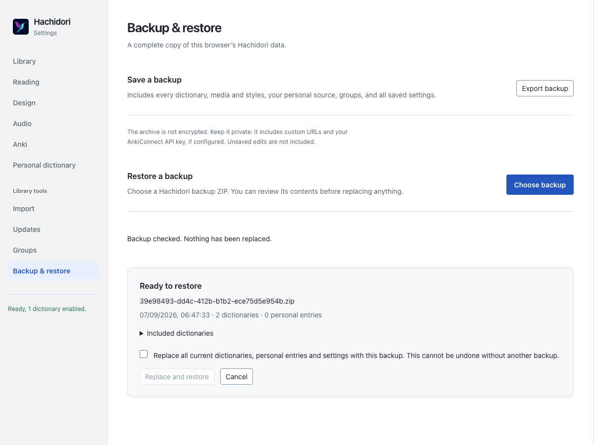

# Backup archive

L2 follows GSM PR #549 at `524ed0b3b92decae87f65df02df9ef9e512f7674`:
prepare and validate an immutable archive, install fresh dictionary generations,
publish the complete state transaction, then clean superseded generations.
Desktop paths, profiles and application-backup plumbing are not portable.

## Using a backup

Settings → Backup & restore exports every installed dictionary, including
disabled packages and generated media, plus dictionary order, aliases,
favourites, groups, managed-source/update metadata, the personal source document,
reader/Design/audio/Anki settings and the global update schedule. The archive is
unencrypted and can contain personal notes, custom URLs and API keys. Keep it
private. It does not contain browser history, downloads, cached runtime results,
or Anki's own collection/media database.

The `downloads` permission saves the engine-owned archive through Chrome's save
dialog. Chrome owns progress and cancellation. Its download ID and temporary
blob URL are tracked in session storage, surviving service-worker restarts;
completion or interruption releases the URL. Those temporary records are not
backup content.

Choosing a backup validates and stages it before showing its date and dictionary
list. Nothing is published until the replacement checkbox is selected and
**Replace and restore** is pressed. This replaces the entire saved configuration,
including empty/default values; it does not merge libraries. Cancel discards the
prepared files. A concurrent saved edit requires preparing the backup again.
Unsaved Settings drafts must be saved or discarded before starting an operation.
Leaving Settings cancels its preparation using an ID allocated before the
request starts. The background retires delayed/retrying preparation requests;
the engine queues token-scoped cleanup even behind another active mutation.
Cleanup does not depend on the closed page receiving a preparation reply.

## Transaction and recovery

Export, prepare, restore and cancellation use the existing engine mutation queue
and offscreen admission lock. Export captures one complete storage snapshot and
leases the committed generations while collecting their files. The ZIP module
loads only when backup work is requested; ordinary lookup does not load it.

Preparation validates archive entries and the complete persisted-state contract,
writes fresh generation roots, persists them, and strict-loads all packages,
including disabled ones. It then restores the working loaded set without
publishing a new logical generation. A damaged current installation does not
prevent restoring a valid backup.

Confirmation checks the exact raw four-key preparation snapshot, strict-loads
the candidate again, and publishes `dictionaryState`, `options`,
`customDictionarySource` and `dictionaryUpdates` in one background storage write.
Each local revision advances; archived revision numbers and generation paths are
not adopted. The storage queue is never held while awaiting the engine.
Schedule reconciliation runs after the storage commit.

A lost commit reply is resolved by reading back the exact expected four-value
transaction. Confirmed success publishes the new engine generation and cleans
superseded roots. Confirmed failure restores authoritative state and removes
unpublished roots. An uncertain commit retains both sets for restart recovery.
Post-commit alarm or Settings-refresh errors are reported separately from restore
success so they do not invite a duplicate operation.

The focused archive/state/download/Settings unit tests cover format and control
contracts. `test/backup-engine-scenarios.mjs`, included by extension smoke, covers
four-way conflicts, disabled-package validation, lost replies, storage failures,
uncertain commits, damaged-installation recovery and empty restores through real
WASM. Five shared browser assertions in `test/chrome-backup-scenarios.mjs` exercise
the actual Chrome download, immutable preview/conflict, complete restore and
corrupt-archive cleanup and actual page closure during staged preparation in
both OPFS and IDBFS suites, followed by browser restart.

## Archive representation

The extension format is a stored ZIP64 archive. Native dictionary data is already
compressed; storing it avoids recompression and allows files and archives larger
than classic ZIP's representation. `hachidori-backup.json` identifies format
`hachidori-backup`, version 1, creation time, the persisted-state snapshot and the
exact file list with sizes. Payload names are `dictionaries/<ordinal>/<relative
file path>`; paths from a backup are never used as live generation paths.

Every entry's CRC32, declared size, path and ZIP headers are validated before
restore. CRC32 detects accidental corruption, not authenticity: only restore
archives you trust. Unlike GSM's Node streaming SHA-256 implementation, the
browser format uses ZIP's streaming checksum without buffering a whole native
file for WebCrypto. There are no product size or entry-count caps. Available
browser storage and the ZIP/browser numeric representation remain constraints.

The lazy backup module uses zip.js 2.11.2, vendored from commit
`3b81b8f79d2abd2bc0ac1f09afd7e933effced62`, under its BSD-3-Clause license in
`extension/vendor/zip-LICENSE`. `extension/vendor/zip.js` is the unmodified
`dist/zip-core-external.min.js` (SHA-256
`09a4776c6baf40f3e2aa0c7c66199f6aa3ebdefc927e83dcaf1dfffd432f9bac`).
It runs in the existing engine context with additional workers disabled. Only
stored, unencrypted regular files are part of this format, so neither external
codecs nor an additional WebAssembly binary are needed. This is not a GSM or
general-purpose ZIP importer.
