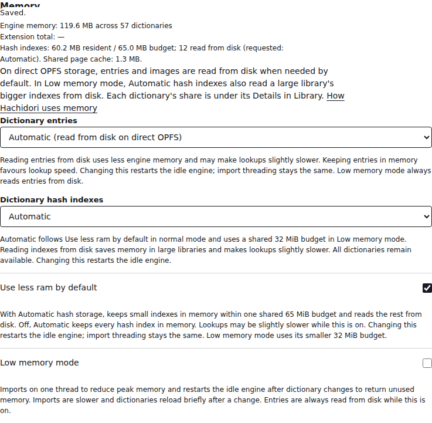
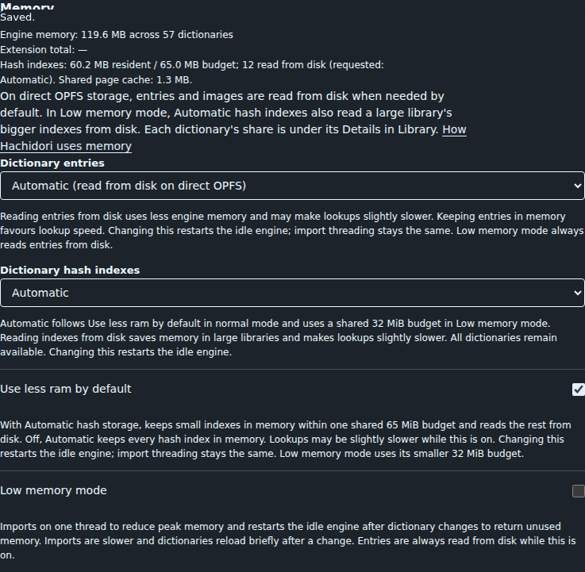

# Use less ram by default: 65 MiB in normal mode

Measurements for [PR #530](https://github.com/bee-san/hachidori/pull/530), comparing
main [`d5bac631`](https://github.com/bee-san/hachidori/commit/d5bac6318c0cc03c2d07214719be639c3b50f43e)
with the implementation [`70f4f08b`](https://github.com/bee-san/hachidori/commit/70f4f08b78191d92bc1fca116645e4c34be8689e).
Both use normal mode, Automatic entries, the full import pool and the same
installed files. Their committed WASM bundles and engine submodule are identical.

For this 58-package library, the 65 MiB budget reduces the load-and-lookup WASM
peak by **198.6 MiB (58.0%)**
and extension-process RSS peak by **192.0 MiB
(23.2%)**. Warm lookup round trips cost
**0.32 ms more at the median (+15.8%)**.
Rendered hovers complete 2.8 ms later at the median.
Every ordered result, kanji lookup, selected-dictionary lookup, media answer and
lifecycle check matched across all six completed samples.

The budget covers resident hash tables only. The shared 32 MiB page cache,
other index files, threads and application memory remain separate. It neither
limits total RAM nor excludes dictionaries or results. Low memory mode keeps
its existing 32 MiB budget and single-threaded imports.

## Setup and boundaries

- Synthetic production-importer output shaped after the #496 inventory:
  58 packages, 249.3 MiB of hashes, nested vocabularies and
  570 Zipf-distributed lookups including inflections and misses. The 65 MiB plan
  keeps 60.2 MiB resident and pages 13 packages.
- Three repetitions of each policy, alternating order. Each sample seeds a
  fresh Chrome profile, restarts the browser, then measures two corpus passes
  and 12 real pointer hovers. It also disables/re-enables packages, restarts
  with half disabled, reimports one package and removes one. Normal mode does
  not recycle the engine after each mutation.
- Lookup times are extension-page-to-engine message round trips, including
  native calls and serialization, excluding rendering and CDP transport.
  Hover times include rendering. The first pass starts with a fresh engine;
  startup/header pages may already be cached. The OS file cache is uncontrolled.
- WASM peak is the capacity after the warm pass, before lifecycle operations.
  Extension RSS covers extension renderer processes, including the Settings
  page driving the run, sampled every 100 ms from measured launch to the end
  of the warm pass. It counts shared pages once per process. Import and later
  UI-policy changes are outside this memory window.
- GitHub Actions Ubuntu 24.04, 4 vCPUs on AMD EPYC 9V45 96-Core Processor,
  15.6 GiB RAM, Linux 6.17.0-1022-azure,
  Node v22.23.1, Chrome for Testing 152.0.7977.75 headless.
  Profile filesystem reported by `stat -f`: `ext2/ext3`.

## Results

Figures are the median of each repetition's value.

| Metric | Main, all hashes resident | 65 MiB default |
| --- | ---: | ---: |
| Hash tables resident | 249.3 MiB | 60.2 MiB |
| WASM capacity after load | 342.2 MiB | 119.6 MiB |
| WASM peak through lookups | 342.2 MiB | 143.6 MiB |
| Extension RSS peak | 827.9 MiB | 635.9 MiB |
| First-pass lookup p50 / p95 | 2.13 / 4.73 ms | 2.44 / 5.13 ms |
| Warm lookup p50 / p95 | 1.99 / 4.40 ms | 2.31 / 4.88 ms |
| Warm throughput | 434 lookups/s | 385 lookups/s |
| Hover first / complete | 25.70 / 53.00 ms | 26.50 / 55.80 ms |
| Startup | 5668 ms | 5620 ms |
| Reimport | 2873 ms | 2805 ms |

Warm p50 ranged from 1.99 to
2.01 ms for main, and
2.29 to
2.60 ms for the 65 MiB default.
[The generated summary](../../benchmark/results/default-ram/summary.md)
includes the remaining metrics and comparisons.

## Reproduce

Use the pinned Node and Chrome tooling on the measured implementation revision:

```sh
npm ci --prefix test/tooling
npm --prefix test/tooling run install:chrome
sudo "$(command -v node)" test/run.mjs install-chrome --install-deps
cmake -S third_party/hoshidicts -B /tmp/default-ram-native \
  -DCMAKE_BUILD_TYPE=Release -DCMAKE_C_COMPILER=gcc-14 \
  -DCMAKE_CXX_COMPILER=g++-14 -DHOSHIDICTS_CLI=ON
cmake --build /tmp/default-ram-native --target hoshidicts-cli --parallel 2
node benchmark/index-residency-fixture.mjs /tmp/default-ram-fixture \
  /tmp/default-ram-native/hoshidicts-cli reporter
export HACHIDORI_PUPPETEER="$(node -p "require.resolve('puppeteer-core', { paths: ['./test/tooling'] })")"
export HACHIDORI_CHROME=/path/to/pinned/chrome
node benchmark/index-residency.mjs --fixture /tmp/default-ram-fixture \
  --output /tmp/default-ram-results --before-ref d5bac6318c0cc03c2d07214719be639c3b50f43e \
  --samples 3 --variants baseline,65 --low-memory false
```

The importer uses hoshidicts `7ae305f8`; the workflow installed GCC/G++ 14.
The output directory must be fresh. The complete source fingerprints, fixture
checksums, environment, samples and failed attempts are retained under
[`benchmark/results/default-ram/`](../../benchmark/results/default-ram/).
Hostnames and runner home directories are redacted; measured values are unchanged.
Recompute the summary with:

```sh
node benchmark/index-residency-report.mjs benchmark/results/default-ram
```

## Limits

This is one host and a synthetic library, not the reporter's private collection.
The first pass is not an OS-cold disk measurement; cold file reads can cost more.
Three repetitions establish the direction of the tradeoff, not a latency guarantee
or a speedup. Reimport and startup differences are small and noisy. One candidate
attempt hit a Chrome protocol timeout and was retried in a fresh profile;
`failures.jsonl.gz` retains it. Libraries whose hashes fit 65 MiB keep them all
resident and need no extra hash-page reads.

The screenshots were captured after the lifecycle checks removed one package,
so they show 57 packages and 12 paged hashes.




