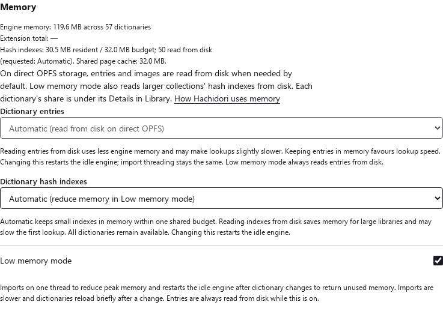
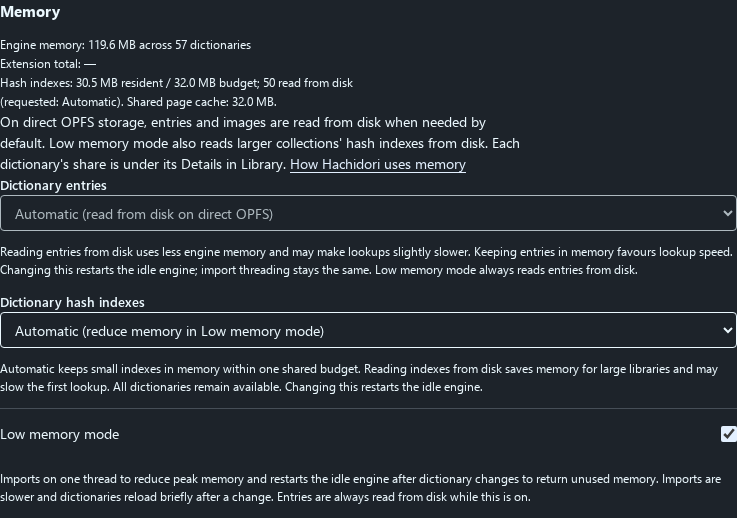

# Hash index residency: main vs paged hash indexes

Measurements for [issue #496](https://github.com/bee-san/hachidori/issues/496)
and PR #497, paired with [hoshidicts #35](https://github.com/bee-san/hoshidicts/pull/35).
Every run compares unmodified `main` (`43535b1b`, all hash tables resident) with
this branch (`4b8bcf9b`): its resident control, 16, 32 and 64 MiB aggregate
budgets and fully paged hashes, on the same installed files. [Commands and
measurement boundaries](../../benchmark/README.md#hash-index-residency).

## Summary

For a 58-package library shaped like the reporter's, the default 32 MiB budget
(Automatic in Low memory mode) pages 21 packages' hash tables and:

- makes lookups **0.42 ms slower at the median (+22%)** and 0.41 ms slower at
  p95 (+10%) with the OS file cache warm, lowering throughput by 13.5%;
- makes the first lookups after an OS-cold start **9.2 ms slower at the median
  (+75%)** on a disk with 0.56 ms random reads;
- shrinks the WASM heap by **242.5 MiB after loading (−71%)** and **222.6 MiB at
  its peak (−65%)**, and the extension processes' RSS by 218 MiB (−27%);
- starts 0.2 s faster (0.8 s OS-cold), and leaves results, rendered hover
  popups and reimport unchanged.

Libraries whose hash tables fit the budget are unaffected. Recommendation: keep
budgeted hashes as the default only in Low memory mode, at 32 MiB
([suggestion and downsides](#recommendation)).

## Setup

| Fixture | Packages | Hash tables | Corpus | Shape |
| --- | ---: | ---: | ---: | --- |
| Reporter-shaped (primary) | 58 | 249.3 MiB (60 KiB–26.6 MiB each) | 570 lookups, 441 distinct | Each package's resident index files are sized after the #496 inventory (275.8 MiB in total against the reporter's 263.5 MiB). Vocabularies are nested by rank; lookups sample ranks log-uniformly (Zipf) and include inflections and misses. |
| Uniform worst case | 58 | 252.9 MiB (4.4 MiB each) | 570 lookups | One 200,000-term dictionary under 58 titles: every hit is in every package. |
| Large index | 1 | 34.9 MiB | 570 lookups | 1.6 million terms: one index larger than the budget. |
| Small | 2 | 1.3 KiB | 28 lookups | Two tiny packages: nothing exceeds any budget. |

All fixtures are synthetic Japanese terms written by the production importer,
plus the existing term, frequency, pitch, kanji, inflection and PNG fixtures;
none is the reporter's private collection. Each sample installs the importer's
files into a fresh Chrome profile, restarts Chrome with Low memory mode and the
variant's policy, waits for the threaded OPFS engine, then times two passes of
the corpus (cold: the first pass after the restart; warm: the second) and 12 real
pointer hovers. It then disables and re-enables packages, restarts with half of
them disabled, reimports one package, waits for the idle worker replacement and
removes a package. Complete ordered results, kanji, a dictionary-selected lookup
and media matched in every sample of every variant. Variant order alternates
between repetitions, and every figure is the median across repetitions.

Lookup times are message round trips from an extension page to the engine and
back, including the WASM call and serialization but not rendering. Hovers
include rendering. The WASM heap never shrinks, so its size after both passes
is the peak. Extension RSS covers the extension's renderer processes (the
offscreen document with its engine worker, and the Settings page driving the
run), sampled every 100 ms from launch through the warm pass (peak) and right
after it (steady).

Environment: Intel Xeon Platinum 8488C, 16 vCPUs, 124 GiB RAM, Linux 6.12
(Amazon Linux 2023), Node 22.23.1, Chrome for Testing 152.0.7977.75 headless.
Both revisions' bundles come from Emscripten 6.0.9, which reproduces main's
committed bundles byte for byte; the engines are hoshidicts `f244d9b` (main) and
`3327d2d` (this branch). OS-warm profiles were on tmpfs; OS-cold profiles on xfs
on an EBS volume whose random 4 KiB reads take 0.56 ms (`O_DIRECT` p50).

## Results

### Reporter-shaped library, OS file cache warm (5 samples)

| Variant | Resident hashes | Packages paged | Cold p50 / p95 | Warm p50 / p95 | Warm lookups/s | Hover first / complete |
| --- | ---: | ---: | ---: | ---: | ---: | ---: |
| main (all resident) | 249.3 MiB | 0 | 2.06 / 4.30 ms | 1.93 / 4.00 ms | 467 | 29.1 / 52.2 ms |
| PR, resident | 249.3 MiB | 0 | 2.08 / 4.30 ms | 1.94 / 3.97 ms | 464 | 28.9 / 52.0 ms |
| PR, 16 MiB budget | 15.7 MiB | 28 | 2.62 / 5.09 ms | 2.44 / 4.58 ms | 389 | 29.0 / 52.3 ms |
| **PR, 32 MiB budget (default)** | 32.0 MiB | 21 | 2.46 / 4.74 ms | 2.35 / 4.41 ms | 404 | 30.2 / 53.9 ms |
| PR, 64 MiB budget | 60.2 MiB | 13 | 2.34 / 4.51 ms | 2.23 / 4.31 ms | 420 | 30.0 / 51.9 ms |
| PR, all paged | 0 | 58 | 2.96 / 5.21 ms | 2.91 / 5.10 ms | 347 | 30.1 / 52.1 ms |

| Variant | WASM heap after load / peak | Live allocations | Extension RSS peak / steady | Startup | Reimport |
| --- | ---: | ---: | ---: | ---: | ---: |
| main (all resident) | 342.2 / 342.2 MiB | – | 819.6 / 819.6 MiB | 3,993 ms | 2,865 ms |
| PR, resident | 342.2 / 342.2 MiB | 318.9 MiB | 820.1 / 819.2 MiB | 3,976 ms | 2,902 ms |
| PR, 16 MiB budget | 69.2 / 99.7 MiB | 85.4 MiB | 589.9 / 585.2 MiB | 3,812 ms | 2,891 ms |
| **PR, 32 MiB budget (default)** | 99.7 / 119.6 MiB | 101.7 MiB | 601.7 / 601.3 MiB | 3,794 ms | 2,828 ms |
| PR, 64 MiB budget | 119.6 / 143.6 MiB | 129.8 MiB | 630.5 / 630.2 MiB | 3,877 ms | 2,856 ms |
| PR, all paged | 57.6 / 83.1 MiB | 69.7 MiB | 573.0 / 572.7 MiB | 3,633 ms | 2,835 ms |

Against main:

| Variant | Cold p50 | Warm p50 | Warm p95 | Warm throughput | WASM heap after load | WASM heap peak | Extension RSS peak |
| --- | ---: | ---: | ---: | ---: | ---: | ---: | ---: |
| PR, resident | +0.03 ms (+1.2%) | +0.02 ms (+0.8%) | −0.03 ms (−0.9%) | −0.6% | 0 | 0 | +0.5 MiB (+0.1%) |
| PR, 16 MiB budget | +0.57 ms (+27.7%) | +0.52 ms (+26.7%) | +0.58 ms (+14.5%) | −16.7% | −273.0 MiB (−79.8%) | −242.5 MiB (−70.9%) | −229.7 MiB (−28.0%) |
| **PR, 32 MiB budget (default)** | +0.40 ms (+19.5%) | +0.42 ms (+21.8%) | +0.41 ms (+10.1%) | −13.5% | −242.5 MiB (−70.9%) | −222.6 MiB (−65.0%) | −217.9 MiB (−26.6%) |
| PR, 64 MiB budget | +0.28 ms (+13.9%) | +0.30 ms (+15.5%) | +0.31 ms (+7.8%) | −10.1% | −222.6 MiB (−65.0%) | −198.6 MiB (−58.0%) | −189.1 MiB (−23.1%) |
| PR, all paged | +0.90 ms (+43.8%) | +0.98 ms (+50.8%) | +1.10 ms (+27.5%) | −25.7% | −284.6 MiB (−83.2%) | −259.1 MiB (−75.7%) | −246.6 MiB (−30.1%) |

The resident control matches main within 0.03 ms. Paged hashes share the
existing 32 MiB page cache with entries, which main also reads from disk in Low
memory mode. The corpus's working set is larger than that cache, so the warm
pass rereads pages: at 32 MiB each 570-lookup pass makes about 7,800 index and
28,400 entry page reads (the resident control: 26,600 entry reads), against
15,200 index reads when every hash is paged. Rendered hovers stayed within 2 ms
of main in every variant.

An earlier complete matrix against main `991c48cd`, with both revisions built
by Emscripten 5.0.2, found the same: the 32 MiB budget was 0.47 ms (+24%) slower
at the warm median, with identical heap figures. Its raw results are in commit
`63c0144f`.

### Reporter-shaped library, OS-cold (3 samples)

Before each measured launch the harness synced and evicted every file of the
seeded profile and temporary extension from the OS page cache; `fincore` found
0 bytes still cached in every sample. Startup and the first pass therefore read
from the disk, for main as well, whose Low memory mode pages entries.

| Variant | Startup | Cold p50 / p95 | Warm p50 / p95 | WASM heap peak | Cold p50 against main |
| --- | ---: | ---: | ---: | ---: | ---: |
| main (all resident) | 5,821 ms | 12.34 / 57.38 ms | 1.89 / 3.84 ms | 342.2 MiB | – |
| PR, resident | 5,885 ms | 11.72 / 57.82 ms | 1.91 / 3.94 ms | 342.2 MiB | −0.62 ms (−5.0%) |
| PR, 16 MiB budget | 5,149 ms | 22.88 / 74.34 ms | 2.47 / 4.74 ms | 99.7 MiB | +10.54 ms (+85.5%) |
| **PR, 32 MiB budget (default)** | 4,998 ms | 21.54 / 69.98 ms | 2.59 / 5.18 ms | 119.6 MiB | +9.20 ms (+74.6%) |
| PR, 64 MiB budget | 5,045 ms | 18.71 / 65.46 ms | 2.23 / 4.45 ms | 143.6 MiB | +6.37 ms (+51.6%) |
| PR, all paged | 4,815 ms | 23.18 / 75.35 ms | 2.75 / 4.94 ms | 83.1 MiB | +10.84 ms (+87.9%) |

At 32 MiB the cold p95 rose by 12.61 ms (+22%) and startup fell by 0.8 s (−14%),
because only 32 MiB of hash tables are read at load. Once read, the pages stay
in the OS cache; on this xfs profile the warm pass was 0.70 ms (+37%) slower.

### Uniform worst case (3 samples, OS cache warm)

| Variant | Warm p50 / p95 | Against main (warm p50) | WASM heap after load / peak | Extension RSS peak |
| --- | ---: | ---: | ---: | ---: |
| main (all resident) | 4.41 / 5.56 ms | – | 357.5 / 357.5 MiB | 819.4 MiB |
| PR, 16 MiB budget | 5.48 / 6.79 ms | +1.08 ms (+24.5%) | 69.2 / 99.7 MiB | 567.0 MiB |
| **PR, 32 MiB budget (default)** | 5.36 / 6.45 ms | +0.95 ms (+21.6%) | 83.1 / 119.6 MiB | 589.3 MiB |
| PR, 64 MiB budget | 5.27 / 6.32 ms | +0.86 ms (+19.5%) | 119.6 / 143.6 MiB | 626.0 MiB |
| PR, all paged | 5.49 / 6.66 ms | +1.09 ms (+24.6%) | 48.0 / 83.1 MiB | 565.4 MiB |

Every synthetic hit is present in all 58 packages, so each lookup probes paged
hashes far more often than in the reporter-shaped library. The relative cost is
similar; the absolute cost is about twice as high.

### Large index and small library (3 samples, OS cache warm)

The 35 MiB index exceeds the 16 and 32 MiB budgets and is paged under them:
warm p50 changes by −0.03 ms, the WASM heap falls from 62.5 to 23.1 MiB after
loading and from 62.5 to 33.3 MiB at its peak (−29.2 MiB, −47%), and extension
RSS by 33 MiB (−8%). The 64 MiB budget keeps it resident, like main. In the
small library nothing exceeds any budget; every variant stayed within 0.05 ms of
main at the warm median. Full tables:
[large index](../../benchmark/results/index-residency/large-index/summary.md),
[small](../../benchmark/results/index-residency/small/summary.md),
[uniform](../../benchmark/results/index-residency/uniform/summary.md).

### Engine alone (native C++, 3 samples)

The pinned engine's `benchmark-lookup` times `Lookup.lookup` without WASM,
messaging or serialization, for resident against fully paged hashes:

| Library | Resident warm p50 / p95 | Paged warm p50 / p95 | Warm p50 change | Throughput |
| --- | ---: | ---: | ---: | ---: |
| Reporter-shaped | 0.18 / 0.41 ms | 0.30 / 0.55 ms | +0.12 ms (+65%) | −29.5% |
| Uniform | 0.47 / 0.52 ms | 0.63 / 0.76 ms | +0.16 ms (+34%) | −26.7% |

### Import and index time

The importer and installed format are unchanged, so import and index build time
are too: the same native importer built every fixture once for all variants. The
in-extension reimport of one package (single-threaded in Low memory mode,
including loading the new generation) took 2.83–2.90 s in every variant (main:
2.87 s).

## Recommendation

**Keep budgeted (paged) hash indexes as the default only where this branch puts
them: Automatic in Low memory mode on threaded OPFS, with the 32 MiB budget.**
Keep main's resident hashes in normal mode.

**Suggestion.** Ship the policy as it is. It delivers what #496 asks for: the
reporter-shaped library's engine heap falls by two thirds (−223 MiB at its
peak, −242.5 MiB after loading, −218 MiB of extension RSS) without dropping a
dictionary or changing a result. Its cost falls on users who chose Low memory
mode to trade speed for memory: about 0.4 ms (+22%) per lookup once the OS has
cached the files, which does not show next to the ~52 ms a popup takes to
render. Libraries whose hashes fit the budget are unaffected, and **Read from
disk** and **Keep in memory** remain for either extreme. 16 MiB saves only
20 MiB more for a higher cost; paging every hash saves 37 MiB more than 32 MiB
for more than twice the cost. The downsides:

- After a cold boot the first lookups are about 9 ms slower (+75%) on this
  0.56 ms-per-read disk until the hash pages are cached; a hard disk would be
  slower still.
- Lookup throughput falls 13.5%, which matters for bulk lookups rather than
  hovers.
- Index pages now compete with entry pages in the shared 32 MiB cache: about
  7,800 more 4 KiB reads per 570 lookups in a large library.
- The engine and bindings gain a second hash reader path, a residency policy
  and diagnostics to maintain.
- Normal-mode users with large libraries keep main's memory use. If that
  becomes a complaint, extend Automatic to normal mode with a 64 MiB budget
  (−199 MiB, +0.30 ms or +16% warm, +6.4 ms OS-cold), not 32 MiB.

## Raw results and limits

[`benchmark/results/index-residency/`](../../benchmark/results/index-residency/)
keeps each run's gzip-compressed definition (source fingerprints, fixture
checksums, environment), raw samples, failed attempts and summary:
`reporter-warm`, `reporter-os-cold`, `uniform`, `large-index`, `small`,
`native-reporter` and `native-uniform`. Hostnames and home directories are
redacted; nothing else is changed.
`node benchmark/index-residency-report.mjs benchmark/results/index-residency/*/`
recomputes every summary from them.

- The dictionaries are synthetic and sized after, not copied from, the reporter's
  collection; a real library's probe pattern differs.
- One host ran the benchmarks while other work used it. The resident control
  stayed within 0.03 ms of main in the primary run and within 0.2 ms in earlier
  runs.
- OS-cold timings depend on the disk. A local NVMe SSD reads much faster than
  this EBS volume; a hard disk is much slower.
- RSS counts pages shared between processes once per process, and the Settings
  page that drives the run is part of the extension RSS for every variant.
- One large-index sample (the 64 MiB budget, which keeps that index resident
  like main) hit a browser protocol timeout and was rerun in a fresh profile;
  `failures.jsonl` records it. The other runs had no failed attempts.

