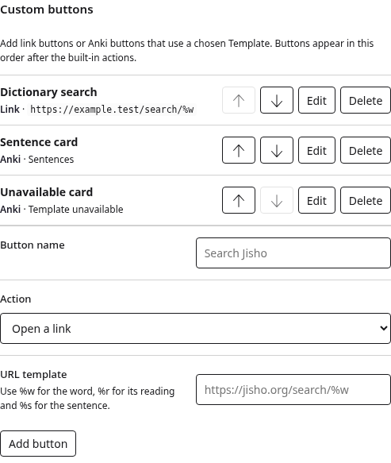
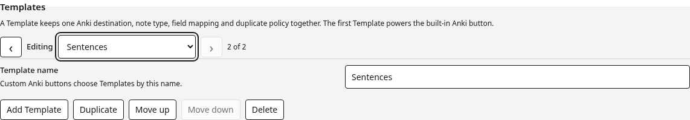
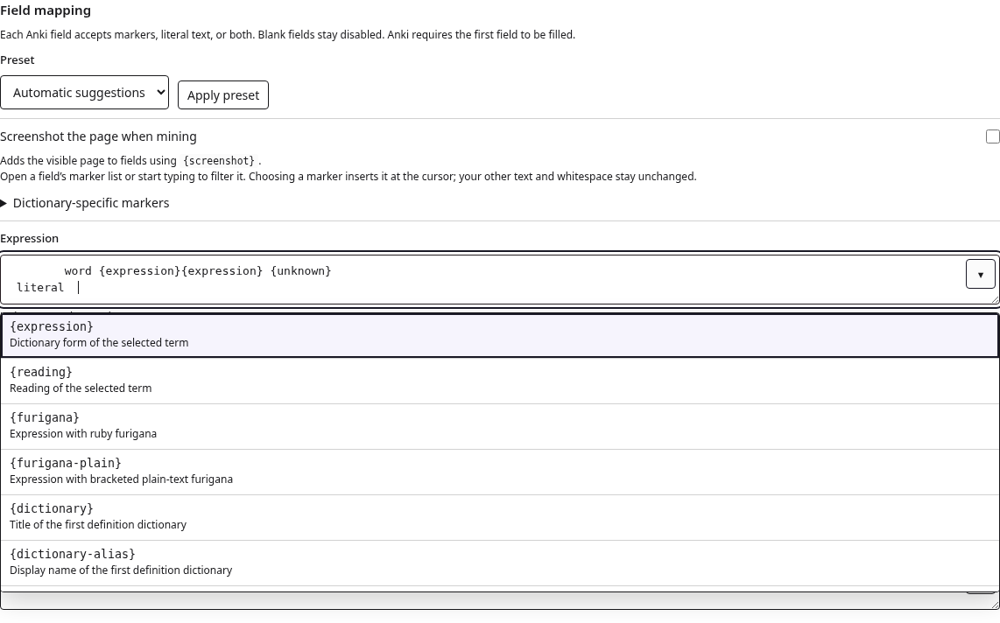
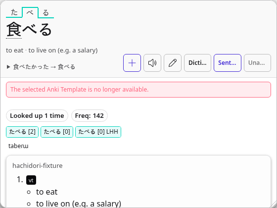
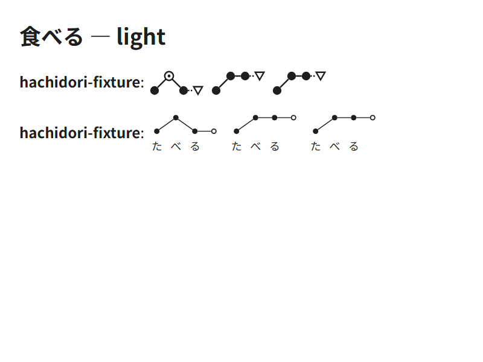
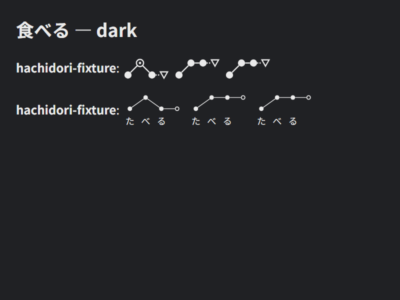

<!-- SPDX-License-Identifier: GPL-3.0-or-later -->

# Custom buttons and Anki Templates

Custom buttons live under **Settings → Design**. A button either opens an
HTTP(S) URL template or mines the current result to Anki with a chosen
Template. Link buttons support `%w` for the word, `%r` for its reading and `%s`
for the sentence. Anki buttons use the same readiness, duplicate, media and
transactional write path as the built-in Anki action.



Templates live under **Settings → Anki**. Each Template has a stable identity
and a user-editable name, and contains one deck, note type, tag list, field
mapping, screenshot choice and duplicate policy. The AnkiConnect URL and API
key remain shared connection settings. The first Template powers the ordinary
built-in Anki button, so a profile with one Template works as before without
needing a custom button.



The Template manager supports previous/next navigation, direct selection,
creation, duplication, reordering, renaming and deletion. Every control is a
native keyboard-focusable control. Deletion is blocked while a custom Anki
button refers to the Template, with the referring button named in the error.
If storage from an older or interrupted writer nevertheless contains a missing
Template ID, its button remains visible and disabled with an explicit error; it
does not silently mine with another Template.

Every Anki field mapping is an editable marker combobox. Open the list from its
button or with an Arrow key to browse every supported marker and a short
description. Typing filters the list around the marker at the cursor. Arrow
keys, Home and End move the active option; Enter explicitly inserts it at the
selection. Escape closes the list, Tab leaves the field, and Shift+Enter remains
available for literal multiline text. Pointer selection inserts through the
same path.

The text area remains the source of truth. A highlighted suggestion is never
accepted by Escape, Tab, focus exit, paste or IME composition. Literal text,
unknown or repeated markers, tabs, spaces and newlines are stored exactly as
entered. Unknown markers stay editable and produce a visible validation error;
they are not rewritten while another setting or Template is edited.





## Japanese pitch accent graphs

Import a Japanese pitch-accent dictionary under **Settings → Dictionaries**,
then map an Anki field such as `Graph` to `{pitch-accent-graphs}`. For a graph
with kana under each mora, use `{pitch-accent-graphs-jj}` (Jidoujisho style).
Both export inline SVG that follows the card's text color and font size.

Each dictionary's variants are kept in source order. The final hollow symbol
shows the pitch of a following particle, distinguishing a flat accent from a
drop after the last mora. Numeric downstep positions and explicit `H`/`L`
patterns are supported. A pattern may include one extra level for the particle;
otherwise its final level continues. Missing, transcription-only or invalid
pitch data leaves the graph field empty.

Existing graph mappings produce SVG on the next mining operation; stored notes
are not migrated. Text and position markers keep their existing output. Use
`{pitch}` for nasalization and devoicing annotations, which graphs do not show.

The standard and kana-labelled fields mined from the test pitch dictionary:





## Stored model and migration

`options.anki.templates` is the canonical ordered Template list. Template IDs
do not change when their names or positions change, so custom-button references
survive edits. `options.customButtons` is the canonical ordered button list:

```text
anki: {
  url,
  apiKey,
  templates: [{
    id, name, deck, model, tags, fields,
    duplicateScope, duplicateBehavior,
    captureScreenshot, fieldTemplates
  }]
}

customButtons: [
  { id, type: "link", label, url },
  { id, type: "anki", label, templateId }
]
```

Normalization performs both legacy migrations:

- a flat `options.anki` configuration becomes the `default` Template named
  `Default`, preserving its deck, note type, tags, simple or advanced field
  mappings, duplicate policy and screenshot choice;
- `options.customLinks` becomes link-type custom buttons with deterministic
  `legacy-link-N` IDs, preserving labels, URL templates and order.

The normalized Anki object also projects the first Template through the former
top-level fields. This keeps older setup, recovery and compare-and-swap callers
compatible. If such a caller spreads a normalized Anki value and edits those
top-level fields, normalization applies the edit to the first Template rather
than rejecting or losing it. `customLinks` remains a derived link-only
projection for older popup and host boundaries; new writers use
`customButtons`.

## Mining and ownership

The built-in action binds to the first Template. Each custom Anki action carries
its selected `templateId` through cached View readiness, status, preflight,
submit, browse and screenshot requests. Configuration digests include the
Template identity, so a result prepared for one Template cannot be submitted
through another. The worker re-reads that Template before mutation and all Anki
writes still use the existing singleton mutation queue.

The scheduled compact duplicate and maturity index remains scoped to the first
Template. Other Templates use the same live duplicate search and final
authoritative submission check; a cache row for the built-in Template cannot
answer for another destination. Confirmed writes, overwrite behavior,
`{screenshot}`, pronunciation and captured-media cleanup keep their existing
request ownership.

For a linked browser, the selected Template ID is explicitly allowed through
the sharing protocol, including existing-setup checks. The host resolves it
against its saved, mirrored configuration and owns status, duplicate checks,
writes and browsing. The reading browser still owns its page screenshot and
capture session, then sends the final bounded media with the request. Endpoint
credentials and field mappings supplied by a linked request are ignored.
Template-aware mining and Template or custom-button settings writes require a
current host advertising `linked-anki-v2`; current hosts also advertise legacy
`linked-anki-v1` so an older reading browser can keep using the first Template.
When that older browser writes its flat Anki settings, the current host updates
only the first Template and preserves its ID, name and every additional
Template. Legacy `customLinks` edits replace only the link-button subsequence,
preserving custom Anki buttons and stable IDs for retained links. A legacy
client that tries to write the richer Template or custom-button representation
is rejected.

Overlay hosts can independently advertise link-button support. Link buttons
use the existing host-opened external URL boundary. Anki buttons remain ordinary
mining actions and follow the linked/local ownership rules above.

## Browser evidence and interaction timing

The task-specific harness uses Chrome for Testing 152.0.7977.75, the production
Settings page and popup, a fresh extension profile, an imported dictionary
fixture, and an isolated Anki 24.11 collection. It exercises marker filtering,
keyboard and pointer selection, free-form text, clipboard input, IME
composition, validation, focus exit and the browser accessibility tree. It
also switches between two Templates with distinct invalid drafts, reloads
Settings, and proves that both drafts remain byte-for-byte unchanged before
installing valid mappings and mining two notes:

- the custom **Sentence card** button writes the Sentence Template to its own
  deck and note type, including the selected Template's `{screenshot}` field;
- the built-in action writes the first Word Template to a different deck and
  note type;
- a custom button with a missing Template stays visible and sends no request.

The same run switches between two Templates 40 times. Each sample starts with
the production previous/next click, waits for two animation frames, and forces
the manager's final layout read. The retained sample measured a 33.33 ms median,
33.39 ms p95 and 33.42 ms maximum. Raw samples are in
[`anki-template-switch-timing.json`](assets/anki-template-switch-timing.json).
This measures the static Settings interaction and render path; it is not an
Anki or dictionary-engine benchmark.
