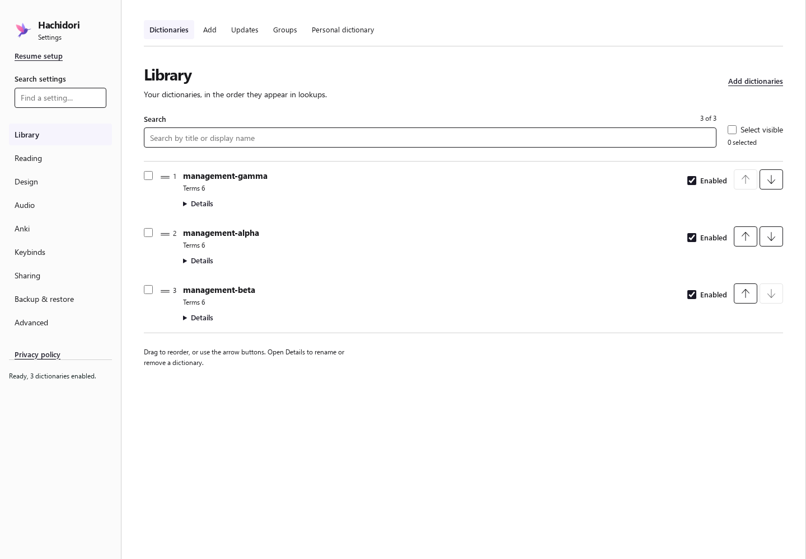

# Dictionary reorder measurements

Issue [#285](https://github.com/bee-san/hachidori/issues/285): Library moves now
update the existing rows immediately and coalesce saves for 150 ms. The engine
changes native order without reloading an unchanged manifest or warming lookup.

The final comparison uses baseline
`f8c57115f7f3b8ef57101225cc4fd8a4e165b559` (including merged Low memory mode,
PR #281) and implementation `5cc4f73300cc8bff06da726cced3d011a72c77e4`.
Later evidence/documentation commits do not change the measured extension.
The host was Linux 7.2.6-1-cachyos, Intel Core Ultra 7 165U, 14 logical CPUs,
with 66,833,809,408 bytes of RAM.

An isolated move now deliberately waits for the debounce before saving; its
reply and first committed lookup arrive later despite the faster native path.
The improvement is immediate interaction and coalesced work, not a claim that
the whole click-to-save interval became shorter.

## Final measured results

All values are milliseconds, median / nearest-rank p95. Each regular cell has
30 moves across three fresh profiles; profiles alternate baseline then head.

| Dictionaries | Metric | Baseline | Head |
| ---: | --- | ---: | ---: |
| 10 | Click → DOM | 12.32 / 18.30 | 1.78 / 3.49 |
| 10 | Click → reply | 5.63 / 12.24 | 156.95 / 158.46 |
| 10 | Send → reply | 5.01 / 11.52 | 4.91 / 5.97 |
| 10 | Click → first ranked lookup | 15.21 / 32.98 | 160.90 / 162.55 |
| 50 | Click → DOM | 31.47 / 39.56 | 3.17 / 5.13 |
| 50 | Click → reply | 13.55 / 25.44 | 163.52 / 166.21 |
| 50 | Send → reply | 11.70 / 24.01 | 9.97 / 12.63 |
| 50 | Click → first ranked lookup | 38.51 / 55.49 | 170.96 / 174.98 |
| 150 | Click → DOM | 98.45 / 120.23 | 5.81 / 9.65 |
| 150 | Click → reply | 39.40 / 67.10 | 175.62 / 180.17 |
| 150 | Send → reply | 34.24 / 63.14 | 19.36 / 23.01 |
| 150 | Click → first ranked lookup | 117.09 / 134.77 | 189.00 / 196.61 |

Per-profile median click-to-DOM (baseline → head, pairs 2/3/4):

| Dictionaries | Pair 2 | Pair 3 | Pair 4 |
| ---: | ---: | ---: | ---: |
| 10 | 12.71 → 1.85 | 9.87 → 1.48 | 12.48 → 1.73 |
| 50 | 30.22 → 3.10 | 32.01 → 2.75 | 30.98 → 3.59 |
| 150 | 100.73 → 5.56 | 93.74 → 5.68 | 102.64 → 5.96 |

All 120 measured head moves reported `order-only` and changed the DOM
before the reply. Across regular and low-memory runs, all 40 head moves at
150 dictionaries were below 16 ms DOM and 50 ms send-to-reply (maxima
9.88 ms and 26.50 ms respectively). No measured head move used a native full-load path.

### Low memory mode and deferred work

One fresh profile per revision, ten measured moves per size. These are a
deferred-work check and repeated within-profile timings, not three independent
low-memory profile pairs.

| Dictionaries | DOM median, base → head | Send/reply median, base → head | Generation after idle, base | Generation after idle, head |
| ---: | ---: | ---: | --- | --- |
| 10 | 11.40 → 1.42 | 5.03 → 4.02 | 13 → 1 | 13 → 13 |
| 50 | 35.29 → 2.88 | 14.43 → 8.81 | 13 → 1 | 13 → 13 |
| 150 | 78.82 → 6.14 | 27.29 → 22.32 | 13 → 1 | 13 → 13 |

Every idle check preserved the correct lookup order. The baseline rebuilt its
worker after the moves; the head retained its generation at all three sizes.

Raw measured rows, archive hashes, exact extension hashes, runtime versions and
per-profile host snapshots are in [the evidence directory](benchmark-data/dictionary-reorder/).
Original screenshots, source snapshots and setup archives remain under the
ignored local `benchmark/results/reorder-settled/` directories.

## Reproduce

Use Node 22.23.1, Chrome for Testing 152.0.7977.75 and the locked
`test/tooling` dependencies. Set `HACHIDORI_CHROME`, `HACHIDORI_PUPPETEER`,
and `HACHIDORI_JSDOM` as described in [the test guide](../test/README.md).
The recorded Linux runs use an isolated network namespace to avoid the host's
live Anki local-audio service, leaving that service running. Each sample creates
and removes its own disposable browser profile.

```sh
unshare --user --map-root-user --net sh -c 'ip link set lo up && bash test/tmp/reorder-final-pairs.sh'
```

The script used for that command is:

```sh
set -eu
base=f8c57115f7f3b8ef57101225cc4fd8a4e165b559
head=5cc4f73300cc8bff06da726cced3d011a72c77e4
for pair in 1 2 3; do
  node benchmark/dictionary-reorder.mjs --revision "$base" --samples 1 \
    --output "benchmark/results/reorder-settled/base-$pair"
  node benchmark/dictionary-reorder.mjs --revision "$head" --samples 1 \
    --expect-path order-only --output "benchmark/results/reorder-settled/head-$pair"
done
node benchmark/dictionary-reorder.mjs --revision "$base" --samples 1 --low-memory true \
  --output benchmark/results/reorder-settled/base-low-memory
node benchmark/dictionary-reorder.mjs --revision "$head" --samples 1 --low-memory true \
  --expect-path order-only --output benchmark/results/reorder-settled/head-low-memory
```

Pair 1 overlapped another worker's user-resumed Chrome suite and is excluded.
The launcher paused after that pair; after the other suite and its browser
processes exited, pairs 2 and 3 and the low-memory pair ran. Only the affected
pair was repeated, with these additional commands:

```sh
node benchmark/dictionary-reorder.mjs --revision f8c57115f7f3b8ef57101225cc4fd8a4e165b559 \
  --samples 1 --output benchmark/results/reorder-settled/base-4
node benchmark/dictionary-reorder.mjs --revision 5cc4f73300cc8bff06da726cced3d011a72c77e4 \
  --samples 1 --expect-path order-only --output benchmark/results/reorder-settled/head-4
```

The final regular table uses pairs 2, 3 and 4 only. Pair 1 remains under the
ignored local result directory as diagnostic evidence.

The input grows from 10 to 50 to 150 six-term fixture clones with unique titles,
imported through the real Settings file input and real WASM importer. Each size
excludes two warmup moves, then records ten moves. Every move checks durable
order and all 2 × N glossary titles in the first real lookup after its reply.
Baseline and head alternate across three fresh-profile pairs; Low memory mode
has one additional pair and an idle-window check at every size.

The replacement commands used the same isolated-network wrapper and pinned
environment as the initial script. No test suites ran alongside the clean
profiles in the recorded process observations. Load averages remained nonzero;
light host work, scheduling, thermal and power-management variation are not
controlled by this benchmark.

## Timing boundaries

- Click-to-DOM measures the real button handler through the observed rank and
  row-position mutation. It excludes CDP overhead and paint.
- Click-to-reply includes the intentional 150 ms trailing debounce. Send-to-reply
  excludes that debounce. Both stop before subsequent Settings renders,
  including group and option controls.
- Click-to-lookup starts at the move and ends with the first correctly ranked
  lookup after the reply. It includes render work that delays that lookup,
  but does not establish final UI settlement.
- Low-memory idle rows wait 2.5 seconds, then check engine generation and lookup
  order. These waits are excluded from move timings. The bridge regression
  separately verifies that pending import and mode-change recycling still runs.
- Small fixtures measure orchestration and native ordering, not large-dictionary
  I/O, import speed or memory savings. The host is shared; process observations
  and load snapshots accompany the results. These are local measurements, not
  a browser-wide latency guarantee.
- The existing cross-engine `benchmark/compare.mjs` uses a different schema.
  This focused benchmark reuses its browser and durable JSONL helpers; the
  accompanying table summarizes the reorder-specific raw rows directly.

## Visible result

The screenshot was taken while the first engine acknowledgement was held.
`management-gamma` already reflects a subsequent move to rank 1, and valid
arrow controls remain usable.



## Correctness and simplification review

The engine derives the fast path from an unchanged loaded manifest (identity,
path, kinds and enabled state), including tolerated failed packages. It retains
those diagnostics; changed sets still use existing validation/loading. No new
message type or client-provided bypass flag is needed. Low memory mode trusts
only a successful engine `order-only` result when excluding a fresh recycle.

Settings reuses its serialized CAS queue, authoritative-state restoration,
row/focus helpers and existing unsaved-work guard. Rapid moves share one batch;
new moves during an in-flight commit follow that page's acknowledgement.
Competing Settings writes fail explicitly and discard stale queued drafts.
The diff's simplification pass removed the redundant reorder option and avoided
another persistence or lifecycle mechanism. There are no new settings,
dependencies, submodule changes or generated WASM changes relative to the base.

## Validation commands and outcomes

All final commands use the pinned runtime above. External locked tooling was
read only; no dependency installation or global tooling change was made.

| Command | Outcome |
| --- | --- |
| `node test/make-fixture.mjs` | Exit 0; generated the existing local fixtures. |
| `node test/extension-smoke.mjs` | 601 passed, 0 failed. |
| `node test/threaded-bridge-smoke.mjs` | Exit 0; real offscreen settlement regression proves no fresh reorder recycle, preserved pending import recycle, preserved mode-change recycle. Expected injected worker errors and Node's MockTimers experimental warning are logged. |
| `node --test test/engine-recycler.test.mjs test/memory-settings.test.mjs test/low-memory-option.test.mjs test/sharing-protocol.test.mjs test/sharing-settings.test.mjs test/anki-addon.test.mjs` | 34 tests passed, 0 failed. |
| `HACHIDORI_SHARING_PORT=18885 node test/chrome-sharing.mjs` | 13/13 checks passed, exit 0. |
| `unshare --user --map-root-user --net sh -c 'ip link set lo up && node test/chrome-e2e.mjs'` | 241/241 checks passed, exit 0, including every new reorder/unload check. |

The focused real-Chrome dictionary scenario also passed separately in a fresh
profile, through the exported `dictionaryManagementScenarios` used by full E2E.
Its unload regression dispatches a cancelable `beforeunload` immediately after
clicks, while an acknowledgement is held, and after settlement. Before the
one-condition guard fix the first assertion failed (`false !== true`); all
three phases now pass. This exercises the actual Settings unload handler,
not Chrome's native confirmation-dialog appearance.

The native regression was run before implementation: **596 passed, 3 failed**.
The failures showed retained warm lookup and full resets/re-adds beside an
unchanged unloadable committed package (enabled and disabled variants).
Healthy imports already retained verification; the missing fast path concerned
that tolerated failed package, which must keep its diagnostic rather than be
marked successfully verified.

Initial timing evidence remains separately under
`benchmark/results/reorder-initial-pinned` (base `4be36f5`) and
`benchmark/results/reorder-first-fix` (head `008a293`). Those single-profile
runs predate #281 and are not the final comparison. An earlier diagnostic run
with system Node 26/Chromium 153 timed out importing 150 dictionaries; its
partial data is excluded. The final pairs use the same pinned Node/Chrome for
both revisions.
