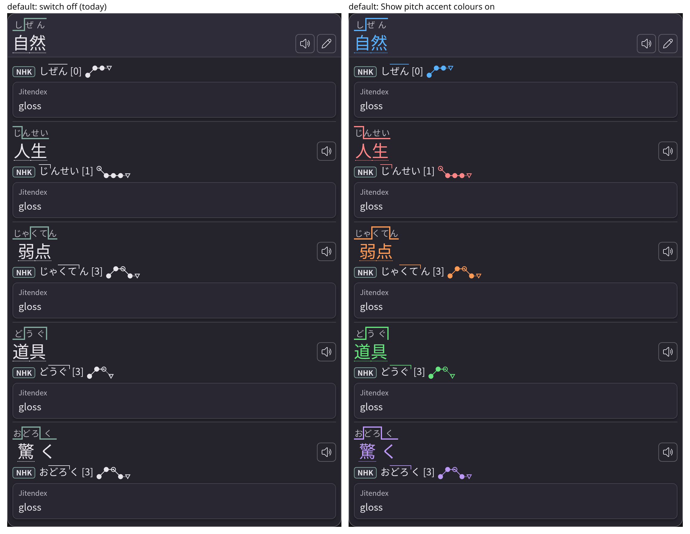
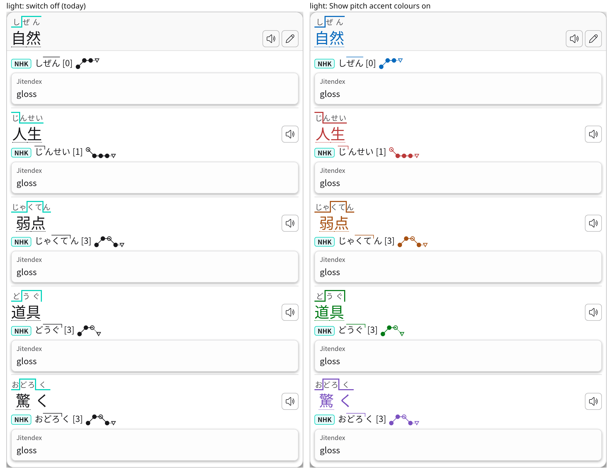
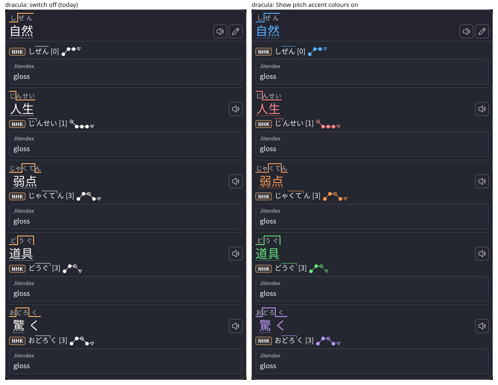
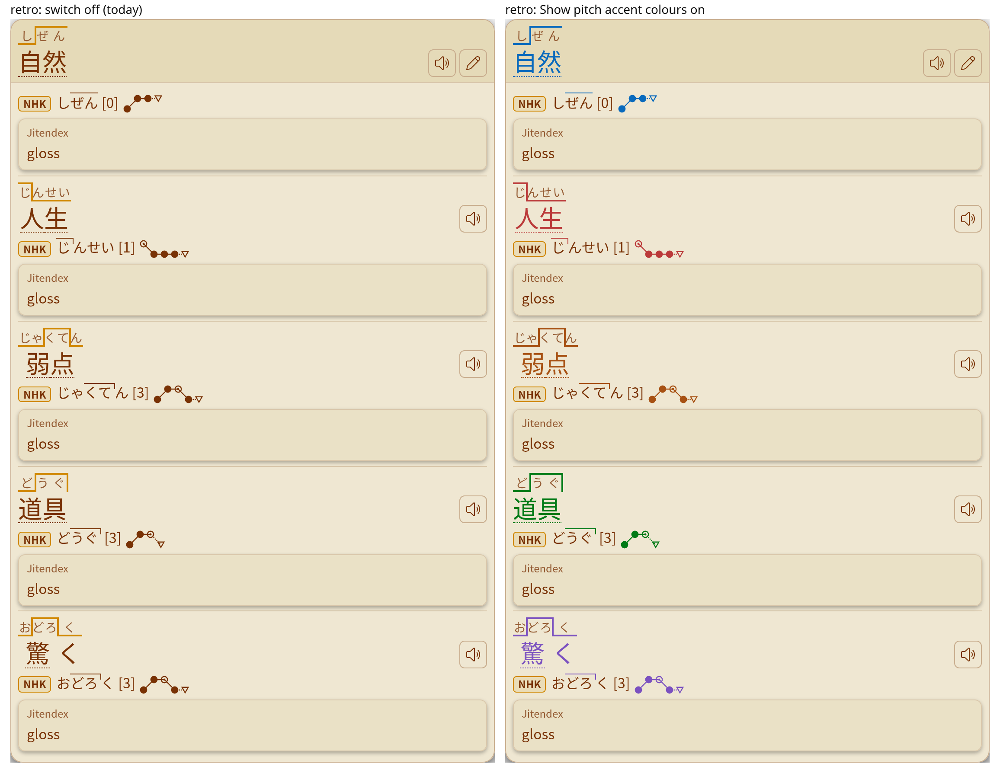
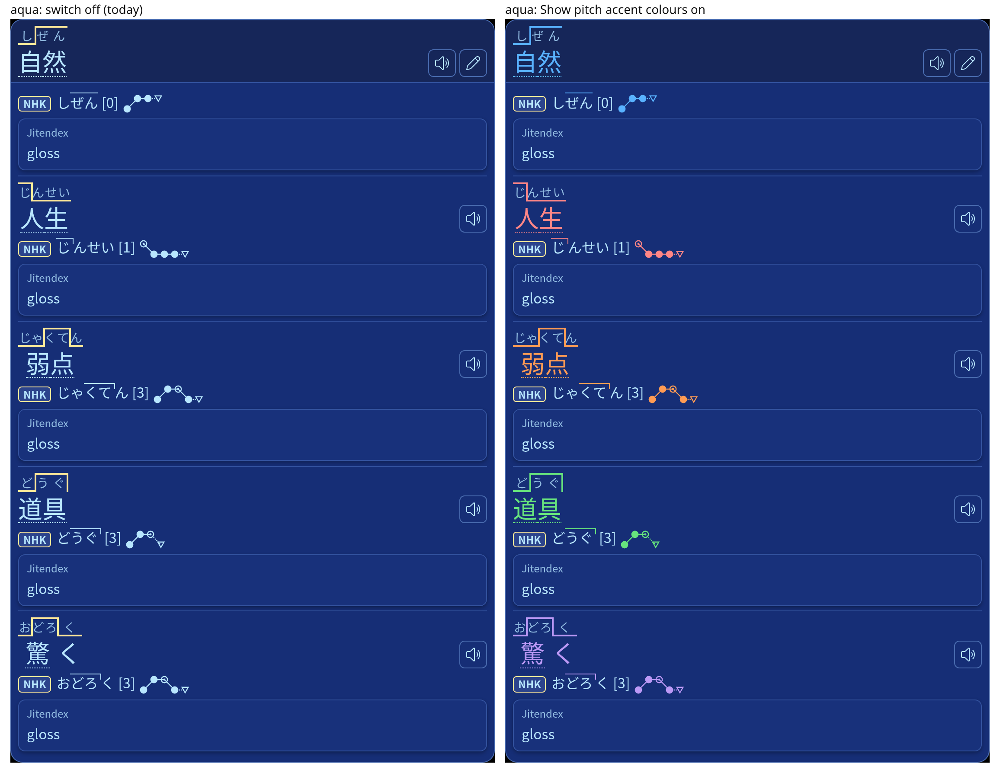
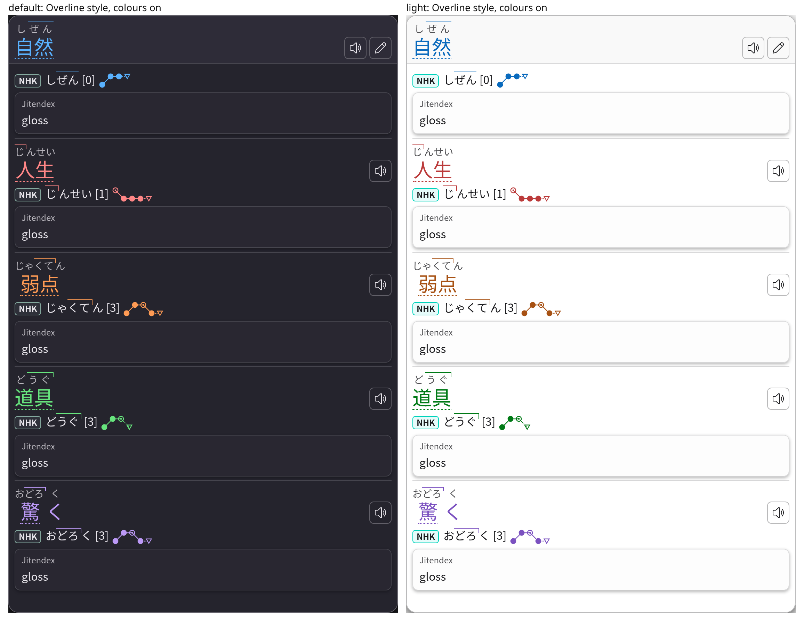
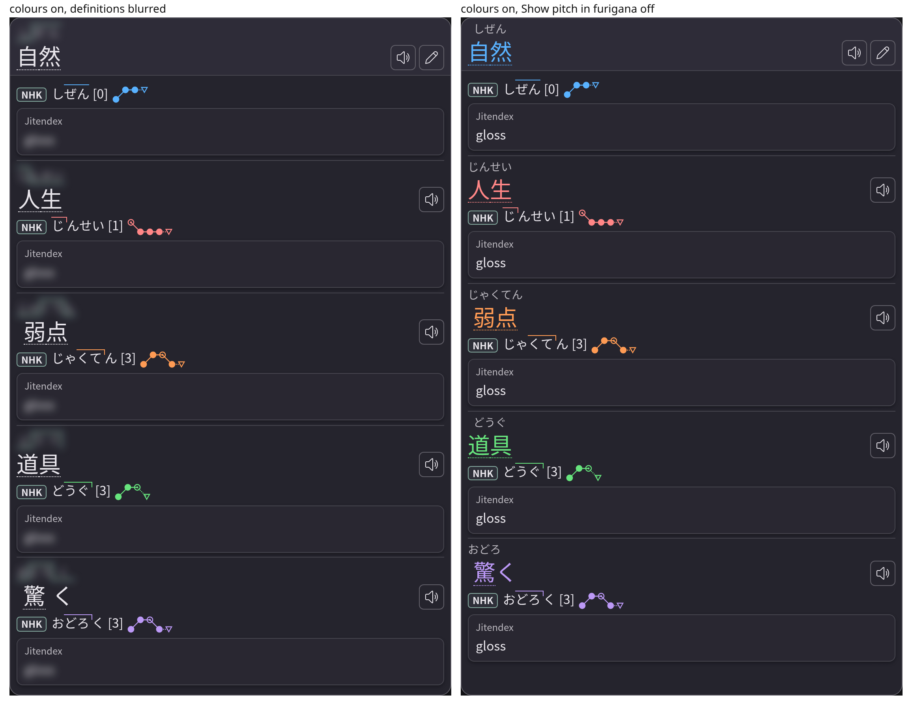
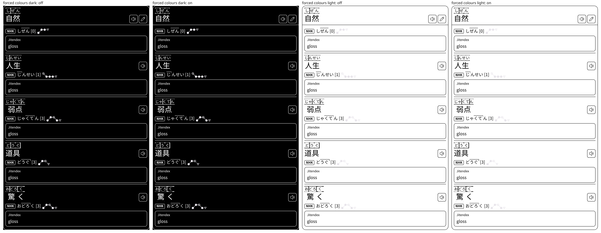

# Issue #458: pitch accent colours — evidence

Evidence for the pull request that adds **Settings → Design → Pitch accent →
Show pitch accent colours**. Branch head measured: `27f6f0a1` (on `main`
`e06aacfc`). Nothing here ships in the extension.

## How it was produced

- `measure.mjs <repo> <chrome> <out>` renders the production popup view
  (`HDPopup.createPopupView` with `render/reader.css` and `icons.css` in a
  shadow root, as the reader does) with 自然 [0], 人生 [1], 弱点 [3], 道具 [3]
  and 驚く [3] `v5`, in headless Chrome for Testing. For every palette in
  `POPUP_THEME_GROUPS` it records Chrome's computed colours with the switch on,
  off, on while definitions are blurred, and with the Overline furigana style;
  then the keyboard focus outline and both emulated forced-colours modes; then
  the screenshots below.
- `check-measure.mjs <measurements.json>` checks those values (210 headwords
  and badges per Chrome build). Both builds report no problems, and the two
  JSON files are identical apart from the version string and the reported
  width of the switch-off `none` focus outline (0px in 128, 3px in 152):
  - on: headword, kanji, kanji underline, contour line, badge overline/hook and
    graph stroke compute the group colour; with the Overline style, its line too;
  - the reading kana, badge text and dictionary tag are the same on and off;
  - off: the headword and badge lines are the text colour, as on `main`;
  - blurred: the headword waits in the text colour, badges keep their group;
  - a Tab-focused coloured kanji computes `outline: solid 2px` (`none` off);
  - forced colours: every measured property is identical on and off.
- `contrast-table.mjs reader.css` prints the worst contrast of each group over
  every palette's base-100, base-200, and popup body and header at 85% opacity
  over a white or a black page (`test/pitch-accent-colors.test.mjs` asserts the
  same).
- `yomitan-parity.mjs <yomitan checkout> <glossary.js>` compares
  `HDGlossary.pitchAccentCategory` with Yomitan 67db60d's own
  `getPitchCategory` and `isNonNounVerbOrAdjective`: 5,489 cases, 0 mismatches.

## Screenshots (Chrome 152, switch off beside on)

Graphs are switched on in every capture so the badge graph shows.

`theme-contrast.png` is `node test/chrome-theme-contrast.mjs` (45/45 rows) on
the branch head; it is byte-identical to the same run on `main`.

## Benchmark

- `pitch-fixture.mjs <repo> <out.zip>` builds a pitch archive for the hover
  benchmark's three words (食べる [2] and `LHL`, 漢字 [0], 深層 [0] and [1]),
  so every hover builds headword groups and pitch badges.
- `benchmark/hover-popup.mjs` ran with
  `HACHIDORI_HOVER_OPTIONS='{"showPitchAccentColors":true}'` on both archives,
  interleaved `main` `e06aacfc`, branch `27f6f0a1`, `main`, branch (3 fresh
  profiles each). `hover-summary.mjs` prints the medians; result signatures
  are equal on both sides.
- `render-bench.mjs <main> <branch> <chrome> <puppeteer> <raw.json> <n>`
  renders the engine's recorded replies with the production view and
  `reader.css` in two pages of one Chrome, alternating revisions sample by
  sample (20 excluded warmups, then n samples per cell), switch off and on.
