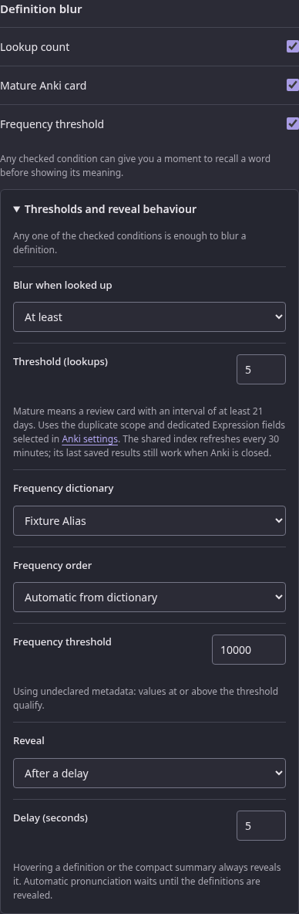

# Lookup counts

Settings → Reading → Lookup history controls recording and display. It is on by
default. Turning it off keeps existing history but stops new increments. The
Design preview uses a fixed sample count and never records a lookup.

A successful new reader request records its primary result's canonical term and
reading, not the inflected search text. Readings remain distinct. Misses and
obsolete replies do not count. Internal links and clicked-kanji term entries
are independent visits; native kanji entries are not term lookups. Tabs,
expansion, Back, and Note refresh reuse the original visit. A lost statistics
reply is never retried as an increment.

The All tab shows the primary result's count. A dictionary/group projection may
display another expression, so it does not borrow that count. Definitions do
not wait for storage: counts arrive independently, guarded by the current
request and committed statistics namespace. Statistics changes do not reload
dictionaries or invalidate lookup results.

Lookup history belongs to Hachidori and stays in this browser. Recording and
reading a count never contacts another application or service. Old external
corpus connection settings are ignored; restoring an older backup discards those
retired fields while preserving its other preferences and lookup history.

The service worker serializes updates. Each lookup reads a descriptor and one
term/reading row, then writes that row and the advanced descriptor together;
it does not scan or rewrite the collection. Terms and readings are trimmed and
NFC-normalized, with JSON-pair keys preserving delimiter identity. Counts and
timestamps survive worker/browser restart and participate in [complete backup
and restore](backup-format.md). There is no product entry cap; browser storage
and safe JSON integer representation still apply.

## Definition blur

Settings → Reading → Definition blur hides definitions, compact summaries and
reading furigana behind a blur until you recall the word. Its three conditions
are off by default and can be enabled independently; a match from any checked
condition qualifies. **Lookup count** needs lookup counts. Choose **At least**
to blur words looked up the threshold number of times (default 5) or more, or
**Below** to blur words looked up fewer times. Zero is a valid Below count. The decision uses the same count the popup displays, after
the current lookup is recorded.

**Mature Anki card** works even with lookup counts off.
It checks the first result's canonical expression against the configured Anki
note type across all decks. A word qualifies if at least one matching card is
in review with an interval of **21 days or more**, following
[Anki's card states](https://docs.ankiweb.net/getting-started.html#card-states).
New, learning and relearning cards do not qualify. The mining deck and duplicate
scope do not restrict this check; the reading and inflected search text do not
form part of the match.

In Settings → Anki, map **Expression** to a dedicated field, or use a field
template containing only `{expression}`. Templates that combine the expression
with other text, readings or markup cannot identify the word through this check.
A missing or unsupported mapping leaves maturity unavailable without changing
the mapping.

The reader checks the compact local duplicate index described in
[the architecture](architecture.md#lookup-statistics-and-definition-blur).
That check does not add or edit notes, cards or scheduling data. Anki being
closed leaves the last saved index available; an absent or unsupported source
leaves this condition unqualified. Dictionary lookup never waits for Anki.

**Frequency threshold** selects one enabled frequency dictionary. Automatic
order treats rank-based dictionaries as ascending and occurrence-based or
undeclared dictionaries as descending. Ascending qualifies when the lowest
positive native value is at or below the threshold. Descending qualifies when
the highest positive native value is at or above it. Display text is never
parsed. Missing, disabled, unavailable and nonnumeric data fail open, while an
unavailable saved selection remains visible so reinstalling the dictionary
restores it.

The Design preview uses fixed mature, count and native-frequency samples
without contacting Anki, recording history or running another lookup.

| Desktop | Narrow |
| --- | --- |
|  |  |

A frequency-only match renders blurred immediately. When frequency does not
qualify while count or Anki evidence is still pending, definitions stay
pending; when no checked condition qualifies, including unavailable checks,
they reveal. Hovering a definition or the compact summary
reveals in either mode. With the timed reveal, one deadline runs from the
first display: navigating to a kanji entry or another word cancels the live
timer, and Back continues with the remaining time rather than restarting, as
does a page restored from the back/forward cache. The decision belongs to that
lookup, so tabs, Show more, a Note refresh and Back keep it; a later count for
the same word never blurs a revealed view, and a different lookup starts
fresh. A lookup made before the saved settings have loaded waits for them.
Native kanji entries are outside term blur; term entries reached through a
clicked kanji participate.

Automatic pronunciation waits until the definitions are revealed, so the audio
does not give the reading away while they are blurred. The request-owned
frequency groups, first count snapshot and Anki result decide the blur for the
whole visit. A result that does not qualify reveals and plays at once; a
blurred result plays once when hover, the deadline or disabling blur reveals
it. Pressing the Audio button while blurred plays it then instead, and nothing
replays at the reveal.

Turning all three conditions off reveals open popups without touching a Note draft.
Disabling lookup counts removes only the count rule. Changes to Anki settings
invalidate pending and completed maturity evidence, including a word retained
for Back; old replies cannot blur the current view.
Revealed definitions never become blurred again during the same lookup. Other
live edits apply to pending or blurred popups from their original display time.
Frequency blur adds no engine, storage, Anki or network request.
