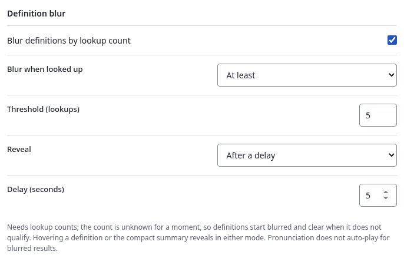

# Lookup counts

Settings → Design → Lookup history controls recording and display. It is on by
default. Turning it off keeps existing history but stops new increments. The
Design preview uses a fixed sample count and never records a lookup.

A successful new reader request records its primary result's canonical term and
reading, not the inflected search text. Readings remain distinct. Misses and
obsolete replies do not count. Internal links and clicked-kanji term entries
are independent visits; native kanji entries are not term lookups. Tabs,
expansion, Back, and Note refresh reuse the original visit. A lost statistics
reply is never retried as an increment.

The All tab shows the primary result's count. A dictionary/group projection may
display another expression, so it does not borrow that count. Definitions do
not wait for storage: counts arrive independently, guarded by the current
request and committed statistics namespace. Statistics changes do not reload
dictionaries or invalidate lookup results.

“Seen” is available through an optional, read-only GameSentenceMiner connection.
It is off by default. Enable it under Settings → Design → Lookup history and
leave the URL at `http://127.0.0.1:7275` for GameSentenceMiner's default local
web server. Hachidori accepts only loopback HTTP or HTTPS origins. It asks the
word-detail endpoint for the canonical headword and uses `total_occurrences`;
reading is intentionally ignored to match GameSentenceMiner's corpus count.

A confirmed `Word not found` response means Seen is zero. Timeouts, unavailable
tokenization, malformed replies and other failures leave Seen unavailable.
Those failures never undo or delay the local lookup increment. Hachidori makes
the corpus request only after releasing its serialized storage transaction, so
a slow local server cannot hold up settings or other storage writes.

The service worker serializes updates. Each lookup reads a descriptor and one
term/reading row, then writes that row and the advanced descriptor together;
it does not scan or rewrite the collection. Terms and readings are trimmed and
NFC-normalized, with JSON-pair keys preserving delimiter identity. Counts and
timestamps survive worker/browser restart and participate in [complete backup
and restore](backup-format.md). There is no product entry cap; browser storage
and safe JSON integer representation still apply.

GSM PR #549, pinned at `524ed0b3b92decae87f65df02df9ef9e512f7674`, is the
reference for the term/reading identity, popup count display and corpus
semantics. Frequency ranks, current page text and custom notes are not
substituted for corpus history. No pages, page URLs or browsing history are
sent to GameSentenceMiner.

## Definition blur

Settings → Design → Definition blur hides definitions, compact summaries and
reading furigana behind a blur until you recall the word. It is off by default
and needs lookup counts. GSM PR #549 blurs a word once it has been looked up
**at least** the threshold number of times (default 5); **Below** is the issue #9
adaptation for words looked up fewer times than the threshold, and zero is a
valid Below count. The decision uses the same count the popup displays, after
the current lookup is recorded.

A new lookup renders blurred while its count is unknown. A qualifying count
keeps the blur; any other outcome, including counts being unavailable or
turned off, reveals immediately. Hovering a definition or the compact summary
reveals in either mode. With the timed reveal, one deadline runs from the
first display: navigating to a kanji entry or another word cancels the live
timer, and Back continues with the remaining time rather than restarting. The
decision belongs to that lookup, so tabs, Show more, a Note refresh and Back
keep it; a later count for the same word never blurs a revealed view, and a
different lookup starts fresh. Native kanji entries are outside term blur;
term entries reached through a clicked kanji participate.

Automatic pronunciation waits for the decision. A blurred result never
auto-plays, even after hover or the deadline reveals it, so the audio does not
give the reading away; a revealed result plays once as usual, and the Audio
button always works manually.

Turning blur or lookup counts off reveals open popups without touching a Note
draft. Other live edits apply to unrevealed popups from their original display
time. The Design preview uses its fixed sample count of 3 with the same rule,
hover and delay, and records nothing.
