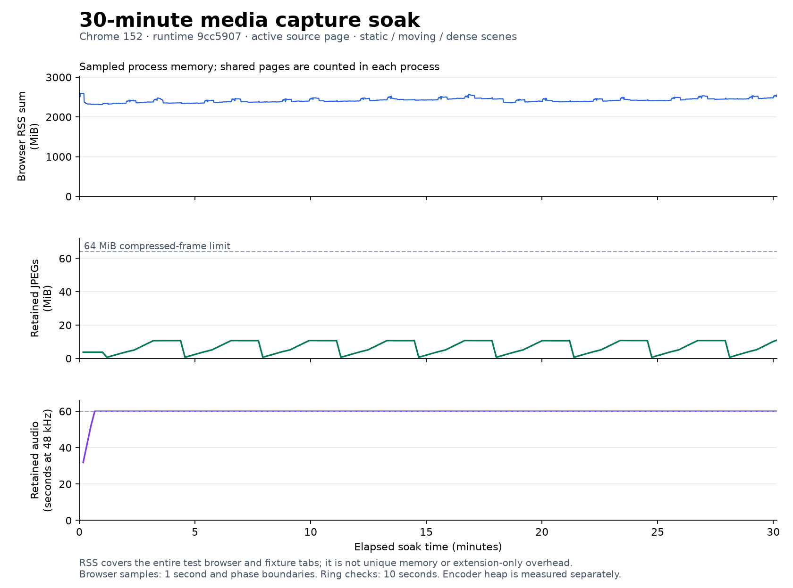

<!-- SPDX-License-Identifier: GPL-3.0-or-later -->

# PR #71 capture acceptance record

This records the follow-up to the 7 September 2026 review of
[PR #71](https://github.com/bee-san/hachidori/pull/71), reviewed at
`5e85e291ccf39f27c56f5f83da4f35762ec2b1c2`. Results below are local validation
snapshots. The timing/resource measurement runtime is `9cc5907`, extension tree
`79cdedc83ca5b15bf42977925bd00c90ca4662df`. It passed both processor and
AudioWorklet capture checks on Chrome for Testing
152.0.7977.82 at later revisions with the same extension tree. The headful
thirty-minute run at `9cc5907` completed **13/13 checks** and **27 repeated exports**.

The final merge review additionally identified cleanup needed after a definitive
Anki duplicate/invalid response and after a replacement reader fails to link.
Those lifecycle corrections and their final validation are recorded separately
below; the long-run measurements retain their original revision provenance.

## Nine review findings

All nine have focused production-path regressions. The complete Node suite
passed **226 tests, 0 failures** for runtime `9cc5907`. Run the capture review subset with:

```sh
node --test test/capture-*.test.mjs test/avif-sequence.test.mjs \
  test/anki-worker.test.mjs test/anki-templates.test.mjs \
  test/media-settings.test.mjs test/texthooker-protocol.test.mjs
```

| Finding | Corrected behavior | Verified evidence and limits |
| --- | --- | --- |
| 1. Stop followed by a new Anki mutation | Recheck the capture job immediately before add/update, after uploads and the final configuration read. Preserve the result of a mutation already sent. | [Anki worker tests](../test/anki-worker.test.mjs) exercise both add and overwrite through the production worker/service with a controlled gateway. No cancellation experiment writes to a live Anki collection. |
| 2. Fresh texthooker settings deadlock | The endpoint is editable before the feed is enabled. | [Settings regression](../test/media-settings.test.mjs) loads the production settings source and invokes the actual input/checkbox handlers. |
| 3. Invalid Automatic capture markers | Automatic and basic mapping share semantic-to-marker conversion, including when capture is disabled. | [Template tests](../test/anki-templates.test.mjs) validate `{capture-animation}` and `{capture-audio}` from the production helper. |
| 4. Stale nested lookup releases the root pin | Only the owner releases an unadopted provisional pin; child requests borrow it. | [Reader ownership tests](../test/capture-reader-ownership.test.mjs) invoke production lookup entrypoints for dismissed/superseded children, errors, stale root replay, and an unlink during pending acquisition. |
| 5. Cue interruption sends an Event timestamp | Pause, seeking, and ended listeners close with a numeric timestamp. | [Collector tests](../test/capture-content.test.mjs) dispatch actual events through the production message validator and timeline, then check the closed interval. |
| 6. Worker restart loses the reader binding | A surviving offscreen recorder and reader recover their same session/document through a validated handshake. | [Routing tests](../test/capture-routing.test.mjs) cover fresh worker handlers, immediate lookup, concurrent recovery, navigation, and settings races. The real-browser run replaced the worker target and recovered the same session/reader successfully. |
| 7. AVIF and WAV durations differ | Retain the start predecessor and serialize both assets on the same sample timebase. A single static frame becomes two identical timed samples, preserving a looping sequence. | [Buffer tests](../test/capture-buffer.test.mjs) and [real libavif tests](../test/avif-sequence.test.mjs) check irregular boundaries, static clips, odd sample counts, and exact WAV duration. Real-browser exports covered exactly ten seconds for both an 80-frame moving sequence and a two-frame static sequence. Content alignment is tracked separately below. |
| 8. Recently captured audio arrives after finalization | Allow a bounded 250 ms delivery drain without moving the anchor; report a continuous audio gap explicitly. | [Session tests](../test/capture-session.test.mjs) deliver late audio/JPEGs for recent and future intervals, test missing samples, stationary video, and Stop during drain. Committed-runtime processor and AudioWorklet browser runs both passed. |
| 9. Resizing stretches the source | Fit each frame inside the original canvas, preserving aspect ratio and adding letterboxing without upscaling. | [Drawing-path regression](../test/capture-routing.test.mjs) checks the production drawing geometry. The real X11 window test delivered a resize from 960 × 540 to 500 × 500; it does not inspect encoded pixels after resize. |

## Additional acceptance checks

| Area | Evidence as of 7 September 2026 | Status / remaining work |
| --- | --- | --- |
| Closed texthooker lines, DOM range association, ancestor visibility | Timeline/session/collector tests cover retained closed lines in the current live epoch, sentence ranges inside paragraphs, ambiguous ranges, and transparent ancestors with layout boxes. The production hover candidate supplies its DOM range. | Focused tests passed. |
| Controls closure and source interruption | The shared offscreen document owns capture. Host tests cover a late picker after Stop/settings changes and source mute without a controls page; clock tests cover backward video timestamps and interrupted audio delivery. | Focused tests and real controls close/reopen passed. The measured runtime also rejects delayed reader linking after Stop or session replacement, and an obsolete same-page link cannot unlink the replacement collector. |
| Real application window and monitor | `chrome-capture-surfaces.mjs`: **5/5** at `9cc5907`, Chrome for Testing **152.0.7977.82**, isolated Xvfb/KWin. Window resize arrived; minimize/restore retained the session and resumed frames; closing the source stopped and cleared history. Monitor capture and Stop passed. Neither surface provided audio, and the controls reported it unavailable. | Verified for this Linux/X11 setup. Physical sleep/wake and other OS capture/audio behavior untested. |
| Default ten-second moving-text clip | The browser export at `9cc5907` produced 80 frames over exactly ten seconds, with matching AVIF/WAV durations, a 32 MiB encoder heap, and 8,560.7 ms export time. | This export component passed actual Anki review: 80 distinct frames observed and repeated in the second loop; its ten-second WAV played/replayed for 10.049/10.087 seconds with PCM peaks of 65 matching the source. |
| Captured tab behind controls | A controlled focus comparison measured 7.99 fps with the source in front, 6.49 fps behind controls, and 7.99 fps after restoring source focus. In the background phase, Chrome counted 70 upstream frames and delivered 65 after five browser rate-adapter discards; all 65 reached JPEG encoding. | The configured 8 fps is a ceiling. The full-rate soak keeps the source in front to match its baseline; it does not establish 8 fps for background sources. |
| Static-scene export | The measured runtime exported a static scene after sixty seconds as a looping two-frame AVIF and WAV, each exactly ten seconds. Export took 771.8 ms with a 32 MiB encoder heap. Actual Anki held the same scene for 23.36 seconds and played/replayed audio for 10.068/10.082 seconds. | Static component passed. Rendered RGB RMS difference was 0.3840/255, within the 1/255 limit. An independent moving-frame negative control measured 17.2280/255 and was rejected. Both audio peaks of 65 matched the source; static pixels alone cannot prove a loop. |
| Flash/beep content alignment ≤125 ms | Chrome for Testing **152.0.7977.82** measured **61.021 ms** with processor audio at `da96d6a`, **122.833 ms** with AudioWorklet at `2a5ce05`, and **106.833 ms** after the thirty-minute processor soak at `9cc5907`, all on measured runtime tree `79cdedc83ca5b15bf42977925bd00c90ca4662df`. | All three **13/13** runs passed the unchanged 125 ms gate. The worklet result is close to that limit and is not a guarantee of additional timing margin. These measure exported content alignment, not synchronization between separate Anki image/audio playback schedules. |
| Short sustained processor check | At `da96d6a`, the headful test completed **150.13 seconds** cycling static/moving/dense scenes. Initial full, static, moving, and dense exports contained **79, 2, 81, and 81 frames** respectively; each AVIF/WAV pair covered exactly ten seconds. Final retention was 480 video frames and 2,880,512 audio samples. | **13/13** browser checks passed, independently of the thirty-minute run. |
| Thirty-minute retention, CPU, sampled memory, full-export lookup latency | At `9cc5907`, **1,809.97 seconds** of static/moving/dense recording completed **27 exports** and **559 lookup batches during those exports**. Each AVIF/WAV pair covered exactly ten seconds; moving/dense clips held 80–81 frames and static clips held two. | **13/13 passed.** Maximum observed retained JPEGs: **10.97 MiB** against the 64 MiB limit; retained audio: **60.011 seconds**, including a boundary block. Encoder heap: **32 MiB** for every export. Resource measurements and limits are detailed below. |
| Actual Anki Desktop AVIF/WAV | Anki **26.05**, Qt **6.11.1**, embedded Chromium **140.0.7339.225**. Fresh isolated collection, real reviewer, AVIF looping, actual MPV playback/replay, private recorded audio sink, remote reviewer requests blocked. | Short, full moving, and full static asset pairs passed their respective checks. Audible and low-level source PCM were preserved on playback/replay. Static pixels do not independently establish a loop boundary. No AnkiWeb sync or extra-device/client playback was tested. |
| Repository checks | Node **226/226**, focused collector/host/routing **28/28**, and extension smoke **445/445** for runtime `9cc5907`; Chrome E2E **170/170** at `9cc5907`; earlier Node/WASM smoke **116/116** and benchmark tests **39/39**. Capture checks: Chrome for Testing **152.0.7977.82**, processor **13/13** at `da96d6a` and AudioWorklet **13/13** at `2a5ce05`. | Checks are local results for the recorded revisions. Final CI, Sonar, and review status remain tied to the eventual PR head. |

The completed processor and AudioWorklet runs both recorded measured extension
runtime tree `79cdedc83ca5b15bf42977925bd00c90ca4662df` and
`extensionModified: false`. Full exports covered exactly ten seconds in both
formats and used a measured 32 MiB encoder WASM heap:

| Chrome for Testing 152 audio path / revision | Full AVIF frames | Export time | Largest lookup-batch median / p95 during export |
| --- | ---: | ---: | ---: |
| Processor / `da96d6a` | 79 | 8,792.1 ms | 7.7 / 14.9 ms across 30 batches |
| AudioWorklet / `2a5ce05` | 80 | 8,964.6 ms | 9.2 / 15.6 ms across 30 batches |

These are one machine's results, not performance guarantees. The thirty-minute
run started at `9cc5907` with the same extension tree; its initial full ten-second
export measured 8,560.7 ms with 29 lookup batches, whose largest median/p95 was
7.9/14.0 ms. Its full and static assets were independently verified in Anki below.

## Final merge review corrections

The review of `518f190` identified two additional lifecycle failures.
`93da66f` releases a prepared export after an explicit duplicate/invalid Anki
response, including after popup retirement or reader relinking. Uncertain
responses and lost replies retain their existing ownership. Its controller,
worker, mining, and session checks passed **47/47**.

`9148812` clears the previous host binding before attempting a replacement
reader link. A failed replacement leaves the recorder running and unlinked;
newer links and replacement sessions remain protected. Its focused routing and
lifecycle checks passed **44/44**. Both failures were reproduced before the fix,
and both changed runtime files passed the local SonarJS checks with zero findings.

Before these final corrections, the prospective merge with `main` at `6b89552`
passed **230 Node tests, 448 extension smoke checks, and 171 Chrome E2E checks**.
The current main changes were then integrated without conflicts. The final
cleanup changes received focused regressions; full-browser and thirty-minute
checks were not repeated afterward and retain their measured revisions.

## Thirty-minute resource measurements

The completed run used an Intel Core Ultra 7 165U (14 logical CPUs), Linux
7.1.5-1-cachyos, Chrome for Testing 152.0.7977.82, an isolated Xvfb display, and
a 1280 × 720 source with the default 640 × 360 / 8 fps output preset. It explicitly enabled headful mode and
restored source focus after lifecycle checks, matching the throughput baseline.
Nine static, nine moving, and nine dense-scene exports ran while recording
continued. Moving/dense export times ranged from 7,838.2 to 9,342.5 ms; static
exports took 705.6–771.8 ms. Every encoder reported a 32 MiB WASM heap.

The stopped/recording lookup medians were 6.4/6.3 ms. Across the 559 lookup
batches during repeated exports, the largest batch median was 14.9 ms and the
largest batch p95 was 23.1 ms. These are maxima of batch statistics, not a pooled
p95 or a maximum individual lookup latency.

| Browser phase | Observed duration (s) | CPU (% of one core) | Sampled peak summed RSS (MiB) |
| --- | ---: | ---: | ---: |
| Capture off, animated fixture running | 5.22 | 91.2 | 1,940.3 |
| Initial recording | 20.33 | 161.4 | 2,622.7 |
| Initial full export | 10.51 | 321.9 | 2,722.1 |
| Static recording, nine periods | 540.22 | 18.3 | 2,625.6 |
| Static exports, nine periods | 11.63 | 156.8 | 2,491.1 |
| Moving recording, nine periods | 540.25 | 149.0 | 2,475.5 |
| Moving exports, nine periods | 88.95 | 316.8 | 2,532.6 |
| Dense recording, nine periods | 533.52 | 153.1 | 2,537.9 |
| Dense exports, nine periods | 95.31 | 315.5 | 2,570.2 |

CPU/RSS covers the entire test browser, including the animated fixture tabs;
it does not isolate capture overhead. Repeated phase totals exclude intervening
phases, and newly observed processes contribute their observed CPU time.
Sampling occurs every second and at phase boundaries. Processes that start and
exit between samples are missed. Summed RSS counts shared pages in each process,
so it is neither unique memory nor a continuous peak. Export phase durations
include surrounding harness work and differ from the export timings above.



The ring checks observed at most 482 retained frames, 10.97 MiB of JPEGs, and
2,880,512 audio samples. Browser RSS rose modestly across scene cycles and also
showed reclamation; this run establishes bounded recording history and measured
resource use, not absence of a browser or extension memory leak.

Chromium forwards the requested frame rate as a
[minimum capture period](https://github.com/chromium/chromium/blob/152.0.7977.82/content/browser/media/capture/frame_sink_video_capture_device.cc#L327).
Its [capture oracle](https://github.com/chromium/chromium/blob/152.0.7977.82/media/capture/content/video_capture_oracle.cc#L140)
samples compositor events and can rewrite animated-content timestamps. Blink's
[track adapter](https://github.com/chromium/chromium/blob/152.0.7977.82/third_party/blink/renderer/modules/mediastream/video_track_adapter.cc#L503)
separately drops frames whose timestamps are too close together. These sources
support a maximum-rate interpretation; the probe does not identify which
upstream compositor decision caused its lower background delivery rate.

## Local evidence provenance

These paths identify the machine-local evidence, not files distributed with the
repository. Use the [test commands](../test/README.md#chrome-capturemjs) to create
new evidence on another machine.

| Run | Evidence |
| --- | --- |
| Full Node for runtime `9cc5907` | `/tmp/pr71-link-race-node-final.log`: **226/226** |
| Focused lifecycle / extension smoke for runtime `9cc5907` | `/tmp/pr71-link-race-root-tests.log`: **28/28**; `/tmp/pr71-extension-smoke-9cc5907.log`: **445/445** |
| Earlier Node-WASM smoke / benchmark tests | `/tmp/pr71-node-smoke.log`: **116/116**; `/tmp/pr71-benchmark-tests.log`: **39/39** |
| Chrome E2E | `/tmp/pr71-chrome-e2e-9cc5907.log`: **170/170** |
| Processor run with recorded revision | `/tmp/pr71-preflight-2a5ce05.log`: **13/13**; its recorded revision is `da96d6a`, as preserved in `/tmp/pr71-preflight-da96d6a-bench.json`; 150.13 seconds sustained, 61.021 ms flash/beep offset |
| AudioWorklet run with recorded revision | `/tmp/pr71-capture-worklet-2a5ce05.log`: **13/13** at `2a5ce05`, 122.833 ms flash/beep offset |
| Earlier Chromium 150 processor coverage | `/tmp/pr71-capture-chromium150-marker-fixed.log`: **13/13** at `acf81a9`, 22.479 ms flash/beep offset |
| Completed thirty-minute headful soak | `/tmp/pr71-capture-soak-active.log`: **13/13**, exit 0; `/tmp/pr71-capture-soak-final-bench.json`; assets and `resources.json` in `/tmp/pr71-capture-assets-soak-active/`; 1,809.97 seconds, 27 exports, 106.833 ms flash/beep offset |
| Controlled captured-tab focus comparison | `/tmp/pr71-focus-cadence-ICTWdp/results.json` and `instrumentation.diff`: identical source and 1280 × 720 capture settings across foreground, background, and restored-foreground phases |
| X11 surfaces | `/tmp/pr71-surfaces-9cc5907.log`; `/tmp/hachidori-surfaces-CCRf3L/results.json` |
| Actual Anki audible clip | `/tmp/hachidori-anki-desktop-pm4uygh1/result.json`: 2.6173125 s WAV, two playback peaks of 8,669 matching the source; 14 distinct rendered AVIF frames, 13 observed again in the second loop. |
| Actual Anki full clip from `9cc5907` | `/tmp/hachidori-anki-desktop-xuc5hjr8/result.json`: 80 distinct rendered frames repeated in the second loop, 9.956 s sampled recurrence, 10.049/10.087 s audio plays with PCM peaks of 65 matching the source |
| Actual Anki static clip from `9cc5907` | `/tmp/hachidori-anki-desktop-6o14q5ti/result.json`: same scene observed for 23.36 s, RMS difference 0.3840/255; ten-second WAV played/replayed for 10.068/10.082 s, both PCM peaks of 65 matching source |
| Static image tolerance controls | `/tmp/pr71-anki-static-controls-final.json`: final static RMS difference 0.3840 accepted; final moving-frame RMS of 17.2280 rejected against the 1/255 normalized RGB limit |

The Anki harness snapshots the exact input bytes before importing them. Recorded
SHA-256 identities for those runs are below. Full/static assets come from
`9cc5907`; the earlier short pair separately proves playback of its audible
flash/beep marker.

| Asset | SHA-256 |
| --- | --- |
| Short AVIF | `d6070f7a9ff1da028b465917012b0dbfc8b23de32e38c811949695d6a1e33ce3` |
| Short WAV | `d90e9ef665e639d4288ddb6df427850f2699e4c6075ce27896686d865279b276` |
| Full AVIF | `418b5a24b61d42642cc10080ebf67ab27a1442ce30560be63de5fe802e4c06fd` |
| Full WAV | `ec1989b706825d4b6fb5b8f5207551529c4d6a91dbcbce2dd53ff22f7ae9d763` |
| Static AVIF | `9e558f663acb46562b746a82d50d40567b227b54a0a75cc7427078e86d74ed7d` |
| Static WAV | `35e10e6fc5c9dab306b74d6744e7d1d5eb9e005f066df22b3d46178a32668495` |

## Superseded attempts

These explain earlier failures and are excluded from the completed soak's
acceptance results. `/tmp/pr71-capture-static-check.log` passed its static export but
later failed alignment. `/tmp/pr71-capture-soak-measured.log` omitted headful
mode and stopped after 387 seconds on its dense-frame gate. Its silent-source
assets did pass isolated Anki playback checks
(`/tmp/hachidori-anki-desktop-92dz6t51/result.json` and
`/tmp/hachidori-anki-desktop-qyaufsca/result.json`), but current asset provenance
comes from the explicitly headful run above.
