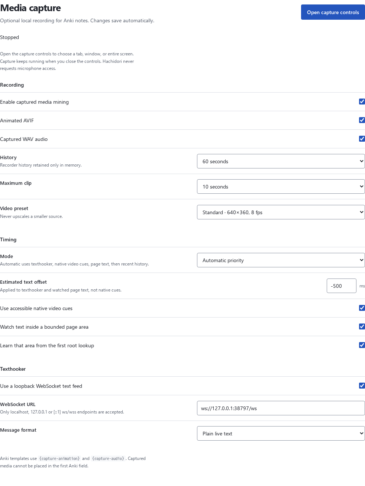
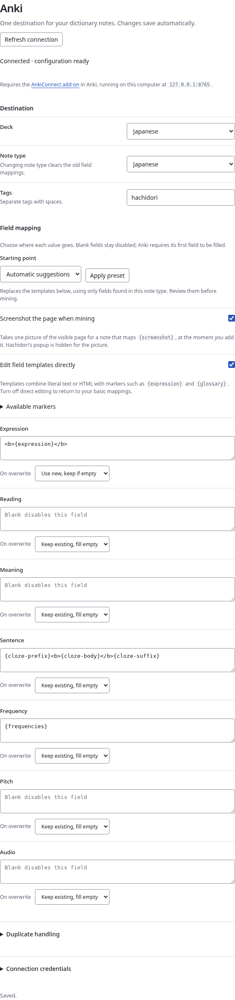

<!-- SPDX-License-Identifier: GPL-3.0-or-later -->

# Media mining

Media mining is an optional, default-off recorder for attaching local gameplay
or reading context to Anki notes. It produces two independent assets over the
same pinned interval:

- an animated AVIF, fitted to 640 × 360 at up to 8 fps in Standard mode or
  480 × 270 at up to 6 fps in Compact mode;
- a 16-bit mono WAV from the selected share's source audio, when Chrome makes
  that audio available.

Pronunciation `{audio}` remains separate. Media-mining templates use
`{capture-animation}` and `{capture-audio}`. When `{audio}` resolves to browser
text-to-speech, an active capture with shared audio can record the exact selected
voice at mining time and attach its WAV to Anki. This does not reuse the pinned
sentence clip. A downloadable pronunciation source remains the fallback when
speech is not captured.

When linked to another Hachidori, the host chooses the browser-speech source
from its saved mining configuration, but the reading browser verifies its own
voice and shared-audio capture and records the exact WAV locally. Transient PCM
never crosses the relay; only the final bounded WAV accompanies the submission
to the host.

## Setup

1. Open **Settings → Media capture**.
2. Enable media capture and keep at least one output enabled.
3. Kiku, Lapis and Senren use their stock fields automatically for a pinned
   clip: animation replaces `{screenshot}` in `Picture`/`picture`, and captured
   audio fills a blank `SentenceAudio`/`sentenceAudio`. A nonblank custom
   sentence-audio template is left alone.
4. For a custom note type, map `{capture-animation}` and/or `{capture-audio}`
   into non-first Anki fields manually. Unmapped outputs are neither encoded
   nor uploaded.
5. Open **Capture controls**, click **Start capture**, and choose one browser
   tab, application window, or monitor in Chrome's picker. Source audio depends
   on the browser, operating system, chosen surface, and picker audio option.
6. Select and link the reading page. If it has several videos, select the
   relevant one. Hachidori may learn an ordinary accessible text area from the
   first root lookup, or you can use **Track this text area**.
7. The controls may be closed and reopened while recording continues. The
   recorder lives in the extension's shared offscreen document.

Changing collection settings while recording asks for confirmation, then stops
capture and clears transient history. **Stop capture** cancels pending capture
and export work and clears media, text timing records, source bindings, and
unsubmitted pins. A note mutation already sent to Anki may still succeed;
stopping during media upload prevents a new note mutation from being sent.

Settings, imports, extension restarts, and browser restarts never arm capture
automatically. A service-worker restart can recover the same recording and
linked reading document while the offscreen recorder survives. Losing that
recorder or the shared source requires another **Start capture** click.

## Page screenshot

A note can also carry one picture of the page it was made from, without recording
anything. It needs no share, no **Start capture**, and no session:

1. Open **Settings → Anki**.
2. Keep **Screenshot the page when mining** on, and give a field the
   `{screenshot}` marker — the Kiku, Lapis and Senren presets already map their
   picture field to it, and **Apply preset** does so for the fields your note
   type actually has.
3. Add a note as usual. One picture of the visible page is taken at that moment,
   with Hachidori's popup and image preview hidden for it.

Without a pinned clip, the recognised presets keep this normal static
screenshot. With a pin and animation output enabled, Hachidori replaces only
the request's `{screenshot}` marker with `{capture-animation}`; the saved
template is unchanged and no JPEG is taken. If animation encoding later fails,
the existing capture error is reported without taking a second, fallback
screenshot. Audio-only capture leaves the static picture mapping in place.

The picture is stored through the same AnkiConnect media gateway as dictionary
images and pronunciation audio, under its own `hachidori-screenshot-<uuid>.jpg`
name, and the mapped field receives an ordinary `` reference. It is uploaded
with the note rather than before it, so a note Anki rejects leaves no stray file. Nothing is
captured while you read, hover or during first-run setup, and only the tab that
asked is captured: if it is no longer the active tab, or has moved to another
page, the screenshot is skipped. `{screenshot}` cannot go in the first field, which is the
note's identity for duplicate checks. A skipped or refused screenshot is a warning
beside the note's own result — the note is still added or updated, its other
fields intact, and no duplicate retry is invited.

When the browser is linked to another Hachidori, it still owns and takes this
screenshot. Immediately before submission it sends the validated JPEG bytes to
the host, which performs every AnkiConnect and generation decision with the
host's configuration. It never tries the linked browser's Anki endpoint.

## Timing

Auto mode resolves each root lookup independently:

1. a matching accepted live record from the configured loopback texthooker;
2. a matching cue transition witnessed on the selected linked-page video;
3. a matching change witnessed in the tracked ordinary DOM text area;
4. the recent history ending at lookup time.

The first text already present when an area is learned has no observed onset,
so it falls back. Later replacement, typewriter, append, hide, pause, seek, and
cue transitions can supply timing. Repeated or cross-session matches that
cannot be distinguished fail closed and continue down the priority chain.
Nested lookups inherit the root pin, so reading definitions does not move the
clip.

**Webpage only** skips texthooker input. **Recent clip only** skips all text and
cue collectors. A matching clip remains valid when its audio contains silence;
Hachidori does not use voice activity detection.

The texthooker client accepts only an explicitly configured loopback `ws://`
or `wss://` endpoint. Enter the endpoint before enabling the feed. Plain mode
requires a live-only stream. The **JSON · text_received** format recognizes the
tested live text messages and ignores snapshots, acknowledgements,
translations, and unrelated commands. Incoming text is never displayed, used
as HTML, or treated as an instruction to create a note.

Closing a line keeps its timing eligible in the current live feed epoch.
Disconnecting or reconnecting invalidates that feed's previous epoch. Page
timing uses the lookup's DOM range to distinguish nearby occurrences; an
ambiguous range falls back to recent history.

## Retention and export bounds

The recorder targets the configured 30- or 60-second history and exports clips
of up to the configured 5 or 10 seconds. A closed text interval or partial
warmup history can produce a shorter clip. It enforces these resource limits:

| Resource | Bound |
| --- | --- |
| Live compressed frames | 64 MiB, 256 KiB per frame |
| Extra pinned compressed frames | 32 MiB |
| Text timing records | 1,000 records, 4,096 characters each |
| Animated AVIF | 4 MiB |
| Mono WAV | 1 MiB |
| Encoder heap | 256 MiB |
| Encoder job | one at a time, 30-second watchdog |
| Capture asset message | 6 MiB serialized |

Frames are fitted without upscaling and JPEG-compressed in a dedicated worker
before entering the ring. This keeps Chrome's background-page idle encoding
from delaying frame delivery. Audio uses a sample-clocked mono Float32 ring.
Each new frame preserves its aspect ratio inside the session's original canvas,
with letterboxing after a source resize when needed. A byte limit can shorten
the available video history.

The 8/6 fps settings are ceilings. A static or background source may deliver
fewer frames, and capture cannot restore frames the browser did not deliver.
In a controlled Chrome test, moving the captured tab behind the controls
reduced delivery from 7.99 to 6.49 fps; returning to the source restored
7.99 fps. Every delivered frame reached the JPEG worker in that probe.

At the selected interval's end, the recorder allows up to 250 ms for already
captured audio and JPEG frames to arrive. This delivery drain does not move
the lookup anchor or extend the clip. The frame displayed at the interval's
start is retained, including when it precedes the boundary; a stationary source
can hold its last frame. AVIF frame durations and WAV samples use a common
48 kHz timebase so both files cover the same duration. Equal duration alone
does not establish flash/beep synchronization; see the acceptance record below.

If audio samples are still missing after the bounded drain, an export requiring
that audio fails explicitly. Fully delivered source silence remains valid.
If the selected share supplies no audio track, animation can still be exported
with a warning; an audio-only mapping reports unavailable source audio.
Hachidori never substitutes microphone or fabricated silent audio.

Anki preflight performs no media work. For recognised presets, preflight and
submission each derive an independent request-only copy of the saved templates
before duplicate and overwrite filtering. A skipped, retained or unchanged
field therefore requests no encoding or upload. On submission, Hachidori
encodes only referenced outputs, rechecks duplicate/configuration state,
uploads assets one at a time, revalidates, writes the note, and verifies the
result. An uncertain write is not automatically retried or duplicated.

## Privacy and limitations

Raw frames, PCM, received text, identifiers, timing records, and source
bindings stay in the offscreen recorder and linked page's transient state,
and are not written to
`chrome.storage.local`. Only explicitly mined final assets are sent to the
configured AnkiConnect endpoint. If this browser is linked, those final AVIF/WAV
assets cross the sharing relay to the host for its Anki transaction; raw capture
history and source bindings do not.

The generic page collector supports ordinary accessible DOM where Hachidori can
already locate text. Unsupported iframe or shadow-root combinations,
canvas-only text, burned-in subtitles, and private player surfaces require a
texthooker or recent-history timing. This release intentionally has no OCR,
speech recognition, VAD, subtitle interception/download, site-specific player
adapters, or microphone capture.

Navigating away from or unlinking the reading page clears its binding and
unsubmitted pins while recording continues. An export already admitted owns
its clip independently. A shared track ending or becoming unavailable stops
capture and clears history. An audio sample-clock interruption leaves an
explicit gap in history and recording continues; a clip crossing that gap
reports missing samples, while later complete clips remain usable. Minimize
behavior depends on the selected share: it may keep producing frames or make
the source unavailable. Stopped capture never resumes itself.

Animated AVIF and WAV are separate Anki media files; client media support and
playback scheduling can vary. Physical sleep/wake and media sync to additional
Anki devices have not been validated.

## Verification

The focused Node suite exercises production settings handlers, lookup ownership,
collector messages, restart routing, buffer and drain behavior, AVIF/WAV
encoding, and the final Anki mutation boundary. Separate browser, Linux surface,
and installed-Anki harnesses cover the real runtimes.

The [PR #71 acceptance record](media-capture-review.md) records passing processor
and AudioWorklet capture, flash/beep alignment within 125 ms, a thirty-minute
retention soak, and actual Anki Desktop playback. It also records measurement
limits and untested platform/client behavior. See the commands in the
[test harness documentation](../test/README.md#chrome-capturemjs).
