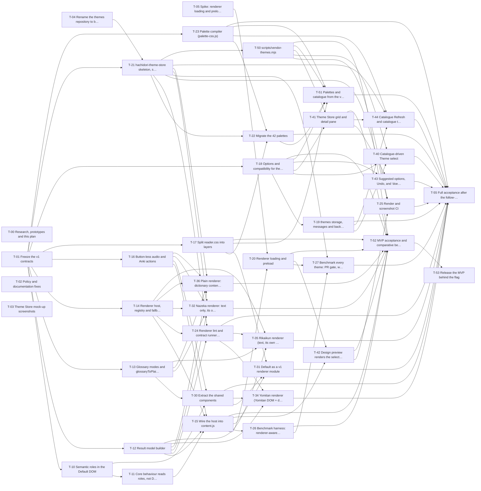

# Kanban board

Columns follow GitHub Projects: **Backlog → Ready → In progress → Review → Done**. A card is *Ready* when everything in "Blocked by" is Done. Size: S ≈ 1 day, M ≈ 2–4 days, L ≈ 1–2 weeks. Full cards: [tasks/](tasks/). How agents claim and ship cards: [parallel-plan.md](parallel-plan.md#5-agent-protocol).

Milestones: **MVP** (Default + Nazeka + Plain behind `experimental.themeStore`, the scope of the issue body of 2026-09-28 18:23 UTC plus the owner's Plain theme), then **after the MVP**. Critical path to the MVP release (sizes as working days, unlimited agents): **T-01 → T-14 → T-15 → T-26 → T-52 → T-53**, about 28 working days. To the full acceptance: **T-01 → T-14 → T-15 → T-26 → T-27 → T-55**, about 30 working days.

#### Done (1)

| ID | Card | Owner | Blocked by | Size | Acceptance |
| --- | --- | --- | --- | --- | --- |
| [T-00](tasks/T-00.md) | Research, prototypes and this plan | agents + bee-san | — | — | Evidence branches + this plan exist |

#### Ready (5)

| ID | Card | Owner | Blocked by | Size | Acceptance |
| --- | --- | --- | --- | --- | --- |
| [T-01](tasks/T-01.md) | Freeze the v1 contracts | architect agent + bee-san sign-off | — | M | Contract + schemas approved; `experimental.themeStore` flag (off); stubs/anchors; suites green |
| [T-02](tasks/T-02.md) | Policy and documentation fixes | docs agent | — | S | AGENTS.md rules, CWS remote-content + permission rows, privacy, daisyUI credit, architecture drift fixed |
| [T-03](tasks/T-03.md) | Theme Store mock-up screenshots | design agent | — | S | 3 PNGs posted to #334; owner feedback recorded in ui.md |
| [T-04](tasks/T-04.md) | Rename the themes repository to `bee-san/hachidori-theme-store` | maintainer (bee-san) | — | S | Repo renamed to hachidori-theme-store, protected, labels created |
| [T-05](tasks/T-05.md) | Spike: renderer loading and preload | perf agent | — | M | Decision record with numbers; chosen loader keeps cold first hover within budget; overlay answer |

#### In progress (0)

Empty. A card moves here when an agent claims it (assignee + `in-progress` label + draft PR).

#### Review (0)

Empty. A card moves here when its PR is ready for review with green CI on the exact head.

#### Backlog (51)

**MVP: next up (Default + Nazeka + Plain)**

| ID | Card | Owner | Blocked by | Size | Acceptance |
| --- | --- | --- | --- | --- | --- |
| [T-10](tasks/T-10.md) | Semantic roles in the Default DOM | core agent | T-01 | S | Every core-read Default element carries its role; no visual change |
| [T-11](tasks/T-11.md) | Core behaviour reads roles, not Default classes | core agent | T-10 | M | Core selectors use roles; fake role-only view keeps nested scan, blur, Back focus, keybinds |
| [T-12](tasks/T-12.md) | Result model builder | core agent | T-01 | M | Builder reproduces fixtures; pure; fast |
| [T-13](tasks/T-13.md) | Glossary modes and `glossaryToPlainText` | core agent | T-01 | M | Data-level plain text; text mode builds no DOM; rich unchanged; Anki unchanged |
| [T-14](tasks/T-14.md) | Renderer host, registry and fallback | core agent | T-01 | L | Host + ctx + fallback + marks; failure → Default with clean-up, proven in jsdom |
| [T-15](tasks/T-15.md) | Wire the host into content.js | core agent | T-11, T-12, T-14, T-16 | L | All levels through the host; switching works; Default identical; benchmark within budget |
| [T-16](tasks/T-16.md) | Button-less audio and Anki actions | core agent | T-01 | M | Audio/Anki work with no buttons; Default unchanged |
| [T-17](tasks/T-17.md) | Split reader.css into layers | styles agent | T-01 | M | Four layer files; rule-by-rule equal; screenshots identical |
| [T-18](tasks/T-18.md) | Options and compatibility for theme slugs | core agent | T-01 | M | Slug survives; strict write checks catalogue ∪ installed; renderer themes need the flag |
| [T-20](tasks/T-20.md) | Renderer loading and preload | core + perf agent | T-05, T-15 | M | Renderer ready at start; cold parity; overlay capability |
| [T-21](tasks/T-21.md) | `hachidori-theme-store` skeleton, schema 2 and CI | infra agent | T-01, T-04 | M | Repo skeleton + schema 2 + validator + deterministic dist + CI; negatives fail with named messages |
| [T-26](tasks/T-26.md) | Benchmark harness: renderer-aware and end-to-end | perf agent | T-15 | L | Harness selects any theme; renderer-neutral readiness; c26/c27 metrics; Default unchanged |
| [T-32](tasks/T-32.md) | Nazeka renderer: text only, its own popup | renderer agent | T-12, T-13, T-14, T-16, T-21 | L | Text-only Nazeka popup built from the model; gates green |
| [T-36](tasks/T-36.md) | Plain renderer: dictionary content only, as fast as possible | renderer agent | T-12, T-13, T-14, T-16, T-21 | M | Dictionary content only, no buttons/chrome; fewest nodes; ⚡Lighter; keybinds still mine/play |
| [T-41](tasks/T-41.md) | Theme Store grid and detail pane | UI agent | T-18, T-50 | L | Store UI per approved mock; a11y; zero network until Refresh |
| [T-42](tasks/T-42.md) | Design preview renders the selected renderer | UI + core agent | T-15, T-20 | M | Preview uses the host and the selected renderer |
| [T-50](tasks/T-50.md) | `scripts/vendor-themes.mjs` | infra agent | T-21 | M | Reproducible vendoring with SOURCE.json and licences |
| [T-52](tasks/T-52.md) | MVP acceptance and comparative benchmark (Default, Nazeka, Plain) | QA + perf agent | T-15, T-17, T-18, T-20, T-26, T-32, T-36, T-41, T-42, T-50 | M | MVP boundary proven with screenshots and focused checks; Default/Nazeka/Plain comparison published |
| [T-53](tasks/T-53.md) | Release the MVP behind the flag | maintainer (bee-san) | T-52 | S | Shipped; flag decision recorded |

**After the MVP**

| ID | Card | Owner | Blocked by | Size | Acceptance |
| --- | --- | --- | --- | --- | --- |
| [T-19](tasks/T-19.md) | `themes` storage, messages and backup | core agent | T-18 | M | SW-owned record + CAS handlers + backup round-trip |
| [T-22](tasks/T-22.md) | Migrate the 42 palettes | infra agent | T-21, T-17, T-23 | M | 42 palette folders; compiled palettes.css byte-identical to Hachidori's |
| [T-23](tasks/T-23.md) | Palette compiler (`palette-css.js`) | core agent | T-01 | S | Palette values → palette block, byte-identical to today; bad values rejected |
| [T-24](tasks/T-24.md) | Renderer lint and contract runner (themes CI) | infra agent | T-21, T-12, T-14 | M | Lint + AST + jsdom contract run; hostile fixture fails; first-party renderers pass |
| [T-25](tasks/T-25.md) | Render and screenshot CI | infra agent | T-21, T-42, T-50 | M | Pinned-Chrome renders for every changed theme; stale screenshots fail |
| [T-27](tasks/T-27.md) | Benchmark every theme: PR gate, weekly catalogue run, published numbers | perf agent | T-26, T-21, T-20 | M | All themes measured (PR + weekly); budgets enforced; numbers in the index |
| [T-30](tasks/T-30.md) | Extract the shared components | core agent | T-10, T-13, T-16 | L | Shared components extracted; Default DOM byte-identical |
| [T-31](tasks/T-31.md) | Default as a v1 renderer module | core agent | T-30, T-17, T-15 | L | Default registered like any renderer; legacy adapter gone; no behaviour change |
| [T-34](tasks/T-34.md) | Yomitan renderer (Yomitan DOM + display.css port) | renderer agent | T-30, T-12, T-24 | L | Yomitan-compatible popup; Yomitan CSS snippets work |
| [T-35](tasks/T-35.md) | Rikaikun renderer (text, its own popup) | renderer agent | T-12, T-13, T-14, T-24 | M | Rikaikun look as a text renderer; gates green |
| [T-40](tasks/T-40.md) | Catalogue-driven Theme select | UI agent | T-18, T-19, T-50 | S | Select from the index; not-installed state shown and kept |
| [T-43](tasks/T-43.md) | Suggested options, Undo, and "doesn't use" | UI agent | T-41, T-18 | M | One-revision apply + exact Undo; ignored controls labelled |
| [T-44](tasks/T-44.md) | Catalogue Refresh and catalogue themes | core agent | T-19, T-23, T-21, T-41 | M | Refresh + use/update catalogue palettes & variants; zero automatic requests; no CSS/JS downloads |
| [T-51](tasks/T-51.md) | Palettes and catalogue from the vendored themes | core agent | T-50, T-18, T-17, T-22, T-23 | S | Palettes and counts come from the vendored index |
| [T-55](tasks/T-55.md) | Full acceptance after the follow-ups | QA + perf agent | T-19, T-22, T-23, T-24, T-25, T-27, T-30, T-31, T-34, T-35, T-40, T-43, T-44, T-51 | M | Full c26/c27/c28 list proven; flag default decided |

Backlog: API extensions and the ten community proposals as renderers. Each follows the same contract and gates, and the proposals need bee-san's approval to be included.

| ID | Card | Owner | Blocked by | Size |
| --- | --- | --- | --- | --- |
| [T-33](tasks/T-33.md) | Wicked — only if distinct from Plain (bee-san decides) | renderer agent | T-36 | M |
| [T-60](tasks/T-60.md) | Placement in the model (anchor rect and side) | core agent | T-15 | S |
| [T-61](tasks/T-61.md) | Declared theme keys | core agent | T-15 | M |
| [T-62](tasks/T-62.md) | `ctx.actions.copyText` | core agent | T-16 | S |
| [T-63](tasks/T-63.md) | Theme memory: page state rules, optional session/storage | core agent | T-19, T-15 | M |
| [T-64](tasks/T-64.md) | Headword kanji data (`needs: ["headwordKanji"]`) | core agent | T-15 | M |
| [T-65](tasks/T-65.md) | Sentence segments (`needs: ["sentenceSegments"]`) | core agent | T-15 | S |
| [T-70](tasks/T-70.md) | Port the Kanji Atlas proposal as a renderer | renderer agent | T-30, T-64 | M |
| [T-71](tasks/T-71.md) | Port the Learner Focus proposal as a renderer | renderer agent | T-30, T-61, T-63, T-64 | M |
| [T-72](tasks/T-72.md) | Port the Sentence Context (文脈) + sentence-context-dark proposal as a renderer | renderer agent | T-30, T-62, T-65 | M |
| [T-73](tasks/T-73.md) | Port the Tategaki (manga-vertical) + manga-vertical-night proposal as a renderer | renderer agent | T-30, T-60 | M |
| [T-74](tasks/T-74.md) | Port the Geocities Y2K proposal as a renderer | renderer agent | T-30 | M |
| [T-75](tasks/T-75.md) | Port the Retro Terminal proposal as a renderer | renderer agent | T-30, T-61 | M |
| [T-76](tasks/T-76.md) | Port the Tango Pet LCD proposal as a renderer | renderer agent | T-30, T-61, T-63 | M |
| [T-77](tasks/T-77.md) | Port the RPG Dialogue proposal as a renderer | renderer agent | T-30 | M |
| [T-78](tasks/T-78.md) | Port the Omikuji Shrine proposal as a renderer | renderer agent | T-30 | M |
| [T-79](tasks/T-79.md) | Port the 電子辞書 (denshi-jisho) proposal as a renderer | renderer agent | T-30, T-61 | M |

## Dependency graph (phases 0–5)

