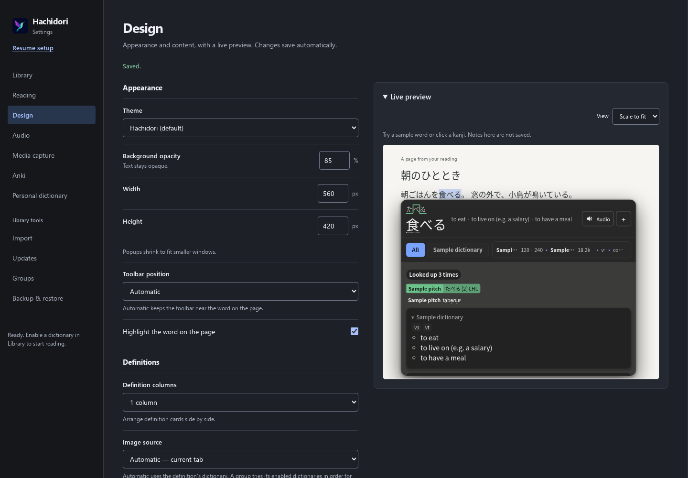
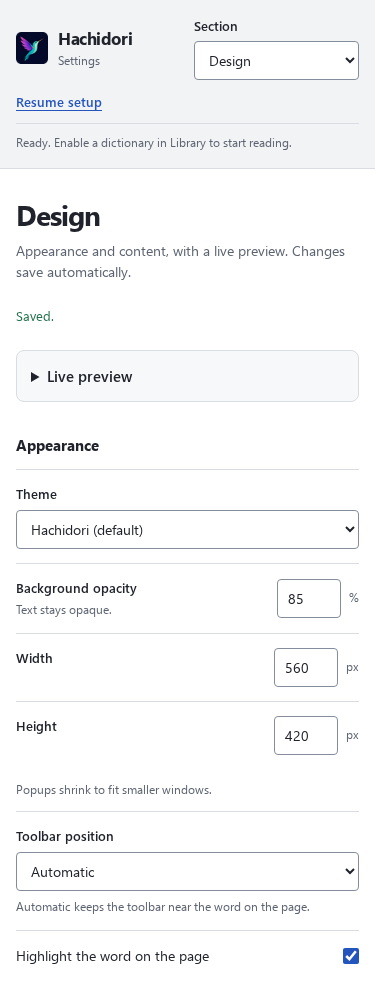
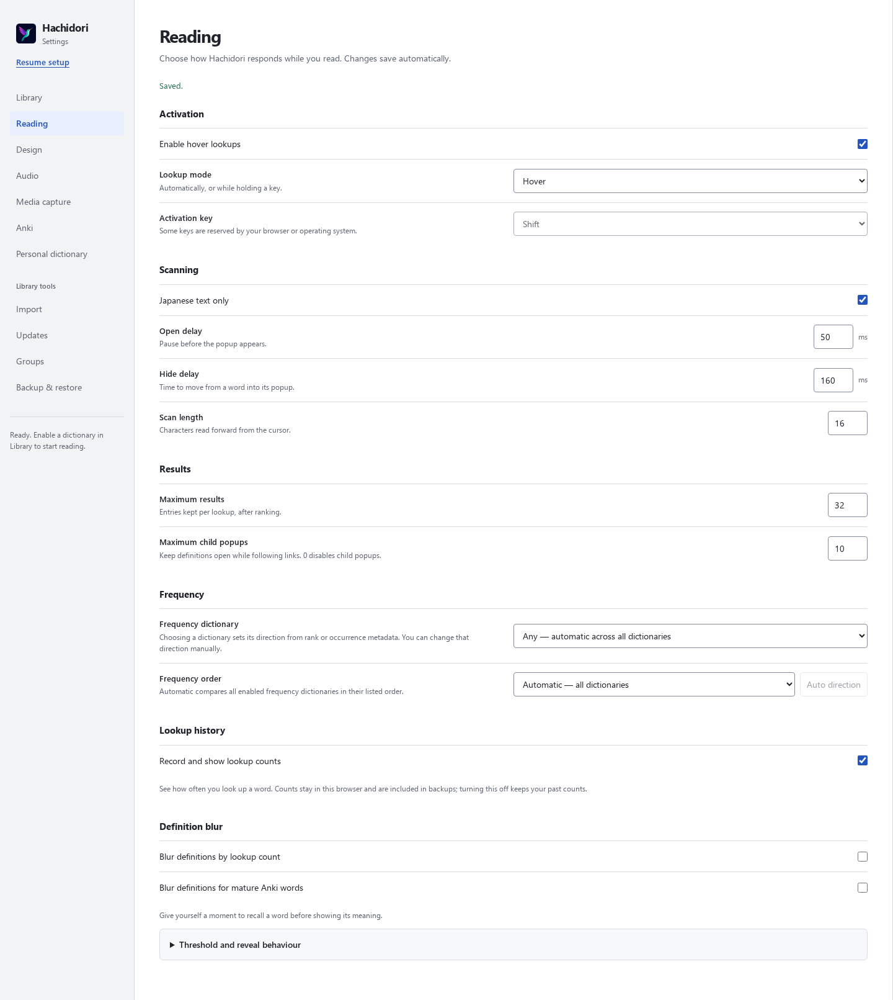
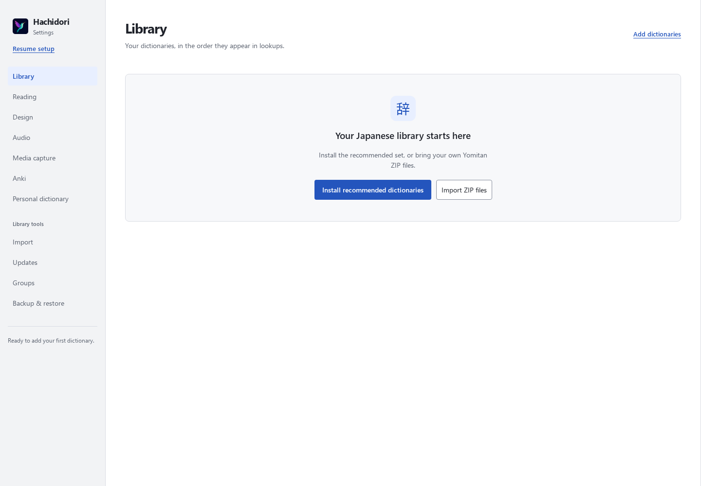
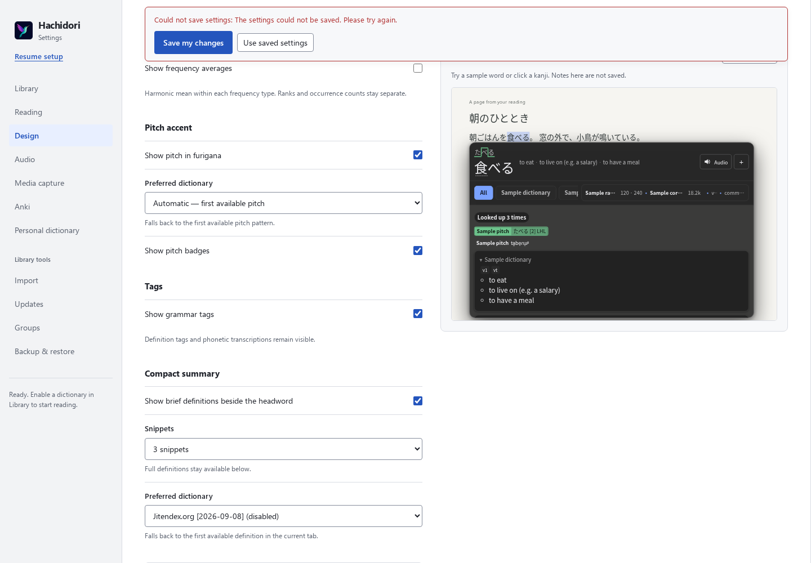

# Settings UI review

Settings now treats Hachidori as a standalone reader. Lookup history stays in
this browser; the external Corpus Seen controls and request path are removed.
Old stored connection fields are ignored, and restore drops those two retired
fields from older backups while retaining other preferences and local counts.
Source attribution and the compatible text-receiver protocol remain intact.

Lookup history and definition blur live in **Reading**. **Design** concentrates
on appearance and definition presentation, with wider selectors, compact numeric
rows and a collapsible live preview. Reset Design preserves the Reading rules.
Threshold/reveal details and custom CSS use native disclosures. Narrow windows
use a section picker that keeps keyboard focus and browser history; background
operation notices remain available beside it.

The empty Library offers recommended dictionaries and ZIP import directly.
Recommendations remain available after a local import or a partial installation,
and installation controls wait for the initial inventory. Readiness distinguishes
an empty or disabled library, while failed dictionary edits retain their error.
Options save feedback sits near each section heading; failures stay visible while
scrolling, with the existing retry and use-saved actions.

## Browser captures

These unedited captures use the unpacked extension in Chromium 150.0.7871.186,
Linux, with an isolated profile containing four small catalogue fixtures imported
through the production engine. The dictionaries are disabled for the captures.
Only the empty-library capture temporarily clears that fixture inventory; it is
restored afterward. The save-error capture injects a failed worker write reply
and exercises the production feedback path.

All eleven sections were checked at 1440, 900 and 375 pixels in light and dark
palettes: 66 views, no horizontal overflow and no page errors. At 1440 pixels,
Design's document height fell from 3647 to 2411 pixels. At 375 pixels, the first
Design control moved from y=1022 to y=510 with the preview initially collapsed.
An intentionally opened preview stays open during subsequent navigation/resizing.
The save-error panel stays at y=12–108.5 in a 1000-pixel-high scrolled viewport.
These are browser geometry checks, not a screen-reader usability study.

| Desktop Design | Narrow Design |
| --- | --- |
|  |  |

## Targeted timings

Compared `5101f38` with `7488edf` (the original settings implementation, rebased
as `05dfbf9`) in Chromium 150.0.7871.186, Node 26.4.0, Linux x86_64. The later
backup, error-state and picker-focus fixes do not change the measured sidebar
navigation or lookup-count transaction path.

Reproduction: load each checkout's unpacked extension in a fresh Chrome profile,
mark setup complete and seed 100 dictionary metadata rows. At 1440 × 1000,
warm the Design preview, then time 20 cycles of Reading → Design → Library.
For each visit, set the fragment with `history.replaceState`, click the matching
sidebar link and read the main element's `offsetHeight`, exercising the production
same-fragment handler plus synchronous layout. Discard one warmup batch and keep
eleven measured batches. In the same profile, time eleven batches of twenty
sequential `hd_lookup_stats_record` worker messages for 食べる / たべる after one
warmup batch. Verify the final count is 240, the library has 100 rows and the
last section is Library. Run before/after/after/before, each in a fresh browser.

The local command was `node /tmp/hachidori-ui-review/benchmark-settings.mjs`;
the repeat used the identical driver with a separate output path. Both runs'
[raw samples](assets/settings-ui-timings.json) are retained. Medians below are
milliseconds per batch, not per individual navigation or count request.

| Run / order | Navigation before | Navigation after | Count before | Count after |
| --- | ---: | ---: | ---: | ---: |
| Initial, before then after | 1448.18 | 1296.69 | 27.43 | 15.35 |
| Initial, after then before | 1349.72 | 2025.45 | 22.38 | 21.07 |
| Repeat, before then after | 1297.60 | 1118.29 | 23.57 | 20.31 |
| Repeat, after then before | 1256.48 | 1220.83 | 56.26 | 15.95 |

The initial navigation results changed direction, so the complete comparison was
repeated with other browser work paused. No consistent regression was measured;
the storage samples remain noisy. These timings do not establish an end-to-end
speedup: navigation excludes deferred paint/async work, the metadata rows do not
contain real dictionary payloads, and count timing excludes dictionary lookup.
No product limits or runtime caches were added for this result.

The simplification pass reused existing section navigation, option-save recovery,
dictionary installation and storage transactions. Native select/details controls
supply the new navigation and disclosures. Removing the external corpus path also
removes its URL validator, timeout, reader refresh bookkeeping and display segment.
