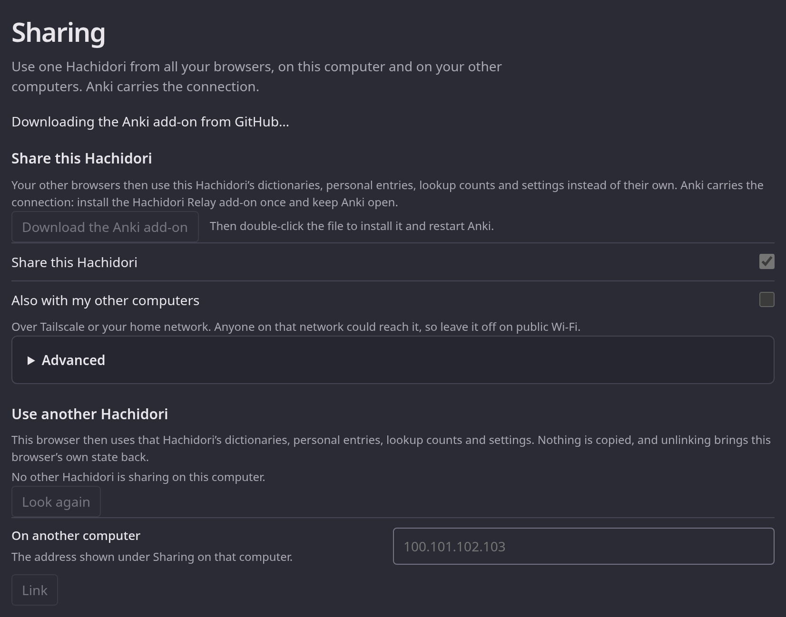
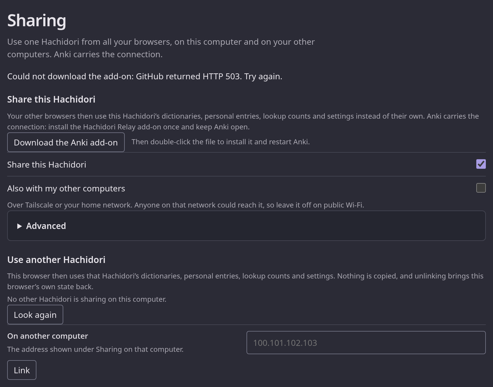
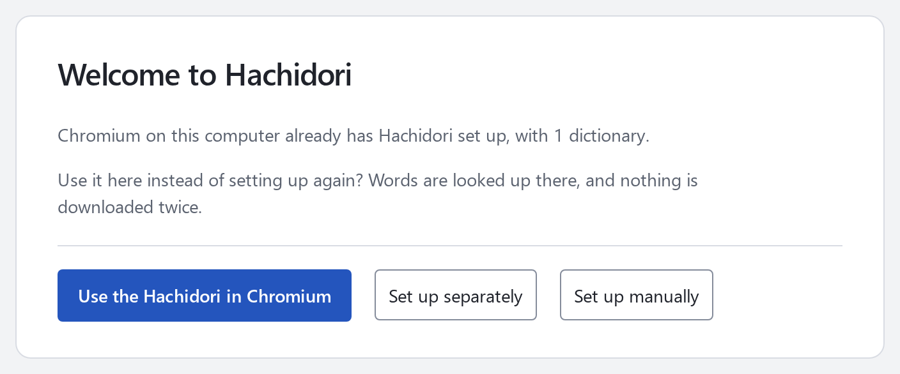
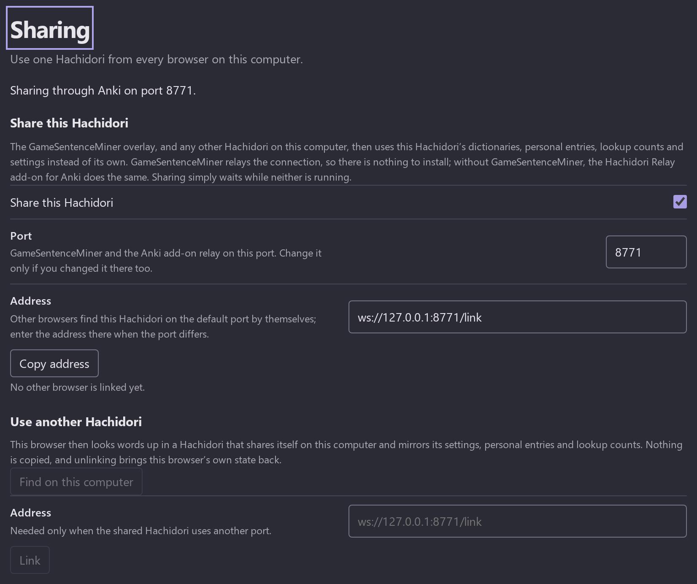
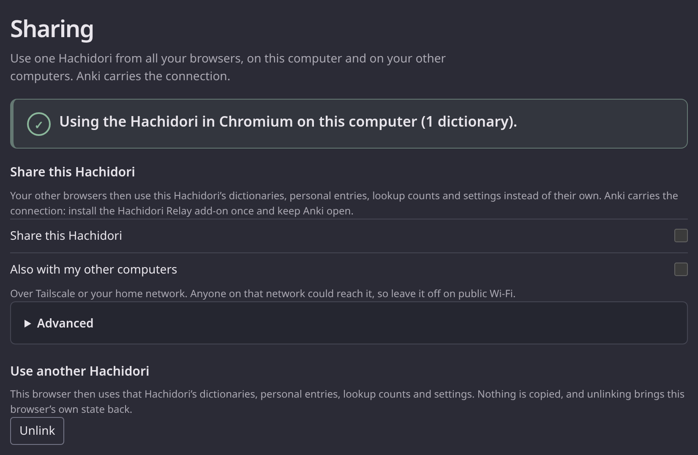

<!-- SPDX-License-Identifier: GPL-3.0-or-later -->

# Sharing

Sharing lets one Hachidori serve all your browsers: the other browsers on this
computer, and the browsers on your other computers when you want that too. The
browser install that holds your dictionaries is the **host**; another install
**links** to it and uses the host's dictionaries, personal entries, lookup
counts and settings instead of its own. Nothing is copied: a linked browser
sends its lookups and its edits to the host and mirrors what the host stores.

Anki carries the connection. A Chrome extension cannot listen for connections,
so both Hachidoris connect out to a small relay that the **Hachidori Relay**
add-on runs inside Anki for as long as Anki is open.

## The first time

**In the browser that has your dictionaries** nothing needs switching on:
sharing is on from install and starts by itself once the install has
dictionaries. **Settings → Sharing** says *Waiting for Anki* and offers
**Download the Anki add-on**. Double-click the downloaded
`hachidori-relay.ankiaddon` (or use **Tools → Add-ons → Install from file…**
in Anki), restart Anki, and the line becomes *Sharing through Anki.* The
button downloads the compatible
[v0.0.3 release](https://github.com/bee-san/hachidori-anki/releases/tag/v0.0.3)
from GitHub, so downloading needs an internet connection. It shows progress
while fetching and an error with a retryable button if the download fails.
The add-on has its own version; this extension pins the version it was tested
with, including in GameSentenceMiner's vendored copy.

To update an existing GitHub-installed relay, install the file offered by
Settings again and restart Anki. It uses the same `hachidori-relay` package ID,
so Anki updates that add-on and keeps its saved configuration. GitHub installs
do not update automatically through AnkiWeb.

**In a second browser on the same computer** the startup page that opens on
install finds the shared Hachidori by itself: *Chrome on this computer already
has Hachidori set up, with 5 dictionaries.* One button, **Use the Hachidori in
Chrome**, links it and finishes setup. A browser that was already set up gets
the same offer under **Settings → Sharing**, with **Use it**. Linking turns
that browser's own sharing off; nothing has to be switched first.

**On another computer**, over Tailscale or your home network: on the sharing
computer tick **Also with my other computers** under Settings → Sharing. The
page lists the addresses to enter, Tailscale's first. On the other computer,
type that address into **On another computer** under Sharing and press
**Link**. Anki and the sharing browser stay on the first computer.

## Sharing this Hachidori

Settings → Sharing says what is happening in one line: *Sharing starts once
this Hachidori has dictionaries*, *Waiting for Anki*, *Sharing through Anki*,
or *Sharing is on, but another browser on this computer is already sharing
through Anki*, in which case the section offers to use that one instead. The
linked browsers are named as they connect: *Linked: Chrome on this computer,
Chrome at 100.75.152.76.*

Sharing waits for dictionaries so that an empty second browser can never take
the host's place ahead of the browser with the library. It survives browser
restarts, and a watchdog alarm reconnects within a minute if Anki starts while
Chrome is idle; a lookup in Chrome reconnects immediately. Turn **Share this
Hachidori** off if you do not want it.

### With your other computers

Until you ask, the relay listens on this computer only. **Also with my other
computers** makes Anki's relay accept links from the network this computer is
on, and the page shows the addresses that reach it; `100.75.152.75` is a
Tailscale address, `192.168.1.20` a home-network one. Enter one of them in
the other Hachidori, with `:port` after it only if you changed the port.
Anyone on that network could reach the relay while the switch is on, exactly
as with AnkiConnect bound to all interfaces, so leave it off on public Wi-Fi.
Windows and macOS may ask once whether Anki may accept incoming connections;
allow it. The relay returns to this computer alone when the switch goes off or
the sharing browser closes, and the browsers linked over the network are
disconnected then.

### The port

Everything on one computer uses port 8771. Change it only if something else
already uses that port: set the new one under **Settings → Sharing →
Advanced** in Hachidori and under **Tools → Add-ons → Hachidori Relay →
Config** in Anki, then restart Anki. Anki shows a warning when the add-on
cannot use its port. Browsers on other computers then enter `address:port`.

## Using another Hachidori

After linking, the page reloads, and from then on:

- lookups, media, engine status, Note appends, settings edits, dictionary
  presentation edits, update checks and installs, recommended-dictionary
  installs and removals go to the host, which commits them through its
  ordinary revisioned transactions and pushes the resulting storage batches back;
- the host's dictionary state, settings, personal dictionary source, update
  schedules and lookup counts are mirrored into this browser's storage, so the
  popup, Settings and toolbar read exactly what they read before;
- this browser's own dictionary state, settings, personal source, update
  schedule and lookup counts are kept aside untouched, and its engine keeps
  reading and committing them, so no local dictionary file is ever removed;
- the Import and Backup sections show that archives and backups belong to the
  host; recommended dictionaries can still be installed from here.

**Unlink** brings the kept state back with revisions above the mirror's, so
every open page adopts it, and removes the host's lookup-count rows. Pages open
in the linked browser before linking keep their previous reader options until
they reload; their lookups go to the host straight away.

Sharing actions from multiple Settings tabs run in order, including the initial
connection probe. Repeating **Link** keeps the original local snapshot; repeating
**Unlink** keeps the first successful restoration. A failed restoration retains
the saved state for retry, and late messages from the old connection cannot
overwrite restored settings or personal entries.

The sharing browser and Anki must be running for a linked browser to look
anything up: when they are not, lookups fail with *The linked Hachidori is not
reachable* and the Sharing section says so; the linked browser reconnects by
itself once they are back. The GameSentenceMiner overlay's Hachidori links
the same way; its Electron runtime needs nothing beyond the WebSocket.

## What the host shares

- lookups, media, styles and engine status;
- reader and Design settings, dictionary state, groups, aliases and order, the
  personal dictionary source, update schedules and lookup counts, pushed to
  every linked browser as the same storage batches the host writes;
- Note appends, settings and presentation edits, update checks and installs,
  recommended-dictionary installs and removals made in a linked browser, which
  the host commits through its ordinary revisioned transactions.

Local-file imports and backups happen on the host. Pronunciation, Anki mining,
capture and external links run in each browser with the shared settings.

## The relay

[hachidori-anki](https://github.com/bee-san/hachidori-anki) owns the add-on:
a few hundred lines of Python on Anki's
own runtime, with the port as its only setting. The host connects to `/host`,
linked browsers to `/link`, and the relay forwards text frames between them
without reading them. Its rules are few: a handshake's `Origin` must be a
browser extension, so web pages cannot reach it; `/host` is accepted from this
computer only; a second host is told that another browser already shares; and
a browser linking while no host is connected is refused and retries. There is
no password or token. On the host's `network` frame the relay swaps its
listening socket between this computer and every interface (Linux refuses a
wildcard bind beside a loopback listener) and answers with the addresses other
computers reach it at, found from the routes to Tailscale's resolver and to the
default route without sending anything. In a checkout of that repository,
run it without Anki with `python3 addon/server.py --port 8771`.

Socket writes never wait while holding the shared relay state lock. A healthy
connection sends directly; a socket that fills its send buffer queues the rest
of that frame and later frames in order, with its own drain thread. Other
browsers can keep looking up words and receiving keep-alives while it catches
up. Turning network sharing off or losing the host interrupts stalled sends;
a partly sent frame ends with transport shutdown rather than a malformed close
frame inserted into its payload.

## Tests

`node --test test/sharing-protocol.test.mjs test/sharing-settings.test.mjs
test/anki-addon.test.mjs` checks the wire contract, covers the Settings section
with jsdom, and verifies pinned binary downloads, HTTP/network failures,
progress across polls, and retry. The relay's raw-socket, packaging, and
optional installed-Anki checks live in
[hachidori-anki](https://github.com/bee-san/hachidori-anki#develop-and-test).
Release v0.0.3 includes the slow-peer isolation and Python 3.9 idle-timeout
regressions previously verified here.

The extension smoke suite's sharing-host and sharing-client stages cover the
service worker's side against fake sockets. `node test/chrome-sharing.mjs`
runs two real Chromes: the host imports a fixture, handles a simulated failed
add-on download, then retries the actual pinned GitHub release from Settings.
The suite unpacks that downloaded archive and runs its relay with `python3`.
The second browser's startup page offers that Hachidori and links with one
click, looks a word up through it, edits a shared setting and saves a personal
entry that the host commits and pushes back, survives the host closing and
relaunching, unlinks back to its own state, and links again through this
machine's network address until the host stops sharing on the network.

For offline testing or a coordinated add-on change, set
`HACHIDORI_ANKI_ADDON=/path/to/hachidori-relay.ankiaddon` to serve a locally
built archive at the pinned URL in the test browser. Otherwise the suite
downloads the live release. See the [test harness guide](../test/README.md).
