# Startup UI review

## Readiness and continuation refinement

This refinement retains PR #75’s passage and shortcut probes, the standalone
Settings layout, screenshot mining, the six-scene carousel and cached Anki
maturity. The refreshed captures use the integrated page runtime at `f22c387`.
The final step now names the next action when the library is empty, its term
dictionaries are disabled, or lookups are switched off. **Add dictionaries**, **Open Library** and
**Open Reading** lead directly to the relevant Settings section. **You’re
ready.** appears only after the installed library answers the practice probe;
reader-load and engine failures retain recovery. A passage-only match is ready
for ordinary lookup while its unanswered shortcut stays hidden. **Finish
setup** remains available throughout.

Anki is labelled **Optional** in the progress indicator. Its check offers
**Continue now** immediately, and a late result preserves the stage the user
has reached. A failed connection says **Anki isn’t connected**, without
claiming that Anki is absent. Dictionary success advances immediately. The
three successful Anki detection steps each remain visible for one second, then
the settled result remains for three seconds. On the final step, the ordinary
reader immediately selects and looks up the demonstrated word once; its
keyboard button and hover route remain available. Installation explains that
it continues after the tab closes, and ZIP imports are clearly separate from
the personal dictionary.

The card has clearer heading and action spacing, less competing Anki feedback
on the practice screen, and full-width dictionary status text. Existing light
and dark colours, the scene, real reader and saved-page controls are retained.

The captures were refreshed on 2026-09-08 with Chrome for Testing
152.0.7977.82 on a MacBook Air M2, at 1024 × 900 desktop and 375 × 900
narrow widths (failure uses 500 × 800; real practice uses 1200 × 1000). The first five render the
actual packaged page, scripts and styles with controlled setup records,
dictionary inventories and Anki replies; the background worker is inert.
They show the UI states and do not prove downloads or lookups. The practice
capture comes from the full extension browser test, with catalogue fixtures
imported through the production engine. All images were inspected without
editing. The capture driver and state/overflow report remain in the local
`hachidori-merge-prs-20260908` run directory as `pr85-capture.mjs` and
`pr85-captures.json`.

| Three-second Anki result | Automatic real lookup |
| --- | --- |
| 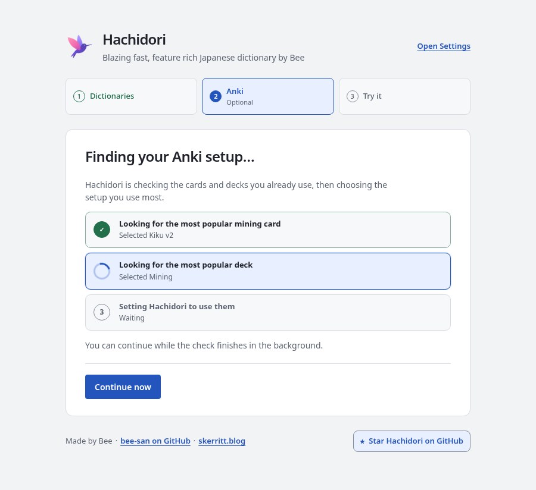 | 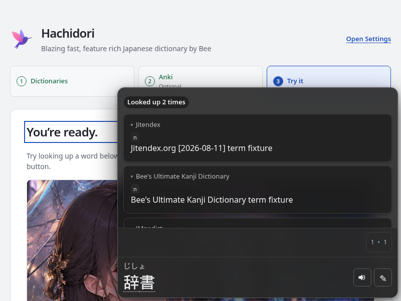 |

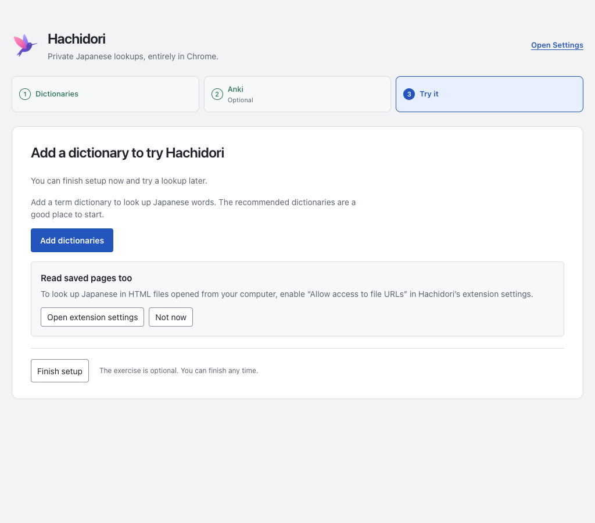

| Optional Anki check, narrow dark | Disabled dictionaries, narrow dark |
| --- | --- |
| 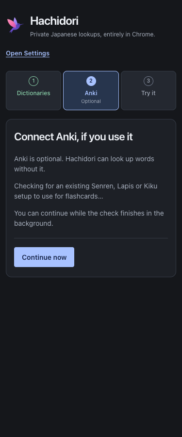 | 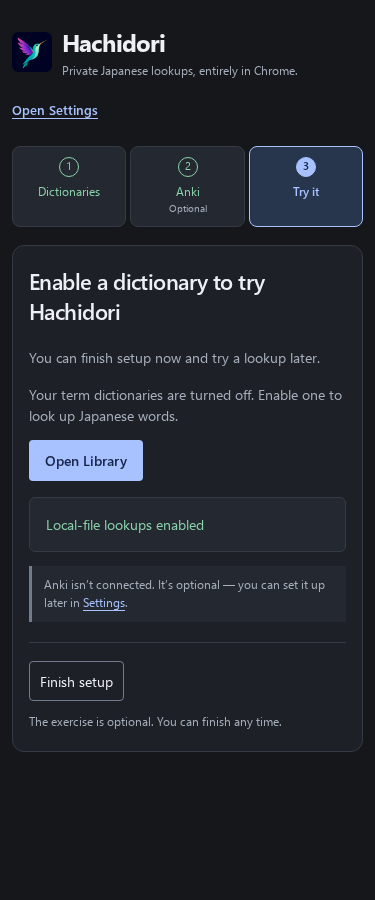 |

[Full-width failure status at 500px](assets/startup-refined-partial-500.png) and
[the retained working practice scene](assets/startup-refined-practice.png).

A simplification pass consolidated readiness headings, recovery text and the
probe precondition in `practiceReadiness`, retained the existing setup CAS and
Anki countdown timer, reused the mounted practice controls, and removed unused
sample CSS and duplicate narrow dictionary rules. Background-install guidance
uses the existing introduction paragraph, so progress updates create no extra
paragraph nodes. The generic paragraph reset excludes the shared scene speaker,
preserving its existing label-to-passage spacing after carousel integration.

### Follow-up progress measurements

Compared `1cbaef6` and `b422e57` with Chromium 150.0.7871.186, Node 26.4.0,
Linux x86_64, a 1024 × 900 viewport and the same production startup listener and
render functions. The local capture command was
`node /tmp/hachidori-startup-refinement/benchmark.mjs`; its driver and raw results
were also retained in the local `hachidori-startup-refinement-20260908` report.

Reproduction: serve each revision’s unmodified extension page/modules/styles
on loopback, inject an inert Chrome storage/runtime bridge before navigation,
and return one unfinished four-source install run with Jitendex downloading
59,768,832 of 125,829,120 bytes. Capture the runtime listener and time eleven
batches of 1,000 synchronous production `hd_setup_progress` messages using
`performance.now()`. Increment the same run’s sequence and received bytes by
1,024 for each event. Run revisions in before/after/after/before order, using a
fresh page for each run. Both revisions retain the original row and finish at
**67.7 MB of 120.0 MB (56%)**.

| Order | Before median ms / 1,000 updates (range) | After median ms / 1,000 updates (range) |
| --- | ---: | ---: |
| Before then after | 116.7 (85.4–154.9) | 56.5 (46.5–111.1) |
| After then before | 117.1 (76.7–178.2) | 74.2 (47.5–117.3) |

These samples found no synchronous progress-update regression. Earlier short
batches were noisy and changed direction between runs; this is not a claim of
an end-to-end speedup. The measurements include event cloning and synchronous
DOM updates, and exclude deferred layout/paint, downloads, imports and lookup.
The compared runs executed serially, with the browser test run deferred during
these longer timed loops.

## Previous scene and file-access review

This review improves the first-run flow from [issue #58](https://github.com/bee-san/hachidori/issues/58)
on the MacBook Air M2. The baseline is `6b895529ef4ff6e98be0e8ce406e8176d3e7c9b2`;
the comparison’s updated page sources are from `ed023b6`.

The screenshots use Chrome for Testing 152.0.7977.82 with isolated profiles,
at **1024 × 900** desktop and **360 × 900** narrow viewports. Full-page captures
include content below the viewport, so image heights differ. Both Settings
palettes and reduced motion were selected through browser media emulation.
Every image below was inspected and copied without editing.

The final “After” comparisons and saved-page recovery image were recaptured
on 2026-09-08 using Chromium 150.0.7871.186 on Arch Linux, after integrating
the project owner's supplied artwork and branding from #79. They use the same
viewport sizes and controlled startup state. The real lookup and ready-screen
captures come from the combined #75/#76 real-Chrome run. The historical “Before”
images retain their original capture environment.

## Dictionary failure and responsive layout

The baseline’s desktop error column overlaps JMnedict’s name and description
when the publisher failure wraps. Status now sits below the dictionary’s name
and purpose, with its own full-width progress bar. The narrow layout keeps the
three steps together, reduces header space, and retains readable retry and
continuation controls.

| View | Before | After |
| --- | --- | --- |
| Desktop, light | 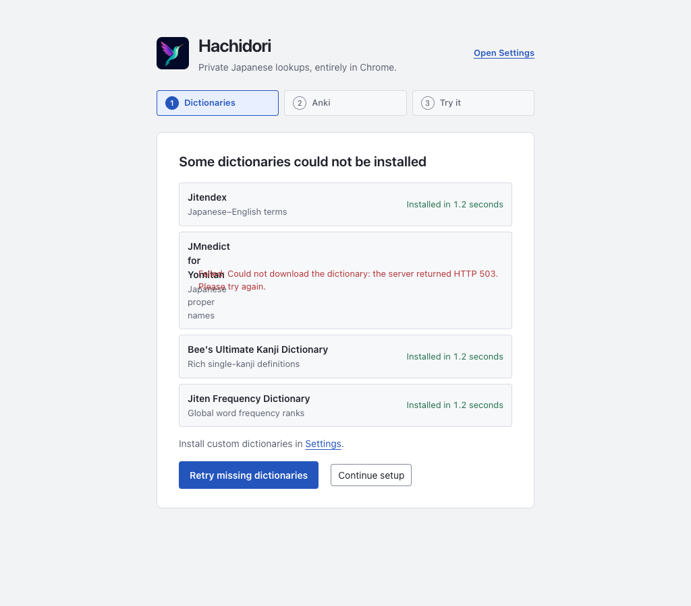 | 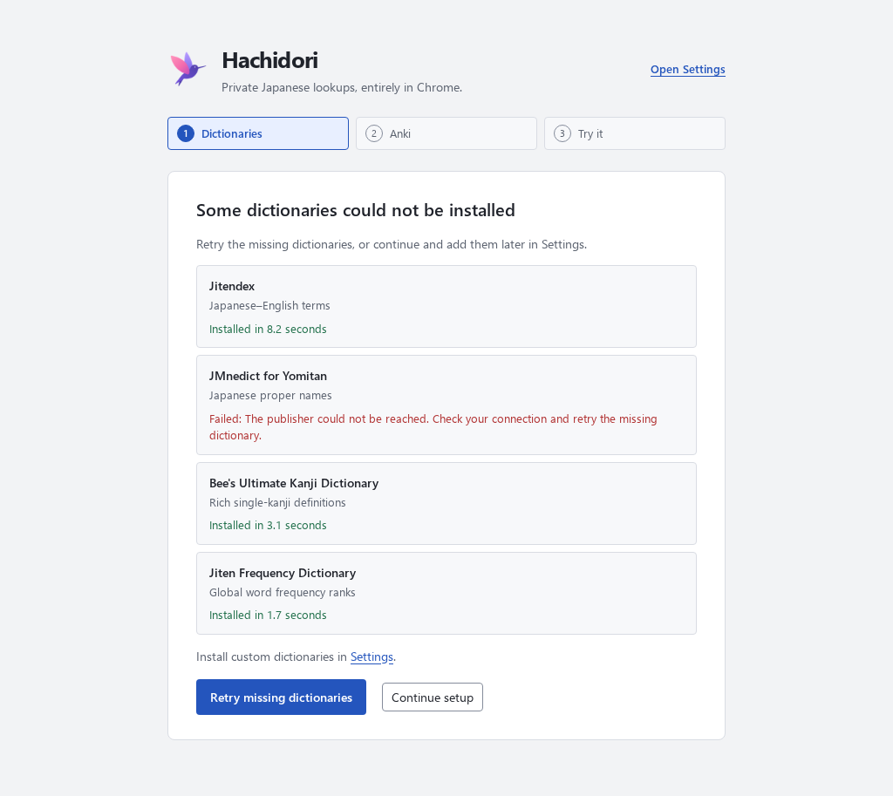 |
| Narrow, dark | 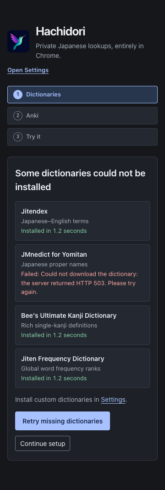 | 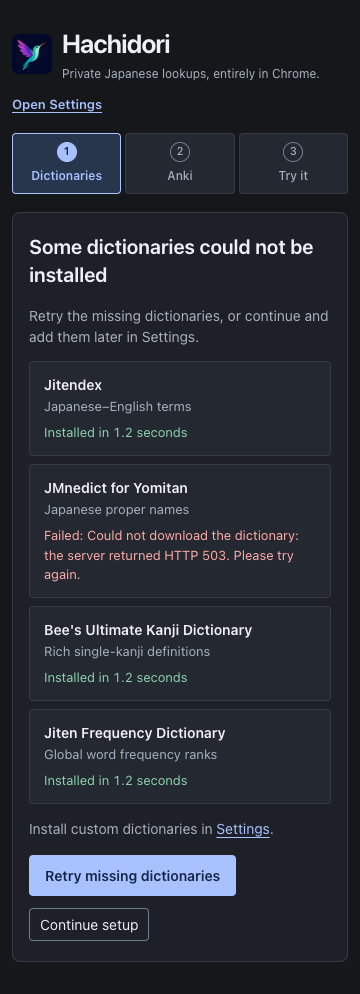 |

## Practice and optional saved pages

The previous final screen only explained how to hover on another webpage.
The new screen supplies the shared visual novel scene, a longer Japanese
passage, a keyboard lookup control, retained Anki feedback and the optional
saved-HTML prompt.
Finish remains available, and missing dictionaries or disabled lookups lead to
the appropriate Settings recovery section.

| View | Before | After |
| --- | --- | --- |
| Desktop, light | 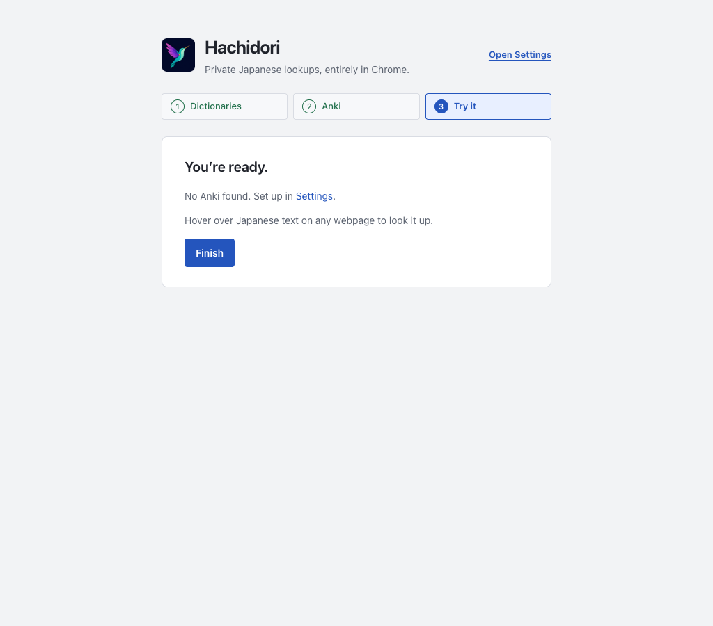 | 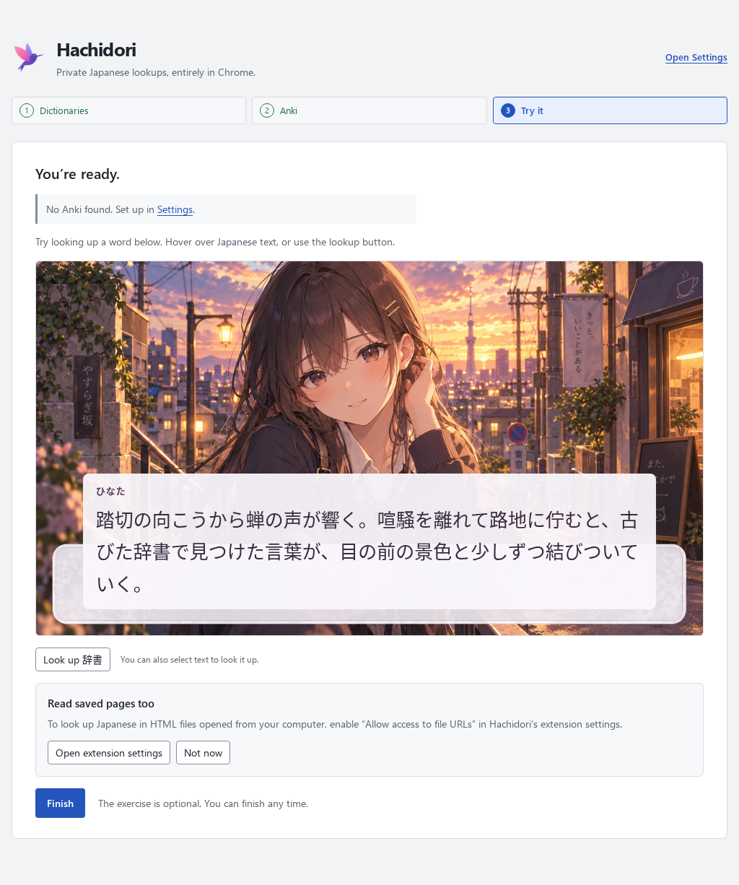 |
| Desktop, dark | 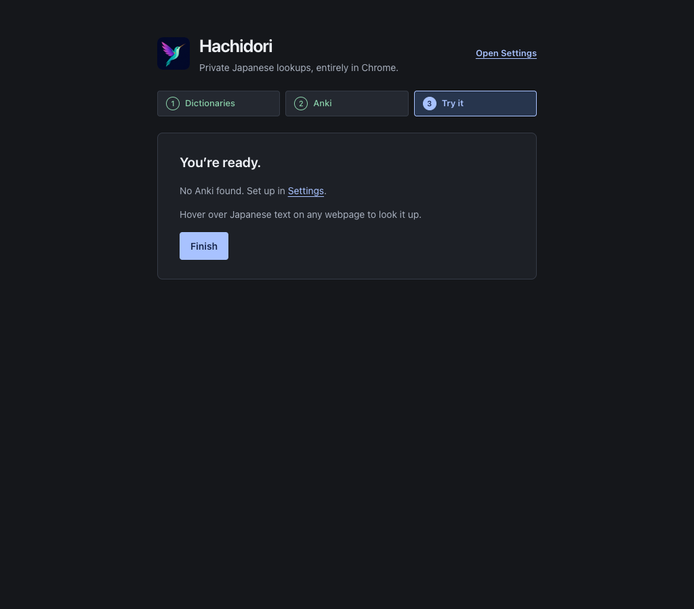 | 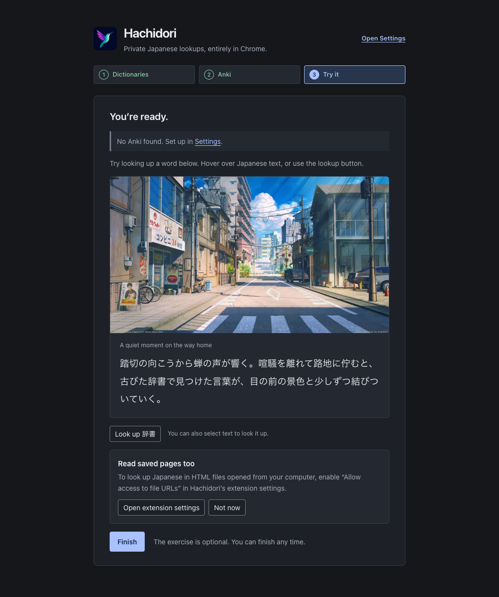 |
| Narrow, light | 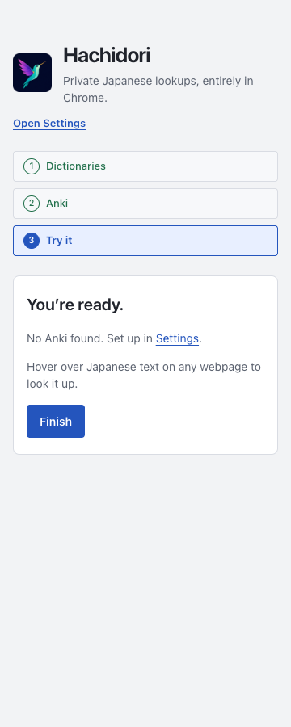 | 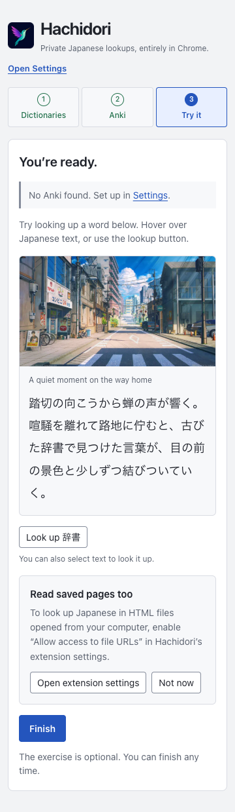 |
| Narrow, dark | 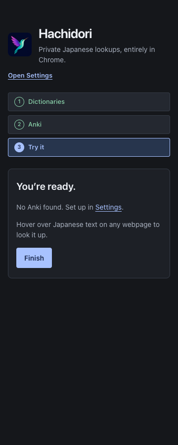 | 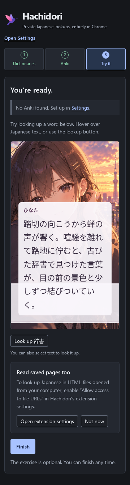 |

These comparison images render the actual packaged page DOM and CSS in Chrome,
with controlled storage, dictionary progress and Anki outcomes. Their background
worker is inert: the displayed installation times and inventory are fixtures,
and these images alone do not prove downloads, imports or lookup results.
The capture driver and complete state matrix remain in ignored
`test/tmp/ui-review/` in the original Mac checkout; final supplied-artwork
and failure captures use `test/tmp/merge-pr75/capture-artwork.mjs` and
`capture-failure.mjs` in the integration checkout. Production-path checks are
documented in
[the test guide](../test/README.md#chrome-e2emjs).

A partial dictionary can answer a passage word while lacking **辞書**. In that
case the scene and ordinary reader stay available, but the unanswered shortcut
and its instruction are hidden. This Chromium 150 / Arch Linux capture uses
the same 360 × 900 controlled setup with only **蝉** answering the probe;
`test/tmp/merge-pr75/capture-partial.mjs` reported no console errors or horizontal
overflow. The actual page and CSS were captured without editing the image.

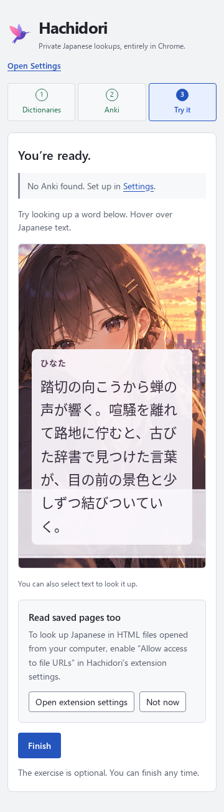

The separate real-Chrome run imports the catalogue fixtures through the normal
WASM engine. Pressing Enter on **Look up 辞書** returns their actual glossary
content in the ordinary popup; pointer lookup is checked too. This viewport
capture shows the result anchored above the selected passage:

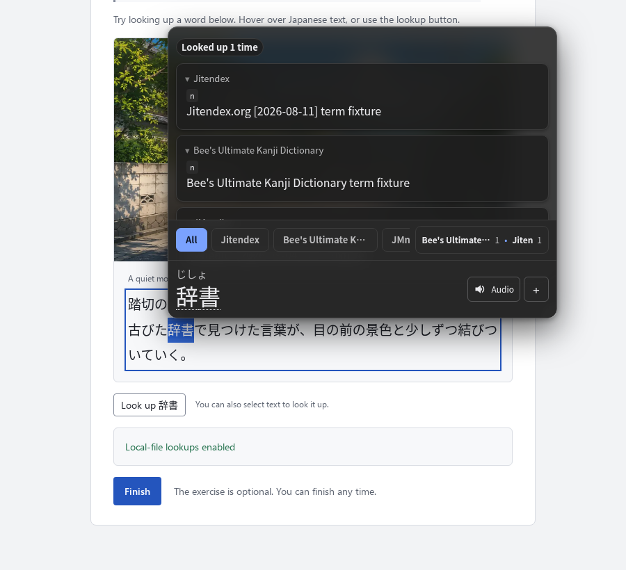

The shared Settings tokens give the dim, success and error text on the inset
surface contrast ratios of at least **5.67:1** in light mode and **6.77:1** in
dark mode. The active step is **5.86:1** and **6.95:1**, respectively. Keyboard
checks cover the skip link, lookup control, preserved selections, recovery and
Finish. Live-region checks cover stage/outcome announcements without per-byte
announcements; this is DOM/browser validation, not a VoiceOver session.

Chrome 152 closes extension tabs when the native file-access switch reloads
Hachidori. The optional prompt now explains **Extension options → Resume
setup** after opening the details page. The native permission lifecycle is
covered by the full Chrome test. This refreshed narrow screenshot uses
controlled startup state with access disabled and the details shortcut already
opened:

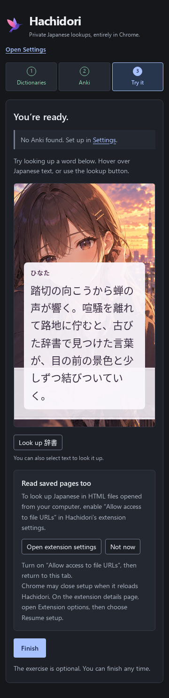

## Targeted progress-update measurements

The persistent rows change the setup progress render path. On macOS 14.6.1,
MacBook Air M2/8 GiB, Node 22.22.3 and headless Chrome 152.0.7977.82, the local
capture driver compared `6b89552` with production sources at `6beb5f4`.
The independent benchmark's timed workloads had finished; these runs used
separate profiles, serially, at Puppeteer's 800 × 600 default viewport.

Reproduction setup: load each revision's startup page and Settings CSS in a
scratch extension with an inert background. Stub the initial storage read to
an empty dictionary inventory and a dictionary-stage setup record. Return an
unfinished run from `hd_setup_install`: four catalogue rows, Jitendex downloading
59,768,832 of 125,829,120 bytes and the other three waiting. Capture the startup
runtime listener, then time 11 batches of 100 synchronous `hd_setup_progress`
messages with `performance.now()`, incrementing the run sequence and received
bytes by 1,024 per message. Use the same run ID and production listener/render
path throughout. Verify the final row says 58.1 MB (48%) rather than 57.0 MB
(47%) and record whether the original row remains connected. Run before/after,
then after/before, each in a separate browser. The local commands are
`node test/tmp/ui-review/capture.mjs before measure` and the corresponding
`after measure`; raw samples and the capture driver remain beside that file.

| Run | Before, median ms / 100 updates | After, median ms / 100 updates |
| --- | ---: | ---: |
| Before then after | 1.465 | 1.005 |
| After then before | 1.580 | 1.065 |

Before sample ranges were 1.260–7.605 and 1.290–2.515 ms; after ranges were
0.770–2.825 and 0.710–2.810 ms. Both revisions applied the same updates; only
the updated page retained the row. These short samples show no median
synchronous-update regression, with visible warmup/noise. They exclude layout,
paint, asynchronous work, downloads, native import and lookup latency, and do
not establish an end-to-end speedup.

## Practice readiness probe comparison

`node test/tmp/merge-pr75/probe-timing.mjs` compares production startup modules
at `c93eedc` and `22b7bbf` through the existing jsdom startup harness. On Arch
Linux, Node 26.4.0 and jsdom 30.0.1, each sample creates a fresh practice page
with the 61-character passage, one enabled term dictionary, scan length 16 and
maximum results 32. Immediate mocked lookup replies answer only **辞書**, only
**蝉**, or nothing. Each revision/scenario has two warmups and 11 samples,
repeated in before/after and after/before order. Timing begins at the first
probe request and ends when the rendered outcome settles.

| Available word | Requests, before → after | Median ms, first / reversed order |
| --- | --- | --- |
| 辞書 | 32 → 1 | 1.695 → 1.665 / 1.347 → 1.347 |
| 蝉 only | 9 → 10 | 1.173 → 1.019 / 0.911 → 0.938 |
| None | 61 → 62 | 1.159 → 1.080 / 0.983 → 1.343 |

Ranges across both orders were 1.070–6.036 / 0.717–4.337 ms for **辞書**,
0.780–3.735 / 0.835–5.562 ms for **蝉**, and 0.832–6.235 / 0.921–5.699 ms
for no result (before / after). The partial and missing cases add one necessary
exact-selection query; there is still only one fallback passage sweep. These
short, noisy timings establish no latency improvement or consistent regression.
They exclude Chrome, messaging IPC, native dictionary lookup, paint and reader
loading. The raw samples remain in `test/tmp/merge-pr75/probe-timing.json`.

The scene uses the project owner's supplied 1672 × 941 PNG and the shared
visual novel styles introduced by #79. [Asset provenance](../extension/assets/ATTRIBUTION.md)
and the [ownership record](asset-rights.md) retain the original filename,
authorization and SHA-256. The earlier practice-only asset is removed; the
runtime and current screenshots use the same supplied artwork as Design.
The long paragraph has its own readable dialogue surface and fits the scene
at 320px without horizontal overflow.

Screenshot-only Anki mining remains a separate acceptance item in #58; this
review does not claim that the entire issue is complete.
