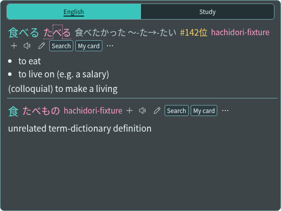
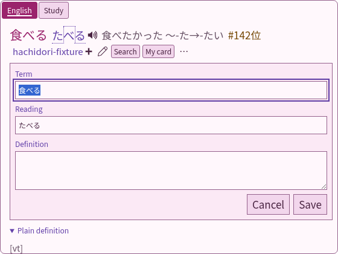
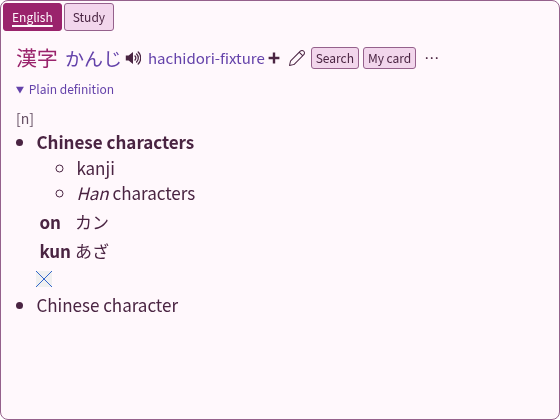
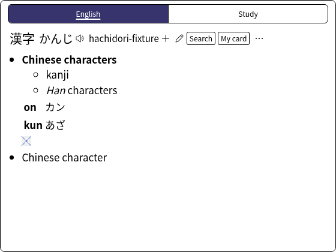
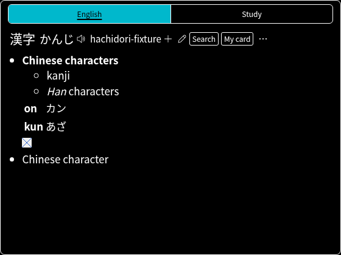

<!-- SPDX-License-Identifier: GPL-3.0-or-later -->
# Bee's Theme

Enable **Advanced → Experimental features → Theme Store**, then open **Design**
and select **Bee's Theme**.

The theme puts a girlypop pink and lilac palette on JL's compact layout,
typography and repeated header for each dictionary. Existing frequency text and
pitch markings follow JL. Light rose surfaces use darker pink and lilac text
accents for contrast at the default opacity. Selected groups have an underline
and keyboard focus has a lilac outline.

- **Group tabs:** only configured groups with results appear, in their saved
  order. A group filters existing blocks in place and audio, mining and keyboard
  actions follow its visible dictionaries. Without matching groups, all results
  appear without a tab row. Back restores the selected group.
- **Formatted definitions:** each dictionary block starts as complete JL text.
  Opening Formatted definition replaces that visible text with the existing
  structured glossary renderer's lists, tables, furigana, links and images.
  DOM and media requests start on expansion; reopening reuses the rendered
  content. Back restores disclosures. Scoped dictionary CSS applies to the rich
  content. The existing media service and link handlers retain request ownership.
- **Personal dictionary:** each block's pencil opens the shared Term, Reading
  and Definition form beneath its header. Exact selections prefill the selected
  text. Escape closes the form first; group presentation updates preserve drafts.
- **Custom actions:** configured link and Anki-template buttons appear beside the
  existing controls. The first two stay inline, with the remainder in More
  actions. Each mining button receives its own dictionary's definitions.

The theme shares JL's direct renderer and Default's lookup-action component.
It builds its own popup and stylesheet. Sources and attribution are in
`extension/vendor/themes/bee/`; `source.json` records the reviewed source revision.





## Validation

The focused theme test uses the real extension, WASM importer and a local fake
AnkiConnect. It checks the Store selection, group-only tabs, inline custom
actions, lazy rich content, Note/Escape, kanji, structured tables and loaded
dictionary images, plus switching back to Default. Forced-colour screenshots
cover the new layout in both light and dark system palettes. Browser assertions
check WCAG AA text contrast (4.5:1) and control/focus contrast (3:1) with the
default popup opacity composited over both white and black pages.




## Performance

Measurements use the existing production hover harness with the same synthetic
flat, 40-level structured and 24-sense entries. Initial lookup measurements keep
formatted definitions closed; expansion costs and media loading are separate
from initial popup latency.

| Renderer / revision | First display, median / p95 | Complete display, median / p95 | Synchronous render, median / p95 |
| --- | ---: | ---: | ---: |
| JL before | 16.80 / 17.70 ms | 33.20 / 33.50 ms | 0.95 / 1.50 ms |
| JL after | 16.80 / 17.10 ms | 33.20 / 33.90 ms | 1.00 / 2.00 ms |
| Default before | 17.00 / 18.20 ms | 33.30 / 35.40 ms | 2.50 / 5.50 ms |
| Default after | 16.90 / 18.10 ms | 33.30 / 33.40 ms | 3.00 / 5.80 ms |
| Bee's Theme | 16.80 / 17.20 ms | 33.20 / 33.60 ms | 1.20 / 2.00 ms |

Each row uses three fresh Chrome profiles and 72 measured warm lookups. The
harness excludes an alternating warmup pair per profile and retains cold,
nested, rapid-replacement and correctness samples in the raw evidence.
Baseline revision is `ed2f340`; the local JL/Default comparison checkout was
`d5047b2` and the final Girlypop Bee checkout was `4f3c59a`. Manifests retain
these measurement SHAs and hashes. The published integration snapshot is
[`96da264`](https://github.com/bee-san/hachidori/commit/96da264f2c73d028b60cb5720edeaedf40678a33):
JL/Default runtime code is unchanged from their measured checkout, and Bee
runtime code matches its final measured checkout. Later edits add evidence,
documentation and the vendored source pin; they do not change the measured paths.

Environment: Linux, AMD EPYC 9V74 (9 logical CPUs exposed), Node 22.23.1,
Chrome 152.0.7977.75 and the pinned test tooling. Profiles run sequentially.
These synthetic dictionaries isolate popup work; they do not represent a large
dictionary library. First/complete timings are frame-quantised. The results
show no material initial-display regression; they do not establish a speedup.
Formatted glossary construction and media decoding are deferred until expansion
and are excluded from these initial-display timings. Custom actions and group
switching are covered by the focused browser suite rather than this microbenchmark.

To reproduce, check out `ed2f340` for the baseline rows or the published
integration snapshot for the after/Bee rows. Use the `popupTheme` value from
the corresponding manifest (`jl`, `default` or `bee`):

```sh
HACHIDORI_BENCH_REPO=/path/to/checkout \
HACHIDORI_PUPPETEER=/path/to/puppeteer-core.js \
HACHIDORI_CHROME=/path/to/chrome \
HACHIDORI_HOVER_OPTIONS='{"popupTheme":"bee"}' \
  node benchmark/hover-popup.mjs /tmp/bee-results \
  docs/themes/bee-evidence/bee-hover-fixture.zip \
  docs/themes/bee-evidence/bee-senses.zip
```

[Summary and raw samples](bee-evidence/) include archive checksums and every
measured result. Medians average the middle pair; p95 uses nearest rank.
