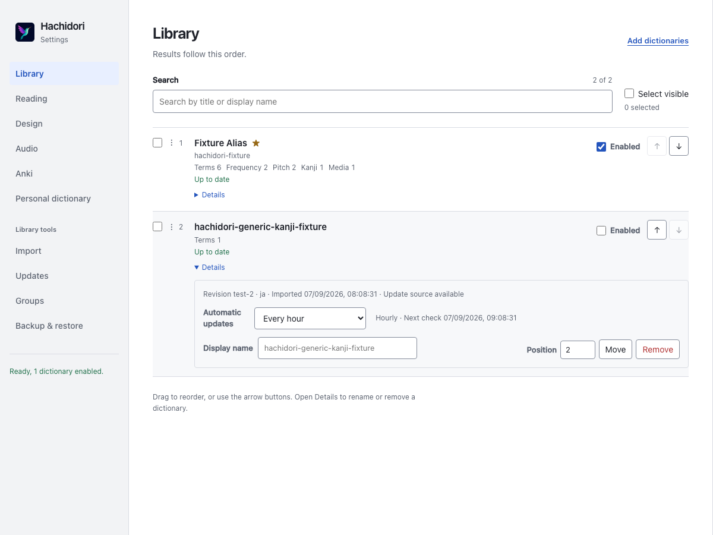

# Dictionary update schedules

Settings → Updates chooses the default schedule. In Library → Details, each
update-checkable dictionary can use that default or choose Off, hourly, daily,
weekly or monthly. An explicit interval continues to work when the default is
Off. Local-only packages have no schedule control. Disabled managed packages
are still eligible for automatic updates.

The next check is the last attempted check plus its interval: one hour, one day,
seven days or thirty days. Never-checked packages are due immediately. Successful
and failed attempts both advance the due time. Check now ignores schedule/due
time and only records availability; manual installation remains explicit.
Automatic due checks install available updates using the existing generation
transaction and preserve the working generation on failure.

One nonperiodic Chrome alarm targets the earliest due package. Package changes,
schedule edits, completed checks, restore and worker startup reconcile it. An
already-due alarm is retained instead of repeatedly postponing delivery. Every
scheduled candidate is checked against the current generation and policy before
its index fetch, so a later package switched Off during a batch is skipped.

Overrides are package metadata, preserved through import/update/reconciliation
and complete backup. Editing a schedule does not reload the engine. The control
is disabled while a dictionary edit is saving; stale external policy edits are
refused. Global schedule changes refresh row timing labels without coupling
that work to ordinary busy-state rendering.

This implements issue #9 L3 using GSM PR #549 at
`524ed0b3b92decae87f65df02df9ef9e512f7674`: `effectiveDictionarySchedule`,
`nextDictionaryUpdateCheck`, `setDictionarySchedule` and its scheduler semantics.
Chrome alarms replace desktop timers; no desktop polling cap or per-package
browser alarms are introduced. This intentionally extends D6's original
global-only schedule and retains the owner's automatic-install clarification.
